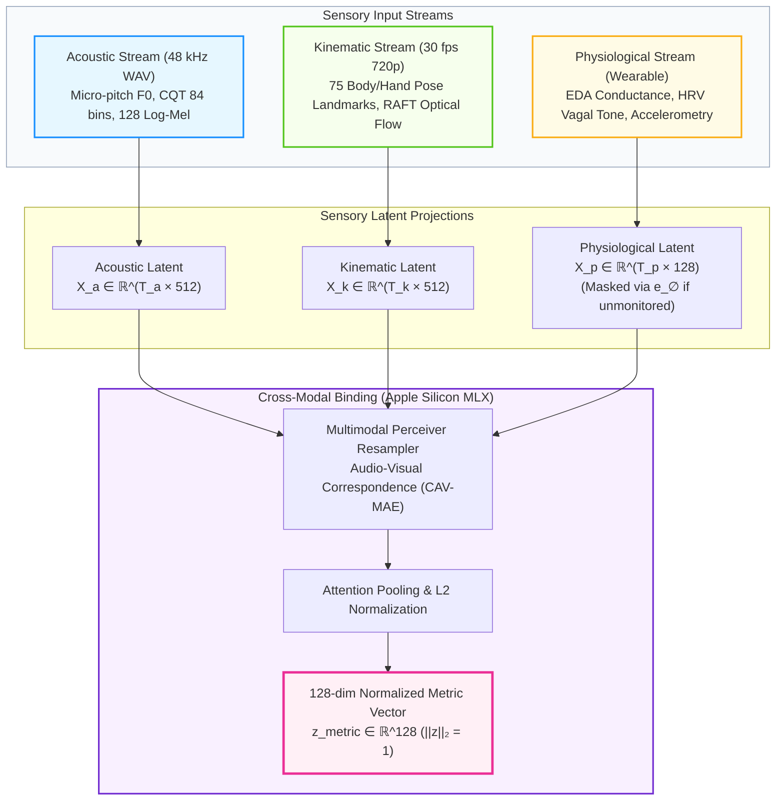
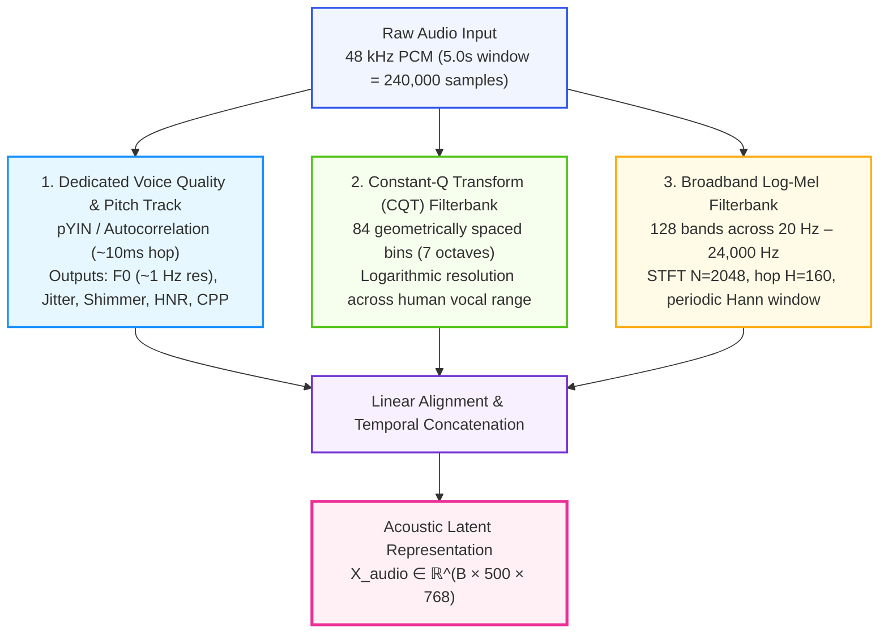
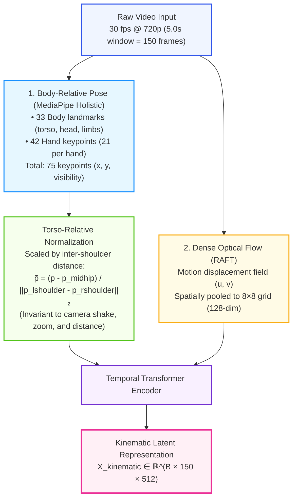
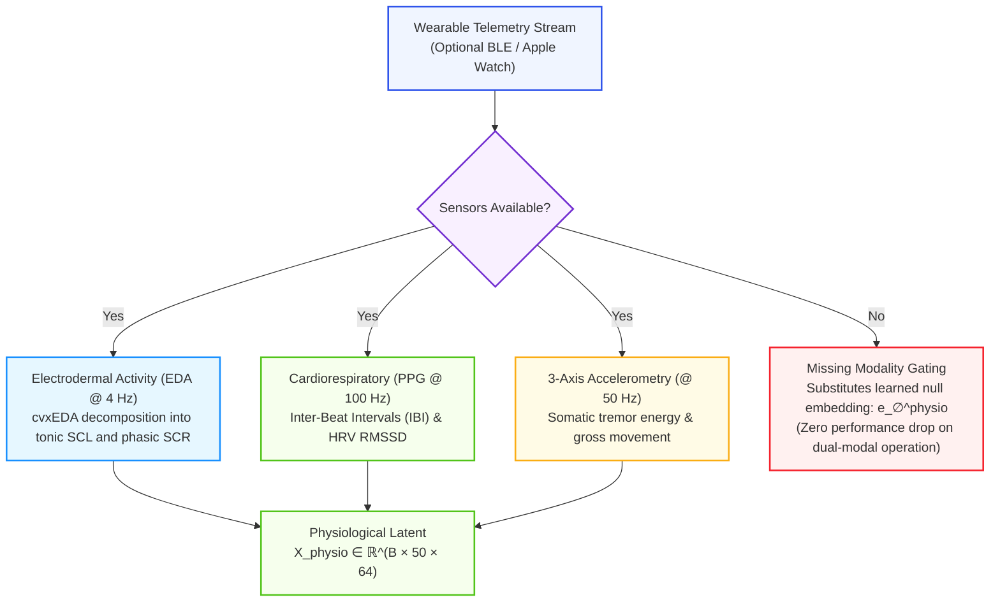
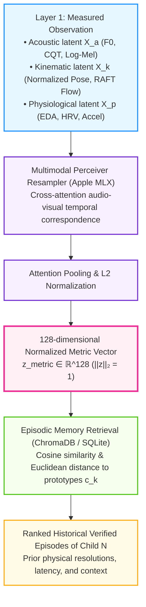
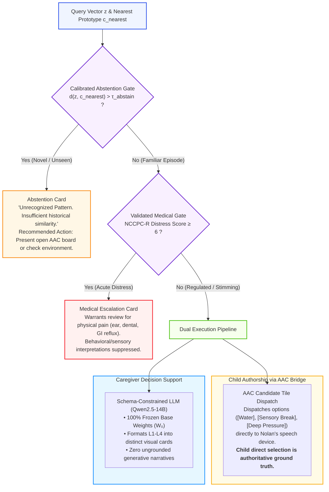
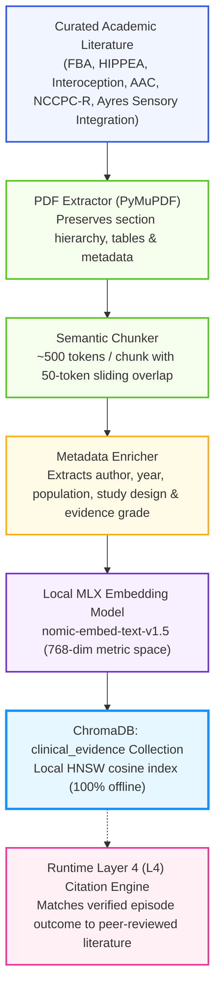

# Project N: Architectural, Neurobiological & Systems Engineering Design Document

---

## 1. Biological and Neurological Foundations

### 1.1 Neurobiology & Communication in Non-Verbal Individuals
Autism Spectrum Disorder (ASD) encompasses heterogeneous neurodevelopmental profiles. For non-verbal children—specifically conceptualized around Nolan (Child N), a 7-year-old completely non-verbal autistic boy—expressive spoken language is absent. Childhood apraxia of speech (CAS), atypical oral-motor coordination, or motor-planning challenges frequently co-occur, dissociating cognitive capacity from phonetic articulation.

Crucially, **the absence of verbal speech does not indicate the absence of language, cognition, agency, or communicative intent**. The scientific grounding for Project N rests on several foundational principles:

- **Heterogeneous Connectivity Profiles:** Classical models proposed local hyper-connectivity coupled with long-range hypo-connectivity. Contemporary neuroimaging indicates that functional and structural connectivity alterations are highly heterogeneous; long-range underconnectivity is reasonably supported, while local microcircuit hyper-reactivity varies widely across individuals. Project N rejects one-size-fits-all neurological assumptions, adopting an individualized (N-of-1) measurement posture.
- **Sensorimotor & Cerebellar Coordination:** Group-level post-mortem and imaging studies show morphological variations in cerebellar Purkinje cells, which contribute to predictive motor sequencing and sensorimotor integration. However, attributing specific internal cerebellar mechanics to an individual child from a video clip is an unlicensed causal jump. Project N treats motor differences as observable kinematic patterns rather than direct indicators of neural circuit failure.
- **Autonomic Regulation & Objective Physiological States:** Autonomic nervous system (ANS) tone—including sympathetic arousal and vagal modulation—fluctuates in response to sensory demands. However, respiratory sinus arrhythmia (RSA) and vagal tone findings in autism are complex and non-uniform. Inferring autonomic hyper-arousal solely from surface movement or acoustic volume is circular; an objective assessment requires direct physiological sensing (electrodermal activity, heart rate variability, and accelerometry).

### 1.2 Sensory Processing Differences & Stimming Functions
Sensory processing in autistic individuals frequently diverges across auditory, proprioceptive, vestibular, and tactile domains:

1. **Proprioceptive & Vestibular Seeking:** Atypical sensory threshold gating can lead individuals to seek intense vestibular or proprioceptive input to achieve somatic equilibrium (e.g., rhythmic rocking, vertical jumping, or rapid hand/wrist stimming).
2. **Auditory Hyper-Reactivity & Gating Differences:** Thalamocortical gating differences can reduce acoustic habituation. Ambient noises (such as mechanical hums or overlapping voices) can register as acute somatic distress rather than ignorable background sound.
3. **Stimming as Active Self-Regulation & Predictability Seeking:**
   Motor stimming (e.g., 3 Hz to 6 Hz wrist rotation, finger-flicking) and tonal vocalizations are not purposeless pathology to be suppressed. Contemporary cognitive neuroscience—notably the **HIPPEA framework** (High Inflexible Precision of Prediction Errors in Autism; Van de Cruys et al., 2014)—conceptualizes stereotypic movements as strategies to generate highly predictable sensory feedback in an uncertain or overwhelming environment. Stims fulfill plural, context-dependent roles: down-regulating hyper-arousal, up-regulating under-stimulated sensory pathways, expressing joy, or communicating engagement.

### 1.3 Paralinguistic Structure of Idiosyncratic Vocalizations
In the absence of phonemic speech, communicative and affective states are conveyed through non-verbal acoustic signals:

- **Continuous Tonal Hums & Pitch Dynamics:** Sustained vocalizations contain measurable fundamental frequency ($F_0$), harmonic spacing, jitter, and shimmer. Within an individual child, shifts in pitch trajectory and vocal effort correlate with internal homeostatic state and communicative intent.
- **Harmonic Decay & Voice Quality:** Micro-pitch variations, harmonic-to-noise ratio (HNR), and spectral tilt carry affective valence. However, as established in the scientific audit (`docs/REVIEW_REFINEMENTS.md`), standard filterbanks cannot resolve fine micro-pitch without specialized acoustic tracking.

---

## 2. Epistemic Validity, the "Rosetta Stone" Fallacy & Grounding

### 2.1 The Emotion-Inference Critique & Epistemic Traps
A core risk in automated affective computing is the assumption that facial movements or vocal acoustic properties map uniformly to internal emotional states. As established by Barrett et al. (2019), emotional expressions are profoundly context-dependent; observer agreement does not establish ground truth.

Project N avoids two critical epistemic traps:

1. **The Facilitated Communication (FC) / RPM Authorship Trap:**
   Facilitated Communication, Rapid Prompting Method (RPM), and Spelling to Communicate (S2C) all failed blinded message-passing tests because the facilitator or observer unknowingly authored the message. If an AI system is trained solely on a caregiver's interpretation (`parent_tag`) and then outputs that same interpretation back to the caregiver, it creates a closed confirmation loop that manufactures false certainty. The child is excluded as an active author.
2. **The Truth Criterion (Actionable Resolution & Child Authorship):**
   Project N establishes an objective, falsifiable ground truth:

   - **Primary Truth Criterion:** The child's direct response via Augmentative and Alternative Communication (AAC) or explicit physical choices outranks all adult interpretations.
   - **Secondary Truth Criterion:** Documenting whether an offered support (e.g., offering water, deep pressure, or a quiet break) successfully resolved the observed distress episode within an observed temporal window.

### 2.2 Failure of Commercial Foundation Encoders & Unconstrained LLMs
Standard foundation models impose severe neurotypical inductive biases:

- **Phonemic Discretization (The Whisper Failure):** ASR models are trained to map acoustic energy into discrete phonemic and lexical tokens. Whisper's decoder discards non-lexical harmonic resonances, vowel hums, and pitch contours as "untranscribable noise." However, intermediate encoder representations (layers 6–12) retain rich paralinguistic and prosodic information. The failure lives in the phonemic text head and CTC loss, not necessarily in the acoustic encoder layers.
- **Spatial Pooling (The Standard ViT Failure):** Standard vision transformers pool pixels spatially across frames, obliterating 3 Hz–6 Hz hand or finger stims into generic background scenery tokens.
- **The Unaligned Prefix Fallacy (`F-01`):** Projecting continuous sensory vectors directly into a frozen LLM prefix without extensive end-to-end multimodal alignment training (which requires hundreds of thousands of paired examples) yields random vectors from the LLM's perspective. The LLM will generate fluent, confident, but **input-independent** clinical prose. Project N therefore removes the LLM from the primary inference path.

---

## 3. Sensory Extraction, Physics & Feature Determination

Project N deploys a modular, multi-pathway sensory extraction architecture combining acoustics, kinematics, and direct physiology.



### 3.1 Acoustic Front End (Resolving the Micro-Pitch Limit)
In a 7-year-old child, fundamental phonation frequencies range from $150\text{ Hz}$ to $400\text{ Hz}$. At a $48\text{ kHz}$ sampling rate, a 128-band log-mel filterbank produces bands of approximately $27\text{ Hz}$ width near $300\text{ Hz}$, rendering $\pm 15\text{ Hz}$ micro-pitch shifts sub-bin and unresolvable.

Project N resolves this with a dedicated tripartite acoustic engine:



### 3.2 Kinematic Front End (Pose Over Raw Differencing)
Raw-pixel temporal differencing ($\mathbf{\Delta}_t = \|\mathbf{Z}_t - \mathbf{Z}_{t-1}\|_1$) is highly sensitive to handheld camera shake, auto-exposure adjustments, mains flicker, and room shadows.

Project N establishes a robust kinematic hierarchy:



### 3.3 Physiological Front End & Graceful Degradation
To ground internal arousal without circular inference from video, Project N integrates wearable telemetry (e.g., Empatica EmbracePlus, or Apple Watch sensor streaming):



---

## 4. Target Architecture: Retrieval-First, Rendering-Only

Project N inverts traditional multimodal generation. The Large Language Model is removed from the primary classification loop and restricted to schema-constrained rendering.

### 4.1 Metric Space & Prototypical Learning



The high-dimensional sensory representations are mapped into a compact, 128-dimensional metric space:
$$\mathbf{z} = \text{L2\_Normalize}\left( \text{AttentionPool}(\mathbf{X}_{sensory}) \mathbf{W}_{proj} \right) \in \mathbb{R}^{128}$$

Using a 128-dimensional metric space (rather than 4096 dimensions) prevents geometric collapse when operating with hundreds of labeled historical examples rather than hundreds of thousands. Matching is performed using cosine similarity or Euclidean distance over class prototype centers $\mathbf{c}_k$:
$$\mathbf{c}_k = \frac{1}{|S_k|} \sum_{i \in S_k} \mathbf{z}_i$$

### 4.2 Calibrated Abstention & Epistemic Decision Gating



If the distance between the query vector $\mathbf{z}$ and the nearest historical prototype exceeds a calibrated threshold $\tau_{abstain}$:
$$d(\mathbf{z}, \mathbf{c}_{nearest}) > \tau_{abstain}$$
the system **abstains from classification**. It outputs:
```text
Unrecognized Pattern. Insufficient historical similarity to classify.
Recommended Action: Observe environmental context or present AAC open choice board.
```

---

## 5. Clinical Evidence Ingestion & Grounding Pipeline

Rather than bulk-fine-tuning LoRA on academic text (which causes hallucination and fact drift), Project N grounds its clinical knowledge via an inspectable, versioned Retrieval-Augmented Generation (RAG) store.



### 5.1 Evidence Synthesis Without Hallucination
When an episode matches historical precedents in Layer 2 (e.g., deep proprioceptive pressure resolution), the system queries the `clinical_evidence` collection using the structured outcome. The retrieved excerpt is cited directly in Layer 4 (L4) with its author, publication year, and evidence level. The LLM is strictly forbidden from adding clinical claims beyond what is cited in L4.

---

## 6. Full System Architecture: Server, Storage & Client UI

### 6.1 Server Architecture: Python & FastAPI
The server executes as an asynchronous daemon under Python 3.11+ using FastAPI and Uvicorn:

- **Metal Memory Residency:** MLX tensor arrays reside directly in Apple Silicon Unified RAM. FastAPI endpoints execute inference passes via Python C++ bindings with zero IPC overhead.
- **Server-Sent Events (SSE) Bus:** Real-time event streaming (`/api/v1/events/stream`) pushes live progress to the web dashboard (demuxing $\to$ acoustic $\to$ kinematic $\to$ metric $\to$ retrieval $\to$ AAC routing $\to$ LLM streaming).
- **Two-Key macOS Vault:** Background video ingestion while the Mac screen is locked uses a signed LaunchAgent helper with Apple's Data Protection Keychain (`SecItem` with `kSecAttrAccessibleAfterFirstUnlock`). Touch ID authentication is required to decrypt and view raw video files.

### 6.2 Mobile Companion Architecture (Flutter Android & iOS)
The mobile companion app runs on Flutter, supporting both Android and iOS:

- **Playground & Clinic Offline Mode:** When Child N is away from home Wi-Fi (e.g., at an OT therapy session or outdoor playground), the app records 30–120s clips, prompts for quick optional caregiver notes, and stores them in a local AES-encrypted SQLite queue (`offline_clips_outbox`).
- **Store-and-Forward Background Flushing:** When the phone returns home and detects the Mac helper over local Wi-Fi, the background sync manager flushes queued clips over mutual TLS (mTLS) with SHA-256 chunk verification.

### 6.3 Local Caregiver Dashboard (React + Tailwind SPA)
The local Mac interface is a modern React SPA served directly by the FastAPI backend at `http://127.0.0.1:8080`:

- **Live System Telemetry:** Real-time gauge of active vs. peak Metal unified memory, thermal state, and MLX engine status.
- **Timeline & Episode Browser:** Filterable historical diary of verified episodes.
- **Multimodal Video Inspector:** Synchronized video player with `<canvas>` skeletal overlay, interactive audio pitch ($F_0$) waveform, and the four-layer output card.
- **2D UMAP Lexicon Visualizer:** Interactive WebGL cluster map showing the geometry of Child N's behavioral repertoire.
- **Candidate Model Promotion Gate:** Visual holdout calibration curves and one-click model promotion/rollback.

---

## 7. Continuous Adaptation & Periodic Re-fit Protocol

### 7.1 Periodic Full Re-fit Over Nightly SGD
Rather than running unstable nightly SGD on single batches, Project N executes a periodic **full re-fit**:

- Upon accumulation of $K \ge 10$ new verified episodes, the 128-dimensional metric projection head and prototype cluster centers are re-fit over the entire verified historical dataset.
- On Apple Silicon Metal shaders, re-fitting a 128-dimensional metric space over hundreds of episodes completes in seconds, making catastrophic forgetting structurally impossible.

### 7.2 Gated Model Promotion Pipeline
Before any candidate model is deployed to caregiver-facing inference, it must pass the preregistered evaluation protocol in [`docs/evaluation_protocol.md`](file:///Users/olostan/code/project_n/docs/evaluation_protocol.md):

1. **Holdout Evaluation:** Evaluated on leave-one-day-out (LODO) splits and the locked 50-episode safety holdout set.
2. **Safety Regression Check:** Zero tolerance for missed NCCPC-R distress events.
3. **Caregiver Sign-off:** The caregiver inspects validation metrics on the dashboard and explicitly confirms promotion.
