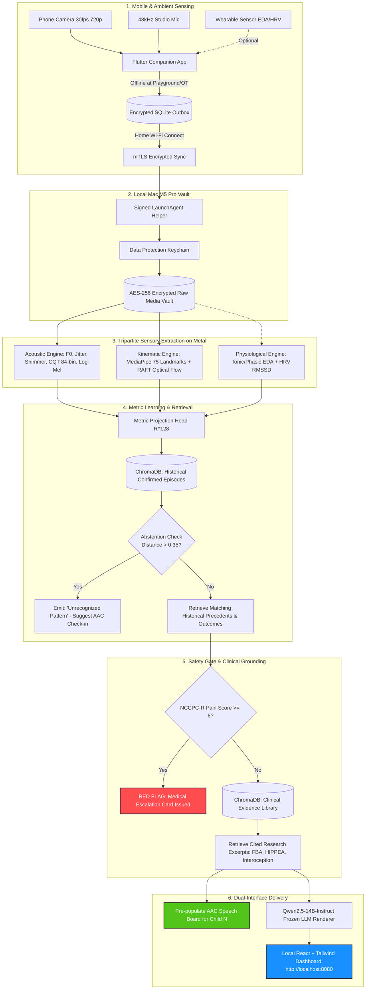
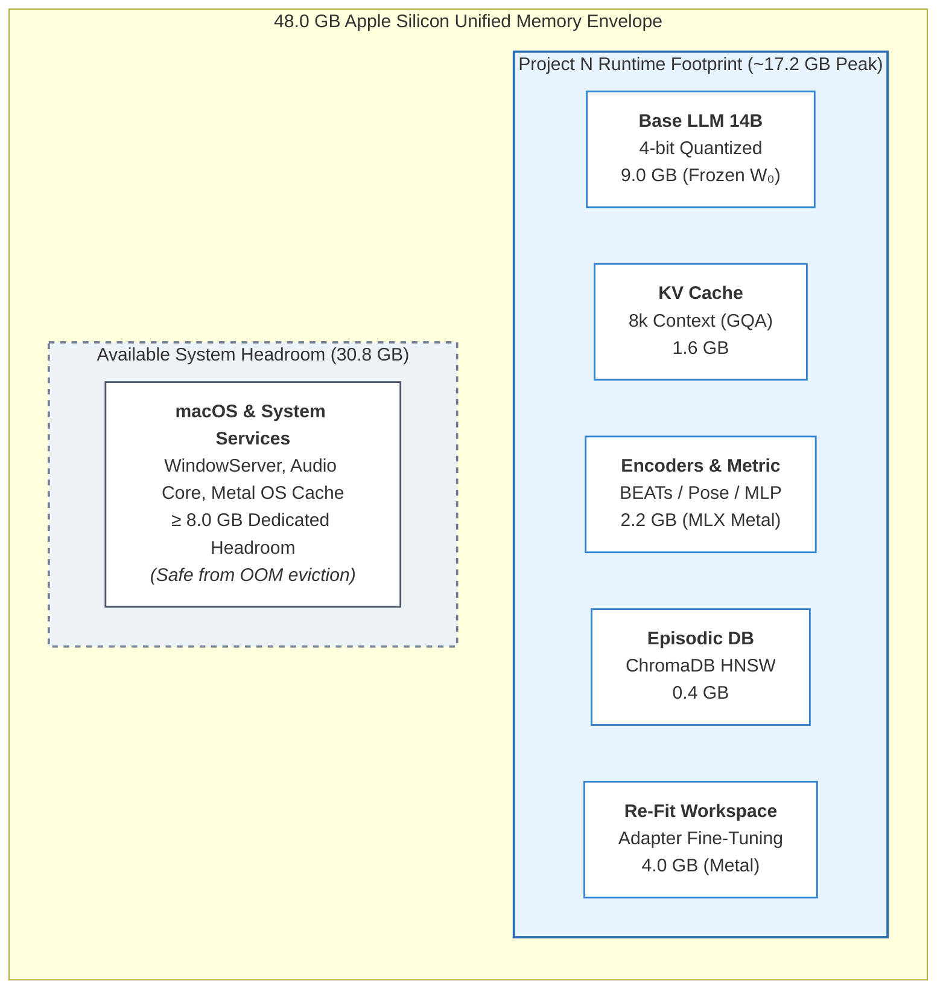

# Project N: Multimodal Communication Support & Behavioral Insight Pipeline

[-black?style=flat-square&logo=apple)](https://developer.apple.com/metal/)
[](https://github.com/ml-explore/mlx)
[-green?style=flat-square)]()
[]()
[]()
[](https://olostan.github.io/project_n/)

---

## A Note from the Founder

> *"I am [Valentyn Shybanov](https://olostan.me/), a software engineer and the father of Nolan, a 7-year-old completely non-verbal boy with Level 3 autism. Every single day, I experience the heartbreak and beauty of trying to understand my son. He has so much to say, but he cannot use spoken words. Nolan is non-verbal. Completely. His entire vocabulary is written in subtle vocal inflections, guttural tones, rapid hand movements, and physical rhythms.*
>
> *I started Project N not as a commercial product, not to make money, and not to promote a startup. I started it out of a father’s deep desire to understand his child. I want to dedicate my engineering experience, systems knowledge, and machine learning skills to build a free, open-source, local-first tool that can help parents like me and the therapists who dedicate their lives to these children.*
>
> *If you are a speech-language pathologist, an occupational therapist, an autism researcher, or an engineer who cares about non-verbal communication: I invite you with an open heart to review this work, critique it, and help us make it better."*
>
> — **Valentyn Shybanov** ([olostan.me](https://olostan.me/) · [GitHub](https://github.com/olostan))

---

## 1. Mission Statement & System Overview

**Project N is a 100% offline, privacy-preserving, child-authored communication-support assistant** engineered specifically for completely non-verbal neurodivergent children.

### What Makes Project N Different

1. **Acoustic Physics Without Words:** Level 3 non-verbal vocalizations are analyzed using high-resolution bioacoustic physics (fundamental frequency $F_0$ pitch tracking, jitter, shimmer, harmonic overtones via CQT, and glottal strain via CPP). The system matches acoustic signals directly to past verified episodes without forcing sounds into clumsy English descriptions.
2. **The Dyadic Transactional Loop:** Communication is not an isolated broadcast. Grounded in the **SCERTS framework** and the **Transactional Model of Communication**, the system models the interactive dance between the child and the adult communication partner (what the parent/therapist said, what physical scaffolding was offered, and how the child responded).
3. **Child Authorship via the AAC Bridge:** The system never speaks *for* the child. Candidate possibilities are dispatched to Child N's speech-generating device or AAC choice board as pre-populated icons for him to select, confirm, or reject.
4. **Medical Safety Gate (NCCPC-R):** Acute distress is evaluated using the validated 27-item Non-Communicating Children’s Pain Checklist – Revised, immediately triggering medical review escalations for physical pain (ear infections, dental abscesses, GI reflux).
5. **100% Offline & Two-Key Encrypted:** Runs locally on an Apple Silicon Mac (M5 Pro) with zero cloud network telemetry. Video and audio recordings are encrypted with unique per-clip keys.

---

## 2. Interactive Architecture Visualizations

### 2.1 The Dyadic Transactional Communication Loop
```mermaid
sequenceDiagram
    autonumber
    actor Child as Child N (Completely Non-Verbal)
    actor Partner as Communication Partner (Parent / SLP / OT)
    participant Engine as Project N Local Assistant (Apple Silicon)
    participant AAC as Child's AAC Speech Device

    Child->>Partner: Vocal inflection + rhythmic wrist stim (Natural bid)
    Note over Partner: Partner observes & scaffolds:<br/>"Do you need a sensory break?"
    Partner->>Engine: Captures episode via mobile app (or ambient camera)
    Engine->>Engine: Computes pitch contour (F0), pose landmarks & physiological arousal
    Engine->>Engine: Matches against Child N's historical verified episodes (128-dim metric space)
    Engine->>AAC: Dispatches candidate options ([Water], [Deep Pressure], [Quiet Break])
    Child->>AAC: Directly selects [Deep Pressure] icon
    AAC-->>Partner: Speaks aloud: "Deep Pressure"
    Partner->>Child: Provides weighted blanket / joint compression
    Note over Child,Partner: Regulation restored; latency & outcome logged
    Engine->>Engine: Stores child-confirmed resolution as ground truth
```

### 2.2 End-to-End System Ingestion & Processing Pipeline


---

## 3. Technology Stack Summary

| Component | Selected Technology | Architecture Rationale |
| :--- | :--- | :--- |
| **Machine Learning Core** | **Apple MLX 0.22+** | Native Metal Performance Shaders (MPS) running directly inside Apple Silicon unified memory. |
| **Backend Daemon** | **Python 3.11+ / FastAPI** | Zero-copy in-memory tensor access to MLX arrays. Eliminates IPC serialization bottlenecks. |
| **Caregiver Dashboard** | **React 18 + Tailwind CSS** | Local single-page application bundled with FastAPI. Zero cloud CDNs or external web tracking. |
| **Live Streaming Bus** | **Server-Sent Events (SSE)** | Sub-millisecond unidirectional event stream pushing live pipeline stages, unified memory telemetry, and text cards. |
| **Mobile Companion App** | **Flutter 3.24+ (Dart)** | Native cross-platform client for Android and iOS. Hardware-backed security via Android Keystore and iOS Keychain. |
| **Offline Mobile Outbox** | **SQLite (Encrypted)** | Captures clips at playgrounds, parks, and OT sessions without network, auto-flushing over mTLS upon returning home. |
| **Vector Database** | **ChromaDB (Persistent)** | Embedded HNSW cosine indexing for 128-dimensional metric vectors and 768-dimensional clinical literature chunks. |
| **Base Language Model** | **Qwen2.5-14B-Instruct** | 4-bit quantized format (~9.0 GB VRAM), 100% frozen (`model.freeze()`). Used strictly for schema-constrained rendering. |

---

## 4. Hardware Budget (Measured Envelope: ~17.2 GB)

Project N is engineered specifically for Apple Silicon hardware with 48 GB Unified Memory (parameterized for 64GB/128GB workstations).



---

## 5. Formal Documentation & Research Papers

- 📄 **[Scientific Whitepaper (`docs/WHITE_PAPER.md`)](https://github.com/olostan/project_n/blob/main/docs/WHITE_PAPER.md):** Formal clinical paper for Speech-Language Pathologists, OTs, and autism researchers explaining the dyadic transactional model, SCERTS framework, bioacoustics, and AAC authorship.
- 📋 **[Preregistered Evaluation Protocol (`docs/evaluation_protocol.md`)](https://github.com/olostan/project_n/blob/main/docs/evaluation_protocol.md):** Single-case (N-of-1) study design with leave-one-day-out splits, mandatory baselines B1–B4, and safety metrics.
- 📐 **[Technical Specifications (`SPECS.md`)](https://github.com/olostan/project_n/blob/main/SPECS.md):** Complete mathematical definitions, tensor shapes, REST endpoints, SSE event schemas, and executable MLX pseudo-code.
- 🧠 **[Theoretical Architecture & Design (`DESIGN.md`)](https://github.com/olostan/project_n/blob/main/DESIGN.md):** Detailed neurobiology, acoustic physics, pose kinematics, literature grounding, and continuous adaptation.
- 🛡️ **[System & Safety Invariants (`INVARIANTS.md`)](https://github.com/olostan/project_n/blob/main/INVARIANTS.md):** True non-negotiable invariants (100% offline, privacy vault, frozen LLM, medical rule-out) vs. tunable empirical defaults.
- 🤖 **[Agent Directives (`AGENTS.md`)](https://github.com/olostan/project_n/blob/main/AGENTS.md):** Engineering standards, MLX memory conventions, and mandatory documentation synchronization protocol.
