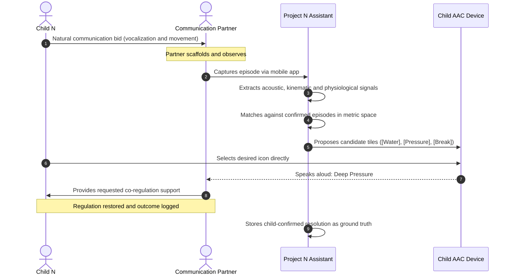

# Project N: Multimodal Communication Support & Behavioral Insight Pipeline

[-black?style=flat-square&logo=apple)](https://developer.apple.com/metal/)
[](https://github.com/ml-explore/mlx)
[-green?style=flat-square)]()
[]()
[]()
[](https://olostan.github.io/project_n/)

> [!IMPORTANT]
> 🌐 **Interactive Documentation & Scientific Research Website:**  
> **[https://olostan.github.io/project_n/](https://olostan.github.io/project_n/)**  
> *Explore interactive system diagrams, zoomable architectures, clinical evaluation protocols, and technical specifications.*

---

## A Note from the Founder

> *"I am [Valentyn Shybanov](https://olostan.me/), a software engineer and the father of Nolan, a 7-year-old completely non-verbal boy with Level 3 autism. Every single day, I experience the heartbreak and beauty of trying to understand my son. He has so much to say, but he cannot use spoken words. Nolan is non-verbal. Completely. His entire vocabulary is written in subtle vocal inflections, guttural tones, rapid hand movements, and physical rhythms.*
>
> *I started Project N not as a commercial product, not to make money, and not to promote a startup. I started it out of a father’s deep desire to understand his child. I want to dedicate my engineering experience, systems knowledge, and machine learning skills to build a free, open-source, local-first tool that can help parents like me and the therapists who dedicate their lives to these children.*
>
> *If you are a speech-language pathologist, an occupational therapist, an autism researcher, or an engineer who cares about non-verbal communication: I invite you with an open heart to review this work, critique it, and help us make it better."*
>
> — **Valentyn Shybanov** ([olostan.me](https://olostan.me/) · [GitHub](https://github.com/olostan))

---

## 1. Mission Statement & System Overview

**Project N is a 100% offline, privacy-preserving, child-authored communication-support assistant** engineered specifically for completely non-verbal neurodivergent children.

### What Makes Project N Different

1. **Acoustic Physics Without Words:** Level 3 non-verbal vocalizations are analyzed using high-resolution bioacoustic physics (fundamental frequency $F_0$ pitch tracking, jitter, shimmer, harmonic overtones via CQT, and glottal strain via CPP). The system matches acoustic signals directly to past verified episodes without forcing sounds into clumsy English descriptions.
2. **The Dyadic Transactional Loop:** Communication is not an isolated broadcast. Grounded in the **SCERTS framework** ([Prizant et al., 2006](https://olostan.github.io/project_n/WHITE_PAPER/#ref-11)) and the **Transactional Model of Communication** ([Sameroff, 1975](https://olostan.github.io/project_n/WHITE_PAPER/#ref-13); [Wetherby & Prizant, 2000](https://olostan.github.io/project_n/WHITE_PAPER/#ref-17)), the system models the interactive dance between the child and the adult communication partner (what the parent/therapist said, what physical scaffolding was offered, and how the child responded).
3. **Child Authorship via the AAC Bridge:** The system never speaks *for* the child. Candidate possibilities are dispatched to Child N's speech-generating device or AAC choice board as pre-populated icons for him to select, confirm, or reject.
4. **Medical Safety Gate (NCCPC-R):** Acute distress is evaluated using the validated 27-item Non-Communicating Children’s Pain Checklist – Revised ([Breau et al., 2002](https://olostan.github.io/project_n/WHITE_PAPER/#ref-2)), immediately triggering medical review escalations for physical pain (ear infections, dental abscesses, GI reflux).
5. **100% Offline & Two-Key Encrypted:** Runs locally on an Apple Silicon Mac (M5 Pro) with zero cloud network telemetry. Video and audio recordings are encrypted with unique per-clip keys.

---

## 2. The Dyadic Transactional Loop



---

## 3. Comprehensive Documentation & Research Portal

All detailed technical architectures, clinical protocols, interactive zoomable diagrams, and formal specifications are hosted on the interactive documentation portal:

| Document | Focus & Target Audience |
| :--- | :--- |
| [📄 **Scientific Whitepaper**](https://olostan.github.io/project_n/WHITE_PAPER/) | Clinical foundations, dyadic transactional model, SCERTS alignment, and bioacoustics for SLPs, OTs, and autism researchers. |
| [🧠 **Engineering Architecture**](https://olostan.github.io/project_n/design/) | Detailed theoretical design, sensory feature extraction, metric learning, episodic retrieval, and interactive diagrams. |
| [📐 **Technical Specifications**](https://olostan.github.io/project_n/specs/) | Mathematical definitions, tensor shapes, REST endpoints, SSE event streams, and UI layout wireframe. |
| [📋 **Evaluation Protocol**](https://olostan.github.io/project_n/evaluation_protocol/) | Single-case (N-of-1) study design, leave-one-day-out splits, locked safety holdouts, and model promotion criteria. |
| [🛡️ **System & Safety Invariants**](https://olostan.github.io/project_n/invariants/) | Non-negotiable safety rules: 100% offline boundary, zero cloud SDKs, frozen base LLM, and encrypted storage. |
| [🤖 **Autonomous Agent Directives**](https://olostan.github.io/project_n/agents/) | Development standards, Apple MLX memory management conventions, and documentation synchronization rules. |

---

## 4. Technology Stack At a Glance

| Layer | Technology | Role in Project N |
| :--- | :--- | :--- |
| **ML Engine** | **Apple MLX 0.22+** | Metal-accelerated sensory encoders, metric projection, and local inference. |
| **Backend Daemon** | **Python 3.11+ / FastAPI** | High-performance local server with zero-copy in-memory tensor access. |
| **Caregiver Dashboard** | **React 18 + Tailwind CSS** | Local web application bundled with FastAPI (zero external CDNs or trackers). |
| **Live Event Bus** | **Server-Sent Events (SSE)** | Unidirectional streaming of pipeline stages, memory telemetry, and cards. |
| **Mobile Client** | **Flutter 3.24+ (Dart)** | Cross-platform app (Android & iOS) with encrypted offline outbox for capture at playgrounds or OT sessions. |
| **Vector Storage** | **ChromaDB (Persistent)** | Embedded HNSW indexing for 128-dim metric embeddings and clinical RAG library. |
| **Base Language Model** | **Qwen2.5-14B-Instruct** | 4-bit quantized, 100% frozen model used strictly for schema-constrained rendering. |

---

## 5. Getting Started & Local Development

### Prerequisites

- **Hardware:** Apple Silicon Mac (M-series with 32 GB+ Unified Memory; 48 GB recommended).
- **Operating System:** macOS 14.0 (Sonoma) or newer.
- **Python Environment:** Python 3.11+ with [`uv`](https://github.com/astral-sh/uv) package manager.

### Serving Documentation Locally

To browse the complete documentation site with interactive diagrams, full-screen lightbox zoom, and search:

```bash
# Clone repository
git clone https://github.com/olostan/project_n.git
cd project_n

# Serve documentation with live reload
uv run --with mkdocs --with mkdocs-material mkdocs serve
```

Then open `http://localhost:8000` in your web browser.

### Project Roadmap & Implementation Status

Project N is currently in **Phase 1 (Multimodal Feature Extraction & Ingestion Foundations)**:
- [x] Scientific rationale, clinical dyadic foundations, and whitepaper published.
- [x] Architecture, system invariants, and technical specifications formalized.
- [x] Preregistered evaluation protocol and safety promotion gates established.
- [ ] Phase 1: Local Mac backend daemon (FastAPI), encrypted vault, and acoustic feature pipeline.
- [ ] Phase 2: Metric projection head, episodic prototype retrieval, and ChromaDB integration.
- [ ] Phase 3: Flutter companion app with offline outbox and pairing.
- [ ] Phase 4: Local React dashboard and AAC integration.
- [ ] Phase 5: Controlled clinical trial and N-of-1 prospective evaluation.

