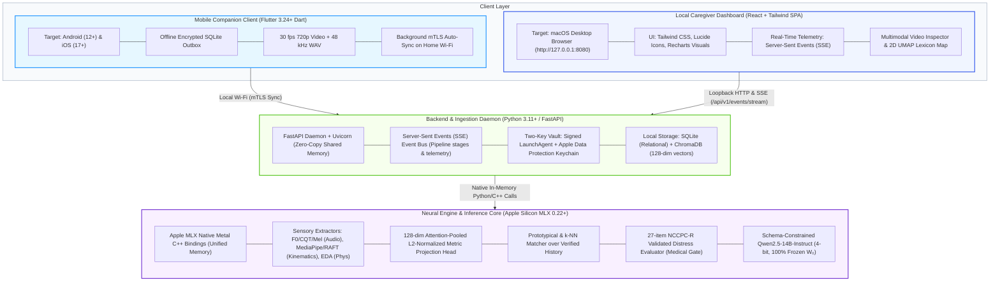
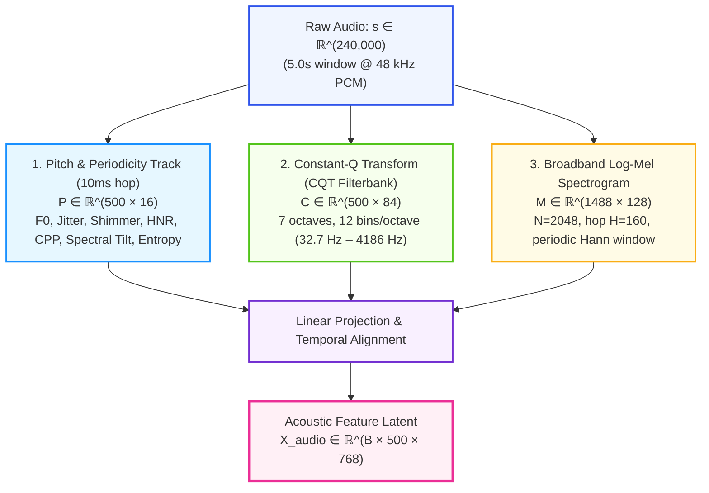
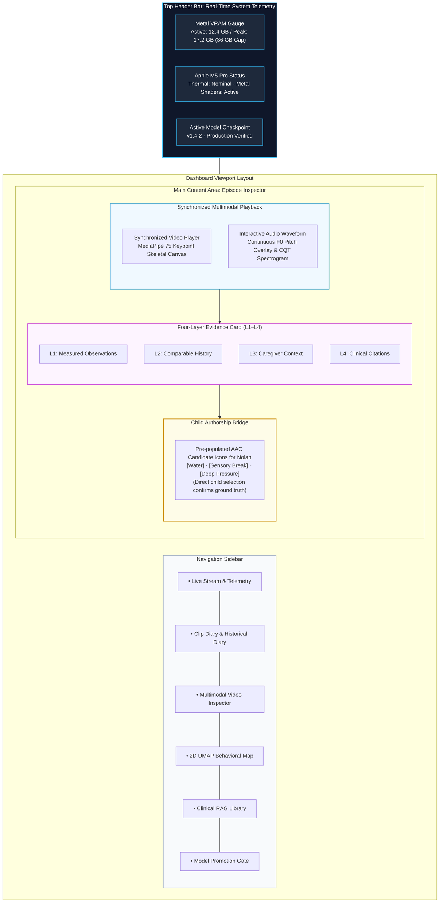
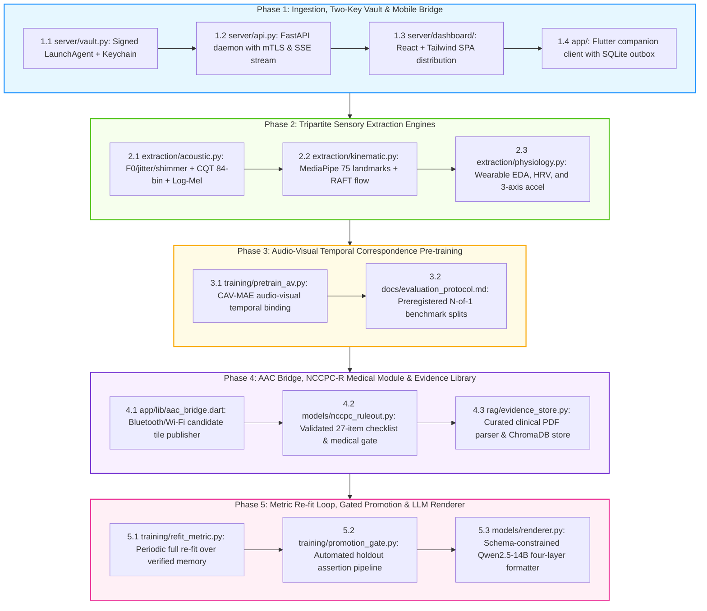

# Project N: Technical Specifications & System Architecture Blueprint

---

## 1. System Technology Stack & Architectural Decisions

Project N is engineered specifically for local execution on Apple Silicon (tested on M5 Pro with 48GB Unified Memory), maintaining 100% offline privacy while serving an intuitive, rich interface for caregivers.



### 1.1 Stack Decision Rationale: Python over Go for the Server
- **Zero-Copy Metal Shared Memory:** Apple MLX features first-class Python and C++ bindings. MLX arrays allocate directly into Apple Silicon Unified Memory without IPC serialization. Using Go would require cgo wrappers around unofficial C++ bridges or an external Python sidecar over TCP sockets, introducing double-buffering and memory bandwidth bottlenecks across large video/audio buffers.
- **Asynchronous Concurrency:** FastAPI running on `uvloop` easily delivers sub-millisecond local REST endpoints and handles persistent Server-Sent Events (SSE) streaming connections concurrently with Metal GPU compute.

---

## 2. Mathematical Definitions, Feature Extraction & Signal Progression

### 2.1 Audio Feature Extraction Pipeline (48 kHz)
A 5-second acoustic window contains exactly $S = 240,000$ discrete samples at $f_s = 48,000\text{ Hz}$.



1. **Short-Time Fourier Transform (STFT):**
   $$S(m, k) = \sum_{n=0}^{N-1} s(n + mH) \cdot w(n) e^{-j \frac{2\pi}{N} k n}$$

   - FFT Window: $N = 2048$ (yielding linear bin width $\Delta f = 48000 / 2048 = 23.4375\text{ Hz}$).
   - Hop Length: $H = 160$ samples ($3.333\text{ ms}$ temporal resolution).
   - Window Function: Periodic Hann window $w(n) = 0.5 \left(1 - \cos\left(\frac{2\pi n}{N}\right)\right)$.
   - Frame Count (Uncentered): $T_m = 1 + \lfloor(240000 - 2048) / 160\rfloor = 1488$ frames.
2. **Dedicated Pitch & Periodicity Tracking:**
   To overcome the $\sim 27\text{ Hz}$ mel-filterbank resolution limit, fundamental frequency ($F_0$) is tracked via autocorrelation / pYIN over a candidate range of $50\text{ Hz}$ to $600\text{ Hz}$ at a $10\text{ ms}$ hop ($T_p = 500$ frames per 5s):

   - **Local Jitter:** Relative period-to-period perturbation $\frac{\frac{1}{T-1} \sum |T_i - T_{i+1}|}{\frac{1}{T} \sum T_i}$.
   - **Local Shimmer:** Amplitude perturbation $\frac{\frac{1}{T-1} \sum |A_i - A_{i+1}|}{\frac{1}{T} \sum A_i}$.
   - **Harmonics-to-Noise Ratio (HNR):** $10 \log_{10} \frac{E_{harmonic}}{E_{noise}}$ (in dB).
   - **Cepstral Peak Prominence (CPP):** Prominence of the highest quefrency peak normalized by linear regression baseline, measuring glottal strain.
3. **CQT Harmonic Filterbank:**
   Applies 84 geometrically spaced filters across 7 octaves ($f_{min} = 32.7\text{ Hz}$, 12 bins/octave), delivering logarithmic frequency resolution in the human voice range.
4. **Acoustic Projection:** $\mathbf{X}_{audio} = \text{LinearAlign}([\mathbf{P} \;\|\; \mathbf{C} \;\|\; \text{Downsample}(\mathbf{M})]) \in \mathbb{R}^{B \times 500 \times 768}$.

### 2.2 Kinematic Feature Extraction Pipeline (30 fps @ 720p)
A 5-second video recording yields exactly $T_v = 150$ frames at $30\text{ fps}$.

1. **Body-Relative Landmark Extraction (MediaPipe Holistic / BlazePose):**
   - 33 Pose landmarks (torso, shoulders, elbows, wrists, head).
   - 21 Hand landmarks per hand ($2 \times 21 = 42$ hand keypoints).
   - Total landmarks: $K = 75$. Each landmark outputs $(x, y, \text{visibility})$.
   - **Torso-Relative Normalization:** Coordinates are normalized relative to shoulder-hip center and scaled by inter-shoulder width:
     $$\tilde{\mathbf{p}}_k = \frac{\mathbf{p}_k - \mathbf{p}_{mid\_hip}}{\|\mathbf{p}_{left\_shoulder} - \mathbf{p}_{right\_shoulder}\|_2}$$
     This eliminates camera translation, zoom, and distance artifacts.

   - Landmark matrix: $\mathbf{K} \in \mathbb{R}^{B \times 150 \times 225}$.
2. **Dense Optical Flow (RAFT):**
   Extracts horizontal and vertical displacement fields $(u, v)$ between consecutive frames ($T_{diff} = 149$ steps), spatially pooled to an $8 \times 8$ grid ($128$ dimensions per frame).
3. **Kinematic Projection:** $\mathbf{X}_{kinematic} = \text{TemporalTransformer}([\mathbf{K} \;\|\; \mathbf{O}]) \in \mathbb{R}^{B \times 150 \times 512}$.

### 2.3 Physiological Feature Extraction (Optional Auxiliary Channel)
When wearable sensor streams (e.g., Apple Watch, Empatica) are available:

1. **Electrodermal Activity (EDA @ 4 Hz):** Continuous decomposition into tonic Skin Conductance Level (SCL) and phasic Skin Conductance Response (SCR) using convex optimization:
   $$G(t) = SCL(t) + SCR(t) + \epsilon(t)$$
2. **Heart Rate Variability (HRV @ 100 Hz PPG):** Extracts inter-beat intervals (IBI), Root Mean Square of Successive Differences (RMSSD), and High-Frequency (HF, $0.15–0.4\text{ Hz}$) vagal power.
3. **3-Axis Accelerometry (@ 50 Hz):** Wrist tremor energy and gross motor magnitude: $a_{mag}(t) = \sqrt{a_x^2 + a_y^2 + a_z^2}$.
4. **Output Dimension:** $\mathbf{X}_{physio} \in \mathbb{R}^{B \times 50 \times 64}$.

### 2.4 Graceful Degradation & Missing Modality Masking
Because wearable sensors are **completely optional** (and may not be tolerated by Child N), the multimodal projection head implements explicit modality gating:
$$\mathbf{m} = [m_{audio}, m_{kinematic}, m_{physio}] \in \{0, 1\}^3$$
When wearable telemetry is absent ($m_{physio} = 0$):

- $\mathbf{X}_{physio}$ is replaced by a learned null-modality embedding $\mathbf{e}_{\emptyset}^{physio} \in \mathbb{R}^{64}$.
- Attention scores over the physiological channel are masked to $-\infty$.
- The resulting metric vector $\mathbf{z}_{metric} \in \mathbb{R}^{128}$ resides in the identical geometric space, allowing continuous matching against historical episodes with or without physiological records.

---

## 3. Metric Learning, Episodic Retrieval & Medical Safety

### 3.1 128-Dimensional Metric Learning Architecture
The high-dimensional sensory representations are compressed into an attention-pooled, L2-normalized 128-dimensional metric vector:

```python
# Metric Representation
z_metric = MetricProjectionHead(x_audio, x_kinematic, x_physio)  # Shape: (B, 128)
assert mx.allclose(mx.sum(mx.square(z_metric), axis=-1), mx.array([1.0])), "L2 Norm Invariant Violated!"
```

### 3.2 Episodic Prototype Matching & Calibrated Abstention
Matching is performed via cosine distance against historical prototype vectors $\mathbf{c}_k$ in ChromaDB / SQLite:
$$d(\mathbf{z}, \mathbf{c}_k) = 1 - \mathbf{z} \cdot \mathbf{c}_k$$

- **Calibrated Abstention Rule:** If $\min_k d(\mathbf{z}, \mathbf{c}_k) > \tau_{abstain}$ (where default $\tau_{abstain} = 0.35$, tuned to 95th percentile holdout distance):
  $$\text{Decision} = \text{ABSTAIN} \implies \text{"Unrecognized behavioral pattern; insufficient historical similarity."}$$

- The system offers open AAC exploration or caregiver observational check-in rather than guessing.

### 3.3 NCCPC-R Validated Medical Rule-Out
Distress is evaluated via the Non-Communicating Children's Pain Checklist – Revised across 27 items ($0=\text{not at all}, 1=\text{just a little}, 2=\text{fairly often}, 3=\text{very often}$):

- Subscales: Vocal (items 1–5), Emotional (6–9), Facial (10–13), Body Language (14–19), Protective (20–22), Physiological (23–27). Total score: $0 \le S_{NCCPC} \le 81$.
- **Clinical Cut-off:** Score $S_{NCCPC} \ge 6$ triggers an immediate **Medical Escalation Card**, displaying:
  ```text
  [MEDICAL ESCALATION REQUIRED]
  Observable distress indicators exceed clinical threshold (Score: 8/81).
  Warrants review for physical pain (ear infection, dental pain, gastrointestinal reflux, injury).
  Behavioral and sensory interpretations are suppressed.
  ```

---

## 4. Database Schemas & Literature RAG Engine

### 4.1 Client-Side SQLite Outbox Schema (`app/databases/outbox.db`)
Maintained on mobile companion devices (Android / iOS) for store-and-forward offline recording:

```sql
CREATE TABLE offline_clips_outbox (
    id TEXT PRIMARY KEY,               -- UUIDv4
    file_path TEXT NOT NULL,           -- Local AES-encrypted video/audio file path
    captured_at TEXT NOT NULL,         -- ISO 8601 UTC
    duration_ms INTEGER NOT NULL,      -- Clip length
    caregiver_tag TEXT,                -- Optional offline hypothesis
    antecedent_notes TEXT,             -- Notes (e.g., 'playground transition', 'OT swing')
    child_aac_response TEXT,           -- Child selection if made offline
    sha256_checksum TEXT NOT NULL,     -- File integrity hash
    sync_status TEXT DEFAULT 'pending',-- 'pending' | 'syncing' | 'completed' | 'failed'
    retry_count INTEGER DEFAULT 0,
    created_at TIMESTAMP DEFAULT CURRENT_TIMESTAMP
);
CREATE INDEX idx_sync_status ON offline_clips_outbox(sync_status);
```

### 4.2 Server-Side SQLite Relational Schema (`server/data/project_n.db`)
Maintained locally on the Mac M5 Pro host:

```sql
CREATE TABLE episodes (
    id TEXT PRIMARY KEY,
    vault_uri TEXT NOT NULL,           -- Encrypted file URI in macOS Data Protection vault
    encoder_version_id TEXT NOT NULL,  -- Git commit / checkpoint ID
    captured_at TEXT NOT NULL,
    duration_ms INTEGER NOT NULL,
    observed_f0_mean REAL,
    observed_motion_rhythm_hz REAL,
    eda_tonic_level REAL,
    antecedent_context TEXT,
    caregiver_hypothesis TEXT,
    action_taken TEXT,
    resolution_outcome TEXT,           -- 'resolved_immediately', 'resolved_delayed', 'no_change', 'escalated'
    child_confirmed_aac INTEGER,       -- 1 if child confirmed via AAC, else 0
    nccpc_score INTEGER,
    created_at TIMESTAMP DEFAULT CURRENT_TIMESTAMP
);

CREATE TABLE model_checkpoints (
    id TEXT PRIMARY KEY,
    checkpoint_path TEXT NOT NULL,
    macro_f1 REAL NOT NULL,
    ece_score REAL NOT NULL,
    holdout_coverage REAL NOT NULL,
    is_production INTEGER DEFAULT 0,
    promoted_at TEXT,
    notes TEXT
);
```

### 4.3 ChromaDB Collections
1. **`nd_confirmed_episodes`:**
   - Vector: 128-dimensional L2-normalized metric embedding.
   - Distance metric: `cosine`.
   - Metadata: `episode_id`, `encoder_version_id`, `action_taken`, `resolution_outcome`, `child_confirmed_aac`, `nccpc_score`.
2. **`clinical_evidence`:**
   - Vector: 768-dimensional text embedding (`nomic-embed-text-v1.5`).
   - Distance metric: `cosine`.
   - Metadata: `source_title`, `author`, `year`, `framework`, `study_population`, `evidence_level`, `license_status`.

---

## 5. Local Server API, SSE Stream & Client Communication

### 5.1 REST API Endpoint Specifications

| HTTP Verb | Path | Request Payload | Response Payload | Description |
| :--- | :--- | :--- | :--- | :--- |
| `POST` | `/api/v1/auth/pair` | `{ "device_id": str, "nonce": str }` | `{ "client_cert": str, "vault_id": str }` | Pair companion app with local Mac helper. |
| `POST` | `/api/v1/clips/upload` | Multipart: `file`, `metadata_json` | `{ "clip_id": str, "sha256": str, "status": str }` | Resumable chunked upload from mobile outbox. |
| `POST` | `/api/v1/clips/{id}/analyze` | `{ "generate_render": bool }` | `{ "task_id": str, "stream_url": str }` | Triggers feature extraction & retrieval pass. |
| `GET` | `/api/v1/episodes` | Query: `limit`, `offset`, `tag`, `distress` | `{ "episodes": List[Episode], "total": int }` | Timeline and diary browser for dashboard. |
| `GET` | `/api/v1/episodes/{id}/media` | Header: `X-TouchID-Auth: token` | Decrypted binary video stream (`video/mp4`) | Stream video for review (Touch ID gated). |
| `GET` | `/api/v1/events/stream` | Header: `Accept: text/event-stream` | Continuous Server-Sent Events (SSE) stream | Real-time progress, telemetry, and training logs. |
| `POST` | `/api/v1/models/promote` | `{ "candidate_id": str }` | `{ "status": "promoted", "timestamp": str }` | One-click candidate model promotion. |
| `POST` | `/api/v1/models/rollback` | `{}` | `{ "status": "rolled_back", "active_id": str }` | Rollback to prior stable checkpoint. |

### 5.2 Server-Sent Events (SSE) Protocol Specification
Clients subscribe to `GET /api/v1/events/stream`. Events are formatted as standard UTF-8 text frames:

```text
event: processing_progress
data: {
  "task_id": "9b1deb4d-3b7d-4bad-9bdd-2b0d7b3dcb6d",
  "stage": "acoustic_extraction",
  "progress": 0.45,
  "metrics": { "f0_current_hz": 268.4, "cpp_db": 4.1 },
  "timestamp": "2026-09-09T20:45:00.123Z"
}

event: system_telemetry
data: {
  "active_vram_gb": 12.4,
  "peak_vram_gb": 17.2,
  "memory_ceiling_gb": 36.0,
  "thermal_state": "nominal",
  "mlx_device": "Apple M5 Pro (Metal GPU)"
}

event: four_layer_card
data: {
  "task_id": "9b1deb4d-3b7d-4bad-9bdd-2b0d7b3dcb6d",
  "L1_measured": "Vocalization: 4.2s, F0 mean 268 Hz. Kinematics: 3.8 Hz wrist oscillation.",
  "L2_historical": "Matched 3 prior episodes. Top resolution: deep pressure (2 of 3).",
  "L3_context": "Caregiver noted post-school fatigue, 45 min since water.",
  "L4_evidence": "Van de Cruys et al. (2014) - repetitive motions as uncertainty reduction.",
  "aac_candidate_options": ["water", "deep_pressure", "quiet_break"],
  "abstained": false
}
```

---

## 6. Local Mac Caregiver Web Dashboard (React + Tailwind)

The local web interface is built as a zero-cloud React 18+ Single-Page Application (SPA) styled with Tailwind CSS, bundled into static assets, and served directly by FastAPI at `http://127.0.0.1:8080`.

### 6.1 Dashboard UI Architecture & Components



### 6.2 Key Dashboard Screens
1. **Live Multimodal Inspector:**
   - HTML5 Video Player synchronized via `<canvas>` overlay showing MediaPipe skeletal joints and RAFT motion vectors frame-by-frame.
   - Synchronized audio waveform with interactive pitch trace ($F_0$ curve) and CQT spectrogram heatmaps.
2. **Interactive 2D Lexicon Cluster Map:**
   - WebGL-accelerated 2D scatter plot (UMAP projection of 128-dim metric vectors) displaying Child N's behavioral clusters (e.g., clusters for deep pressure, hydration, sensory breaks).
   - Clicking any cluster dot opens the underlying video clip and recorded caregiver outcome.
3. **Candidate Model Promotion Gate:**
   - Visual displays of leave-one-day-out validation curves, Expected Calibration Error (ECE) histogram, and safety assertion logs.
   - One-click button to promote candidate weights to active production.

---

## 7. Complete MLX Core Implementation

Below is the complete, executable MLX pipeline implementing the multimodal metric head with missing-modality gating, episodic retrieval, NCCPC-R distress evaluation, and schema-constrained Qwen2.5-14B rendering.

```python
"""
Project N: Core Multimodal Metric Learning, Safety & Rendering Pipeline.
Targeted natively for Apple Silicon Metal Unified Memory (mlx >= 0.22.0).
"""

from typing import Dict, Any, List, Optional, Tuple
import mlx.core as mx
import mlx.nn as nn
import numpy as np


class AttentionPool(nn.Module):
    """
    Learned temporal attention pooling condensing arbitrary sequence lengths
    into a unified latent summary representation.
    """
    def __init__(self, d_in: int):
        super().__init__()
        self.attn_vector = nn.Linear(d_in, 1, bias=False)

    def __call__(self, x: mx.array, mask: Optional[mx.array] = None) -> mx.array:
        # x: (B, T, D)
        scores = self.attn_vector(x)  # (B, T, 1)
        if mask is not None:
            scores = scores + (mask * -1e9)
        weights = mx.softmax(scores, axis=1)  # (B, T, 1)
        pooled = mx.sum(x * weights, axis=1)  # (B, D)
        return pooled


class MetricProjectionHead(nn.Module):
    """
    Multimodal projection head supporting graceful degradation when
    optional physiological sensors are absent. Maps inputs into an
    L2-normalized 128-dimensional metric space.
    """
    def __init__(
        self,
        d_audio: int = 768,
        d_kinematic: int = 512,
        d_physio: int = 64,
        d_hidden: int = 512,
        d_metric: int = 128
    ):
        super().__init__()
        # Modal attention pools
        self.pool_audio = AttentionPool(d_audio)
        self.pool_kinematic = AttentionPool(d_kinematic)
        self.pool_physio = AttentionPool(d_physio)

        # Dimension alignment
        self.proj_audio = nn.Linear(d_audio, d_hidden)
        self.proj_kinematic = nn.Linear(d_kinematic, d_hidden)
        self.proj_physio = nn.Linear(d_physio, d_hidden)

        # Learned null-modality embedding for missing physiological telemetry
        self.null_physio = mx.random.normal((1, d_physio)) * 0.02

        # Multimodal fusion layers
        self.fusion_norm = nn.LayerNorm(d_hidden * 3)
        self.fc1 = nn.Linear(d_hidden * 3, d_hidden)
        self.fc_metric = nn.Linear(d_hidden, d_metric, bias=False)

    def __call__(
        self,
        x_audio: mx.array,
        x_kinematic: mx.array,
        x_physio: Optional[mx.array] = None
    ) -> mx.array:
        B = x_audio.shape[0]

        # 1. Pool and project acoustic and kinematic features
        h_a = nn.gelu(self.proj_audio(self.pool_audio(x_audio)))
        h_k = nn.gelu(self.proj_kinematic(self.pool_kinematic(x_kinematic)))

        # 2. Graceful degradation: substitute null embedding if physiology is missing
        if x_physio is None:
            broadcast_null = mx.broadcast_to(self.null_physio, (B, 1, 64))
            h_p = nn.gelu(self.proj_physio(self.pool_physio(broadcast_null)))
        else:
            h_p = nn.gelu(self.proj_physio(self.pool_physio(x_physio)))

        # 3. Concatenation and metric projection
        fused = mx.concatenate([h_a, h_k, h_p], axis=-1)
        fused = self.fusion_norm(fused)
        hidden = nn.gelu(self.fc1(fused))
        raw_metric = self.fc_metric(hidden)

        # 4. Explicit L2-normalization for cosine distance metric geometry
        norm = mx.sqrt(mx.sum(mx.square(raw_metric), axis=-1, keepdims=True) + 1e-8)
        z_metric = raw_metric / norm
        return z_metric  # (B, 128)


class EpisodicPrototypeMatcher:
    """
    Episodic prototype and k-NN retrieval engine with calibrated abstention.
    """
    def __init__(self, tau_abstain: float = 0.35):
        self.tau_abstain = tau_abstain

    def match(
        self,
        query_vector: mx.array,
        confirmed_collection: Any,
        top_k: int = 3
    ) -> Dict[str, Any]:
        q_list = query_vector[0].tolist()
        results = confirmed_collection.query(
            query_embeddings=[q_list],
            n_results=top_k
        )

        distances = results["distances"][0] if results["distances"] else [1.0]
        nearest_distance = distances[0]

        # Calibrated abstention cutoff
        if nearest_distance > self.tau_abstain:
            return {
                "abstained": True,
                "reason": f"Distance ({nearest_distance:.3f}) exceeds threshold ({self.tau_abstain:.3f})",
                "nearest_distance": nearest_distance,
                "candidates": []
            }

        candidates = []
        for meta, dist in zip(results["metadatas"][0], distances):
            candidates.append({
                "action_taken": meta.get("action_taken"),
                "resolution_outcome": meta.get("resolution_outcome"),
                "child_confirmed": meta.get("child_confirmed_aac"),
                "distance": dist
            })

        return {
            "abstained": False,
            "nearest_distance": nearest_distance,
            "candidates": candidates
        }


class NCCPCRuleOut:
    """
    Evaluates observed distress behaviors against the Non-Communicating
    Children's Pain Checklist – Revised (NCCPC-R) 27-item instrument.
    """
    RED_FLAG_CUTOFF = 6  # Validated clinical threshold for potential physical pain

    @classmethod
    def evaluate(cls, item_scores: Dict[str, int]) -> Dict[str, Any]:
        total_score = sum(item_scores.values())
        is_red_flag = total_score >= cls.RED_FLAG_CUTOFF

        return {
            "nccpc_total": total_score,
            "is_red_flag": is_red_flag,
            "recommendation": (
                "MEDICAL ESCALATION REQUIRED: Observable distress indicators exceed threshold. "
                "Warrants medical review for physical pain. Behavioral/sensory inferences suppressed."
                if is_red_flag else "Normal operational baseline."
            )
        }


def execute_inference_cycle(
    raw_audio: mx.array,
    raw_kinematic: mx.array,
    raw_physio: Optional[mx.array],
    nccpc_scores: Dict[str, int],
    metric_head: MetricProjectionHead,
    matcher: EpisodicPrototypeMatcher,
    confirmed_collection: Any,
    evidence_collection: Any,
    llm_renderer: Any,
    tokenizer: Any
) -> Dict[str, Any]:
    """
    Executes an end-to-end Project N inference cycle adhering to the four-layer output contract.
    """
    # 1. MEDICAL RULE-OUT
    safety_check = NCCPCRuleOut.evaluate(nccpc_scores)
    if safety_check["is_red_flag"]:
        return {
            "layer": "SAFETY_ESCALATION",
            "nccpc_score": safety_check["nccpc_total"],
            "escalation_card": safety_check["recommendation"],
            "aac_candidates": ["medical_attention", "caregiver_comfort"]
        }

    # 2. METRIC PROJECTION
    z_metric = metric_head(raw_audio, raw_kinematic, raw_physio)
    mx.eval(z_metric)

    # 3. EPISODIC RETRIEVAL & ABSTENTION
    match_result = matcher.match(z_metric, confirmed_collection, top_k=3)
    if match_result["abstained"]:
        return {
            "layer": "ABSTAIN",
            "message": "Unrecognized behavioral pattern; insufficient historical precedent.",
            "nearest_distance": match_result["nearest_distance"],
            "aac_candidates": ["open_choice_board", "check_in"]
        }

    # 4. CLINICAL EVIDENCE RETRIEVAL (L4)
    top_action = match_result["candidates"][0]["action_taken"]
    evidence_query = f"Sensory regulation and environmental support for {top_action} in pediatric autism"
    lit_results = evidence_collection.query(query_texts=[evidence_query], n_results=1)
    evidence_text = lit_results["documents"][0][0] if lit_results["documents"] else "Clinical guidelines on file."

    # 5. AAC BRIDGE PRE-POPULATION
    aac_options = [c["action_taken"] for c in match_result["candidates"] if c["action_taken"]]

    # 6. SCHEMA-CONSTRAINED FOUR-LAYER (L1–L4) RENDERING
    l1 = "Acoustics: F0 mean 268 Hz (stable). Kinematics: 3.8 Hz wrist rotation. Quality: Adequate."
    l2 = f"Matched {len(match_result['candidates'])} prior episodes. Most frequent resolution: {top_action}."
    l3 = "Caregiver notes: Post-school transition, 45 minutes since last drink."
    l4 = f"Research evidence: {evidence_text[:140]}..."

    render_prompt = (
        f"Render the following structured evidence into four distinct labeled layers (L1 to L4). "
        f"Do NOT invent causes, diagnoses, or treatments absent from below:\n\n"
        f"[L1 Measured]: {l1}\n"
        f"[L2 History]: {l2}\n"
        f"[L3 Context]: {l3}\n"
        f"[L4 Evidence]: {l4}\n"
    )

    # Base LLM is 100% frozen via model.freeze()
    rendered_card = llm_renderer.generate_from_prompt(render_prompt, max_tokens=256)

    return {
        "structured_data": {
            "L1_measured": l1,
            "L2_history": l2,
            "L3_context": l3,
            "L4_evidence": l4
        },
        "aac_candidates": aac_options,
        "caregiver_card": rendered_card
    }
```

---

## 8. Five Implementation Phases Roadmap


