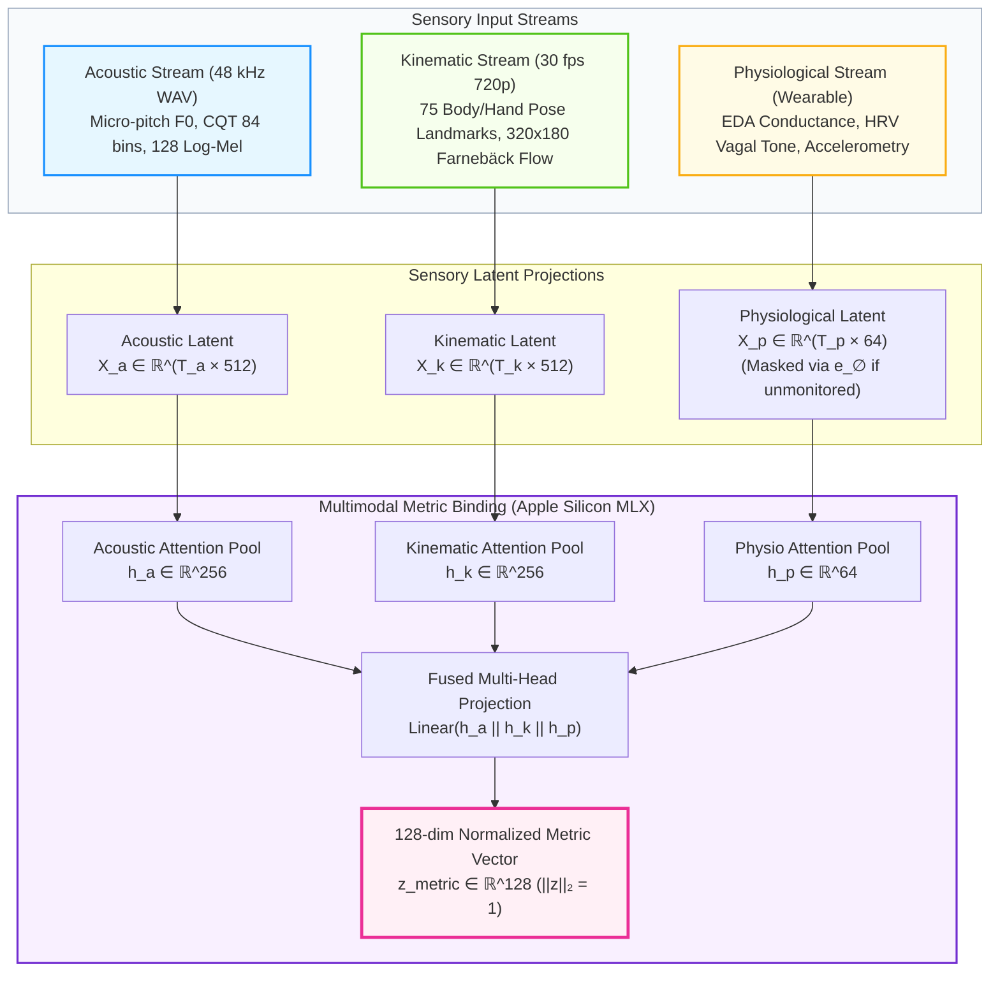
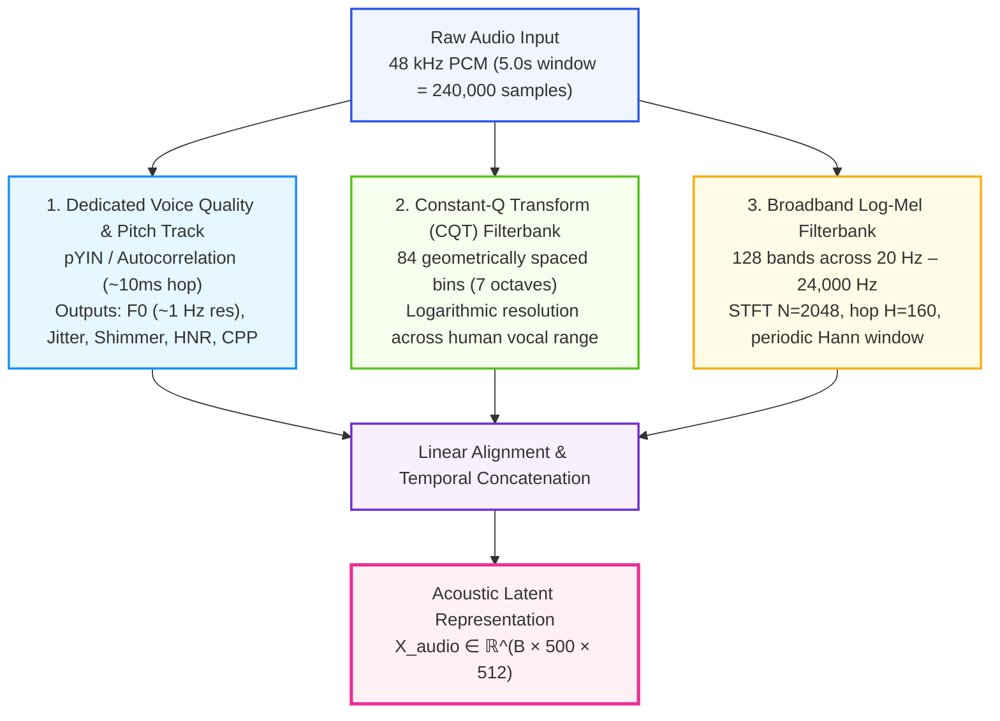
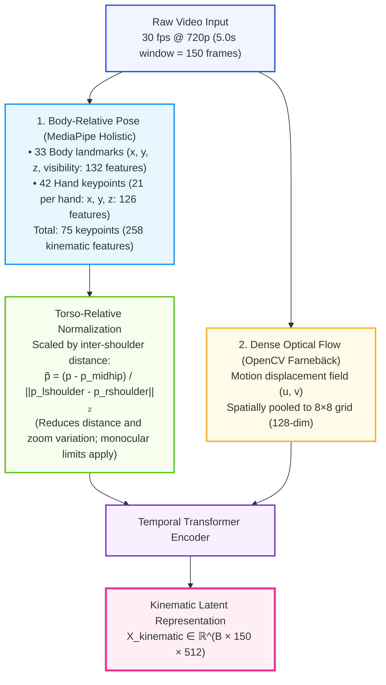
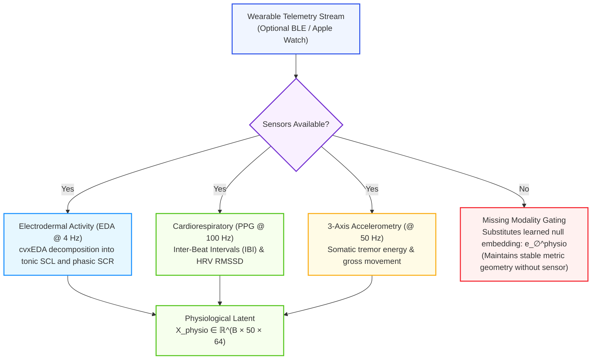
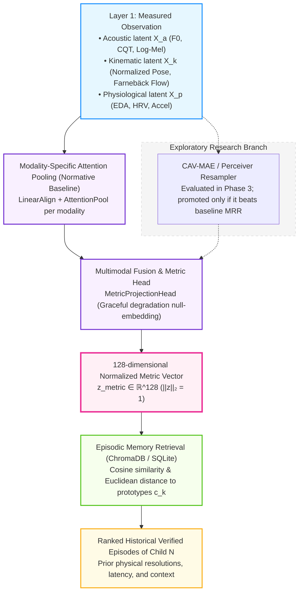
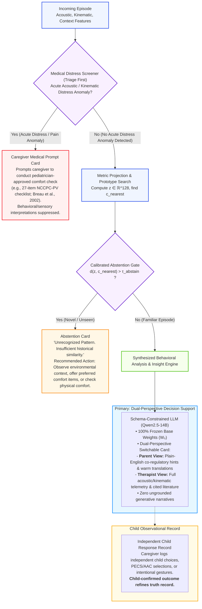
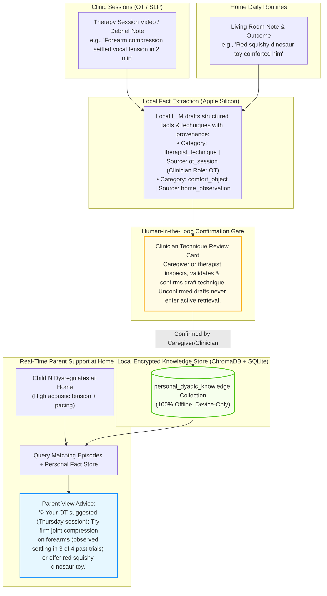
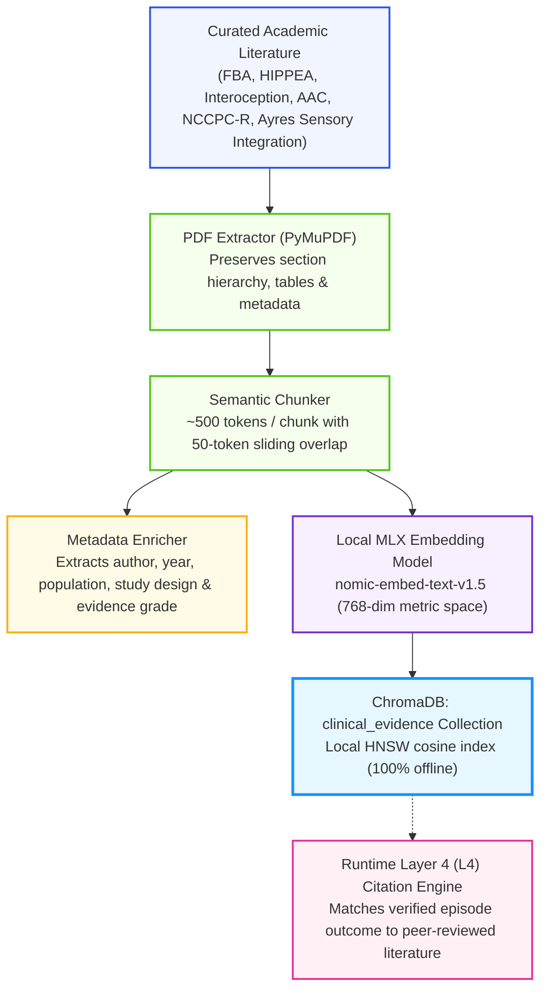

# Project N: Architectural, Neurobiological & Systems Engineering Design Document

---

## 1. Biological and Neurological Foundations

### 1.1 Neurobiology & Communication in Non-Verbal Individuals
Autism Spectrum Disorder (ASD) encompasses heterogeneous neurodevelopmental profiles. For non-verbal children—specifically conceptualized around Child N, a 7-year-old completely non-verbal autistic boy—expressive spoken language is absent. Childhood apraxia of speech (CAS), atypical oral-motor coordination, or motor-planning challenges frequently co-occur, dissociating cognitive capacity from phonetic articulation.

Crucially, **the absence of verbal speech does not indicate the absence of language, cognition, agency, or communicative intent**. The scientific grounding for Project N rests on several foundational principles:

- **Heterogeneous Connectivity Profiles:** Classical models proposed local hyper-connectivity coupled with long-range hypo-connectivity. Contemporary neuroimaging indicates that functional and structural connectivity alterations are highly heterogeneous; long-range underconnectivity is reasonably supported, while local microcircuit hyper-reactivity varies widely across individuals. Project N rejects one-size-fits-all neurological assumptions, adopting an individualized (N-of-1) measurement posture.
- **Sensorimotor & Cerebellar Coordination:** Group-level post-mortem and imaging studies show morphological variations in cerebellar Purkinje cells, which contribute to predictive motor sequencing and sensorimotor integration. However, attributing specific internal cerebellar mechanics to an individual child from a video clip is an unlicensed causal jump. Project N treats motor differences as observable kinematic patterns rather than direct indicators of neural circuit failure.
- **Autonomic Regulation & Objective Physiological States:** Autonomic nervous system (ANS) tone—including sympathetic arousal and vagal modulation—fluctuates in response to sensory demands. However, respiratory sinus arrhythmia (RSA) and vagal tone findings in autism are complex and non-uniform. Inferring autonomic hyper-arousal solely from surface movement or acoustic volume is circular; an objective assessment requires direct physiological sensing (electrodermal activity, heart rate variability, and accelerometry).

### 1.2 Sensory Processing Differences & Stimming Functions
Sensory processing in autistic individuals frequently diverges across auditory, proprioceptive, vestibular, and tactile domains:

1. **Proprioceptive & Vestibular Seeking:** Atypical sensory threshold gating can lead individuals to seek intense vestibular or proprioceptive input to achieve somatic equilibrium (e.g., rhythmic rocking, vertical jumping, or rapid hand/wrist stimming).
2. **Auditory Hyper-Reactivity & Gating Differences:** Thalamocortical gating differences can reduce acoustic habituation. Ambient noises (such as mechanical hums or overlapping voices) can register as acute somatic distress rather than ignorable background sound.
3. **Stimming as Active Self-Regulation & Predictability Seeking:**
   Motor stimming (e.g., 3 Hz to 6 Hz wrist rotation, finger-flicking) and tonal vocalizations are not purposeless pathology to be suppressed. Contemporary cognitive neuroscience—notably the **HIPPEA framework** (High Inflexible Precision of Prediction Errors in Autism; [Van de Cruys et al., 2014](WHITE_PAPER.md#ref-19))—conceptualizes stereotypic movements as strategies to generate highly predictable sensory feedback in an uncertain or overwhelming environment. Stims fulfill plural, context-dependent roles: down-regulating hyper-arousal, up-regulating under-stimulated sensory pathways, expressing joy, or communicating engagement.

### 1.3 Paralinguistic Structure of Idiosyncratic Vocalizations
In the absence of phonemic speech, communicative and affective states are conveyed through non-verbal acoustic signals:

- **Continuous Tonal Hums & Pitch Dynamics:** Sustained vocalizations contain measurable fundamental frequency ($F_0$), harmonic spacing, jitter, and shimmer. Within an individual child, shifts in pitch trajectory and vocal effort correlate with internal homeostatic state and communicative bids.
- **Periodic Energy & Voice Quality (CPP):** Micro-pitch variations, harmonic-to-noise ratio (HNR), and Cepstral Peak Prominence (CPP) carry paralinguistic valence. In standard acoustic protocols (e.g., ASHA consensus), CPP quantifies the ratio of periodic harmonic energy relative to background aperiodic noise—providing a robust objective measure of vocal quality/dysphonia across variable recording conditions, rather than functioning as a direct or specific clinical indicator of internal glottal strain or pain.

---

## 2. Epistemic Validity, the "Rosetta Stone" Fallacy & Grounding

### 2.1 The Emotion-Inference Critique & Epistemic Traps
A core risk in automated affective computing is the assumption that facial movements or vocal acoustic properties map uniformly to internal emotional states. As established by [Barrett et al. (2019)](WHITE_PAPER.md#ref-1), emotional expressions are profoundly context-dependent; observer agreement does not establish ground truth.

Project N avoids two critical epistemic traps:

1. **The Facilitated Communication (FC) / RPM Authorship Trap:**
   Facilitated Communication, Rapid Prompting Method (RPM), and Spelling to Communicate (S2C) all failed blinded message-passing tests ([National Autism Center, 2026](WHITE_PAPER.md#ref-13)) because the facilitator or observer unknowingly authored the message. If an AI system is trained solely on a caregiver's interpretation (`parent_tag`) and then outputs that same interpretation back to the caregiver, it creates a closed confirmation loop that manufactures false certainty. The child is excluded as an active author.
2. **Epistemic Humility & Longitudinal Co-Regulatory Associations:**
   Automated models do not have privileged access to a non-verbal child's private internal cognitive or affective state. Project N avoids claiming to discover "objective causal truth" or "translating mind states." Instead, the system tracks prospective, falsifiable behavioral associations:

   - **Behavioral Resolution Association:** Documenting whether an offered caregiver co-regulatory support (e.g., offering water, deep proprioceptive pressure, sensory break, or wait time) was empirically followed by the resolution of observed distress and a return to homeostatic baseline within an observed temporal window.
   - **Child Communication Priority:** When the child communicates directly via an AAC device, visual choice board, or clear intentional gestures (physical reach, nodding, pushing away), that child-authored choice is logged as the highest-fidelity behavioral record in the longitudinal memory, outranking adult post-hoc interpretations.

### 2.2 Failure of Commercial Foundation Encoders & Unconstrained LLMs
Standard foundation models impose severe neurotypical inductive biases:

- **Phonemic Discretization (The Whisper Failure):** ASR models are trained to map acoustic energy into discrete phonemic and lexical tokens. Whisper's autoregressive decoder discards non-lexical harmonic resonances, vowel hums, and pitch contours as "untranscribable noise." However, intermediate encoder representations (layers 6–12) retain rich paralinguistic and prosodic information. The failure lives in the autoregressive language decoder's strong lexical prior and token-level cross-entropy loss (which penalizes non-words and hallucinates standard English vocabulary), not necessarily in the acoustic encoder layers.
- **Spatial Pooling (The Standard ViT Failure):** Standard vision transformers pool pixels spatially across frames, obliterating 3 Hz–6 Hz hand or finger stims into generic background scenery tokens.
- **The Unaligned Prefix Fallacy:** Projecting continuous sensory vectors directly into a frozen LLM prefix without extensive end-to-end multimodal alignment training (which requires hundreds of thousands of paired examples) yields random vectors from the LLM's perspective. The LLM will generate fluent, confident, but **input-independent** clinical prose. Project N therefore removes the LLM from the primary inference path.

---

## 3. Multimodal Sensory Physics & Bioacoustic Architecture

Project N deploys a modular, multi-pathway sensory extraction architecture combining acoustics, kinematics, and direct physiology.



### 3.1 Acoustic Front End (Resolving the Micro-Pitch Limit)
In pediatric non-verbal communication, subtle paralinguistic inflections (hypothesized in this N-of-1 deployment to manifest within $\pm 15\text{ Hz}$ to $\pm 50\text{ Hz}$ excursions) cannot be resolved by standard mel filterbanks alone: at a $48\text{ kHz}$ sampling rate, a 128-band log-mel filterbank produces bands of approximately $27.8\text{ Hz}$ width near $300\text{ Hz}$, rendering fine pitch fluctuations sub-bin.

Project N resolves this with a dedicated tripartite acoustic engine that separates **pitch periodicity tracking** (via pYIN / autocorrelation) from **harmonic overtone structure** (via Constant-Q Transform filterbanks preserving geometric octave intervals):



### 3.2 Kinematic Front End (Pose Over Raw Differencing)
Raw-pixel temporal differencing ($\mathbf{\Delta}_t = \|\mathbf{Z}_t - \mathbf{Z}_{t-1}\|_1$) is highly sensitive to handheld camera shake, auto-exposure adjustments, mains flicker, and room shadows.

Project N establishes a robust kinematic hierarchy:



### 3.3 Physiological Front End & Graceful Degradation
To ground internal arousal without circular inference from video, Project N integrates wearable telemetry (e.g., Empatica EmbracePlus, or Apple Watch sensor streaming):



---

## 4. Target Architecture: Retrieval-First, Rendering-Only

Project N inverts traditional multimodal generation. The Large Language Model is removed from the primary classification loop and restricted to schema-constrained rendering.

### 4.1 Metric Space & Prototypical Learning



The high-dimensional sensory representations are mapped into a compact, 128-dimensional metric space:
$$\mathbf{z} = \text{L2\_Normalize}\left( \text{AttentionPool}(\mathbf{X}_{sensory}) \mathbf{W}_{proj} \right) \in \mathbb{R}^{128}$$

Using a 128-dimensional metric space (rather than 4096 dimensions) is an empirical design choice hypothesized to mitigate representation collapse when operating with hundreds of labeled historical examples rather than hundreds of thousands, subject to benchmark verification. Matching is performed using cosine similarity or Euclidean distance over class prototype centers $\mathbf{c}_k$:
$$\mathbf{c}_k = \frac{1}{|S_k|} \sum_{i \in S_k} \mathbf{z}_i$$

### 4.2 Calibrated Abstention & Epistemic Decision Gating
Decision triage enforces a strict safety hierarchy: **Medical Safety Triage executes FIRST** prior to any metric matching or novelty evaluation.



If the distance between the query vector $\mathbf{z}$ and the nearest historical prototype exceeds a calibrated threshold $\tau_{abstain}$:
$$d(\mathbf{z}, \mathbf{c}_{nearest}) > \tau_{abstain}$$
the system **abstains from classification**. It outputs:
```text
Unrecognized Pattern. Insufficient historical similarity to classify.
Recommended Action: Observe environmental context, offer preferred comfort items, or check physical comfort.
```

### 4.3 Dual-Perspective Interaction & Rendering Architecture (Parent View vs. Therapist View)

A common pitfall in assistive technology is presenting either fabricated narratives ("mind-reading") or dense clinical jargon that is alienating to parents during moments of acute behavioral distress. Project N implements a **Dual-Perspective Interaction Model** governed by schema-constrained prompt templating over the four-layer evidence foundation:

1. **Parent View (Default — Accessible, Empathetic Co-Regulatory Support):**
   - **Epistemic Translation:** The frozen LLM acts as an empathetic translator, converting complex sensory and acoustic telemetry into warm, accessible, everyday observations (e.g., translating *"high-frequency vocal tension with 3.8 Hz wrist oscillation"* into plain-English observations: *"Child N's vocal tension and wrist movement are elevated relative to recent baseline; gentle possibilities to explore: in similar past episodes, this pattern occurred during room transitions or ambient noise changes; low-risk things to try include a quiet break, hydration, or offering his favorite comfort toy"*).
   - **Actionable, Low-Risk Co-Regulatory Ideas:** Rather than issuing dogmatic medical directives, the system surfaces 2–3 practical, non-invasive strategies based on what has historically comforted Child N (e.g., offering his favorite red squishy toy, dimming room lights, offering water, or providing gentle deep pressure if he leans in).
   - **Hypothesis-Testing Framing:** Candidate interpretations are explicitly framed as gentle hypotheses to investigate (*"Possibilities to explore..."*), acknowledging that structured observational hypotheses provide vital scaffolding for parents navigating moments of uncertainty, while clearly clarifying that sensors do not reveal internal subjective experience.
   - **Prominent Non-Diagnostic Notice:** Every card prominently displays: *"These are supportive co-regulatory hypotheses based on past verified episodes and sensory literature, not medical diagnoses. Always prioritize physical comfort and consult your pediatrician for medical concerns."*

2. **Therapist View (Bioacoustic & Motion Telemetry):**
   - **Full Sensor Precision:** Surfaces raw fundamental frequency ($F_0$ mean, trajectory, jitter, shimmer), Cepstral Peak Prominence (CPP), CQT harmonic overtone spacing, and 3D pose/optical flow oscillation frequencies.
   - **Interdisciplinary Framework Alignment:** Maps patterns directly to Ayres Sensory Integration categories (sensory defensiveness, vestibular/proprioceptive seeking) and the SCERTS model (Mutual Regulation, Social Communication).
   - **Direct Literature Citations:** Cites peer-reviewed literature (e.g., Schoen et al., 2019; Van de Cruys et al., 2014) with evidence levels for review during formal Occupational Therapy and Speech-Language Pathology sessions.

The caregiver can switch between perspectives with a single click (`view_mode: "parent" | "therapist"`). Both views are derived from the exact same deterministic underlying record (L1–L4), designed to strictly constrain the LLM to facts present in the deterministic L1–L4 records and prevent unsupported causal assertions.

### 4.4 The Clinic-to-Home Dyadic Knowledge Store (Personal & Therapist RAG)

In pediatric developmental therapy, a major barrier is the **"clinic silo"**: groundbreaking co-regulatory techniques discovered by an Occupational Therapist (OT) or Speech-Language Pathologist (SLP) during a weekly 45-minute clinic session are difficult to transfer into the living room during weekend behavioral crises.

Project N bridges this gap through a dedicated, local **Clinic-to-Home Knowledge Store** (`personal_dyadic_knowledge`):



1. **Ingestion & De-Identified Attribution:** Clips and debrief notes recorded during clinical sessions are tagged with `source_type: "ot_session" | "slp_session"` and role-based de-identification (`clinician_role: "OT"`, `clinician_id: "clinician_01"`), strictly respecting Invariant 1 (zero PHI/personal names in runtime databases).
2. **Human-in-the-Loop Technique Verification:** The local pipeline extracts candidate physical scaffolding (e.g., joint compression, sensory swing protocols, weighted input) and communication strategies. **Crucially, candidate techniques are placed in an unverified staging queue until explicitly inspected and confirmed by the caregiver or therapist on a review card.** Unverified extractions are never committed to the active retrieval store, preventing hallucinated advice from being presented with clinician authority.
3. **Living Room Scaffolding:** When matching behavioral patterns arise at home, the assistant surfaces specific, familiar strategies explicitly framed as relaying the clinician's instruction (*"Your OT suggested, Thursday session: ..."*), accompanied by empirical numerator/denominator history, empowering parents with professional techniques without requiring clinical jargon.
4. **Clarification on 'Behavioral Resolution':** Throughout Project N, "behavioral resolution" is defined as an observational correlation—meaning *an offered intervention was followed by observed settling to baseline within measured latency*. It does not assert or prove that the intervention was the sole objective cause of the child's regulation.

---

## 5. Clinical Evidence Ingestion & Grounding Pipeline

Rather than bulk-fine-tuning LoRA on academic text (which causes hallucination and fact drift), Project N grounds its clinical knowledge via an inspectable, versioned Retrieval-Augmented Generation (RAG) store.



### 5.1 Evidence Synthesis Without Hallucination
When an episode matches historical precedents in Layer 2 (e.g., deep proprioceptive pressure resolution), the system queries the `clinical_evidence` collection using the structured outcome. The retrieved excerpt is cited directly in Layer 4 (L4) with its author, publication year, and evidence level. The LLM is strictly forbidden from adding clinical claims beyond what is cited in L4.

---

## 6. Full System Architecture: Server, Storage & Client UI

### 6.1 Server Architecture: Python & FastAPI
The server executes as an asynchronous daemon under Python 3.11+ using FastAPI and Uvicorn:

- **Metal Memory Residency:** MLX tensor arrays reside directly in Apple Silicon Unified RAM. FastAPI endpoints execute inference passes via Python C++ bindings with zero IPC overhead.
- **Two-Key macOS Vault & Envelope Encryption:** Background video ingestion while the Mac screen is locked uses a signed LaunchAgent helper with Apple's Data Protection Keychain (`SecItem` with `kSecAttrAccessibleAfterFirstUnlockThisDeviceOnly` and `kSecAttrSynchronizable = @NO`). Media files are encrypted with per-clip Data Encryption Keys (DEKs) wrapped under an Ingest KEK. A separate Biometric Review KEK requiring Touch ID / user presence (`kSecAccessControlUserPresence`) is required to unwrap raw video for interactive viewing on the dashboard. On paired Android mobile devices, key storage validates hardware-backed security via `KeyInfo.getSecurityLevel()` (`SECURITY_LEVEL_STRONGBOX` or `SECURITY_LEVEL_TRUSTED_ENVIRONMENT`).

### 6.2 Mobile Companion Architecture (Flutter Android & iOS)
The mobile companion app runs on Flutter, supporting both Android and iOS:

- **Playground & Clinic Offline Mode:** When Child N is away from home Wi-Fi (e.g., at an OT therapy session or outdoor playground), the app records 30–120s clips, prompts for quick optional caregiver notes, and stores them in a local AES-encrypted SQLite queue (`offline_clips_outbox`).
- **Store-and-Forward Background Flushing:** When the phone returns home and detects the Mac helper over local Wi-Fi, the background sync manager flushes queued clips over mutual TLS (mTLS) with SHA-256 chunk verification.

### 6.3 Local Caregiver Dashboard (React + Tailwind SPA)
The local Mac interface (`ui/`) is a modern React 18 + Tailwind CSS single-page application served directly by the FastAPI backend at `http://127.0.0.1:8080`. Operating under Invariant 1, the dashboard is a **100% self-contained offline bundle** with zero runtime cloud connections, zero telemetry, and zero remote CDNs (typography uses locally bundled `@fontsource/inter` and `@fontsource/jetbrains-mono`).

The frontend architecture follows a component-driven, unidirectional flow structured across 7 dedicated views:

1. **Live System Telemetry (`pages/LiveTelemetryPage.tsx`):**
   - Metal unified VRAM gauge (`components/telemetry/VRAMGauge.tsx`) tracking real-time active and peak allocations against the 36.0 GB ceiling.
   - Thermal state monitor (`components/telemetry/ThermalIndicator.tsx`) displaying Apple Silicon thermal state and active checkpoint calibration ID.
   - Real-time pipeline task tracker (`components/telemetry/PipelineTaskTracker.tsx`) visualizing SSE event streaming across extraction and metric projection stages (`hooks/useSSEStream.ts`).

2. **Historical Episode Diary (`pages/DiaryPage.tsx`):**
   - Filterable timeline browser (`components/diary/EpisodeFilters.tsx`) supporting antecedent tags (`mealtime`, `post_school_transition`, `loud_environment`), outcome statuses, and acute distress indicators.
   - Episode cards (`components/diary/EpisodeCard.tsx`) displaying duration, bioacoustic summary ($F_0$ mean, motion rhythm), and direct navigation to detailed inspection or triage.

3. **Multimodal Video Inspector & Four-Layer Insight Card (`pages/InspectorPage.tsx`):**
   - Synchronized 30 fps video player (`components/inspector/VideoPlayer.tsx`) with frame stepping, scrubber, playback rate controls, and secure vault media streaming (`GET /api/v1/episodes/{id}/media`).
   - Dynamic `<canvas>` skeletal overlay (`components/inspector/SkeletalCanvasOverlay.tsx`) rendering 33 pose landmarks, hand keypoints, and optical flow velocity vectors.
   - Bidirectional interactive pitch track (`components/inspector/AudioPitchTrack.tsx`) rendering fundamental frequency ($F_0$) contours.
   - **Strict Four-Layer Separation (`components/inspector/FourLayerCard.tsx`):** Clearly partitions L1 (Measured Features), L2 (Historical Analogues), L3 (Contextual Antecedents), and L4 (Calibrated Hypotheses), enforcing clear non-diagnostic framing and explicit abstention notices.
   - **Dual-Perspective View Switcher (`[ 🟢 Parent View (Default) ] | [ 🔬 Therapist View ]`):**
     - *Parent View (`ParentViewContent.tsx`):* Warm, accessible English translation, gentle exploratory possibilities, and actionable co-regulatory calming cues (*"Offer water"*, *"Deep pressure"*, *"3-minute quiet break"*).
     - *Therapist View (`TherapistViewContent.tsx`):* Granular bioacoustic metrics ($F_0$, CPP, spectral tilt), kinematic tracking figures, SCERTS/Ayres SI domain mapping, and linked peer-reviewed literature citations.
   - **Dyadic Outcome Logger (`components/inspector/OutcomeLoggerModal.tsx`):** Form for recording caregiver calming actions, outcome effectiveness, settling time, and child agency cues (gestures, reach, independent AAC choice).

4. **Caregiver Pain Observation & NCCPC Triage Flow (`pages/PainTriagePage.tsx`):**
   - Digital assessment flow (`components/triage/NCCPCSubscaleSection.tsx`) implementing **NCCPC-PV** (27 items across 6 subscales) and **NCCPC-R** (30 items across 7 subscales) with 0–3 scoring and NA options.
   - Live running score indicator (`components/triage/ScoreIndicator.tsx`) computing subscale totals and detecting clinical cut-offs ($\ge 11$ for PV, $\ge 7$ for R).
   - Medical safety escalation banner (`components/triage/MedicalEscalationBanner.tsx`): automatically locks out behavioral and emotional interpretations when pain cut-offs are breached, prompting immediate medical evaluation and displaying the pediatrician-approved physical comfort protocol.

5. **2D Behavioral Lexicon Visualizer (`pages/LexiconPage.tsx`):**
   - Interactive 2D scatter plot (`components/lexicon/UMAPCanvas.tsx`) projecting 128-dimensional metric clusters in 2D space.
   - Color-coded cluster legend (`components/lexicon/LexiconLegend.tsx`) mapping behavioral states to co-regulatory action resolutions.
   - Interactive cluster hover tooltips (`components/lexicon/ClusterTooltip.tsx`) with direct links to the video inspector for grounded review.

6. **Clinical RAG & Facts Library (`pages/FactsLibraryPage.tsx`):**
   - Repository of verified child profile facts, sensory triggers, comfort objects, and clinician-suggested OT/SLP techniques.
   - Fail-closed caregiver confirmation gate (`components/facts/FactItemCard.tsx`): newly ingested clinical notes remain pending until the caregiver explicitly verifies them (`POST /api/v1/facts/{id}/confirm`).
   - Modal for staging new clinician techniques (`components/facts/CreateFactModal.tsx`).

7. **Candidate Model Promotion Gate (`pages/PromotionGatePage.tsx`):**
   - Checkpoint inspection table (`components/promotion/CheckpointRow.tsx`) auditing validation MRR ($\ge 0.65$), holdout coverage (60–85%), ECE ($\le 0.12$), and safety regression (zero missed acute distress events).
   - Calibration reliability diagram (`components/promotion/CalibrationCurve.tsx`) across $M=5$ confidence bins.
   - Caregiver sign-off modal (`components/promotion/PromotionConfirmModal.tsx`) and one-click rollback mechanism.

**Production Daemon Serving:**
The production SPA bundle (`ui/dist/`) is served directly by the FastAPI daemon (`server/main.py`), mounting static build artifacts at `/assets` and providing an index fallback route for client-side navigation (`/{full_path:path}`), while strictly preserving `/api/*` route resolution.

---

## 7. Continuous Adaptation & Periodic Re-fit Protocol

### 7.1 Periodic Full Re-fit Over Nightly SGD
Rather than running unstable nightly SGD on single batches, Project N executes a periodic **full re-fit**:

- Upon accumulation of $K \ge 10$ new verified episodes, the 128-dimensional metric projection head and prototype cluster centers are re-fit over the entire verified historical dataset.
- **Benchmarked Hypothesis:** We hypothesize that re-fitting a lightweight 128-dimensional metric projection head over the accumulated episodic vault (hundreds of verified episodes) will complete rapidly on Apple Silicon Metal shaders while empirically avoiding the catastrophic forgetting inherent to sequential online gradient descent. This hypothesis will be formally benchmarked in Phase 5.

### 7.2 Gated Model Promotion Pipeline
Before any candidate model is deployed to caregiver-facing inference, it must pass the prespecified evaluation protocol in [`evaluation_protocol.md`](evaluation_protocol.md):

1. **Temporal Holdout Evaluation:** Evaluated on forward-chaining temporal splits (train Days $1..T-1$, evaluate Day $T$) and the locked 50-episode safety holdout set.
2. **Safety Regression Check:** Zero tolerance for missed acute distress anomalies (caregiver-verified distress episodes).
3. **Caregiver Sign-off:** The caregiver inspects validation metrics on the dashboard and explicitly confirms promotion.
