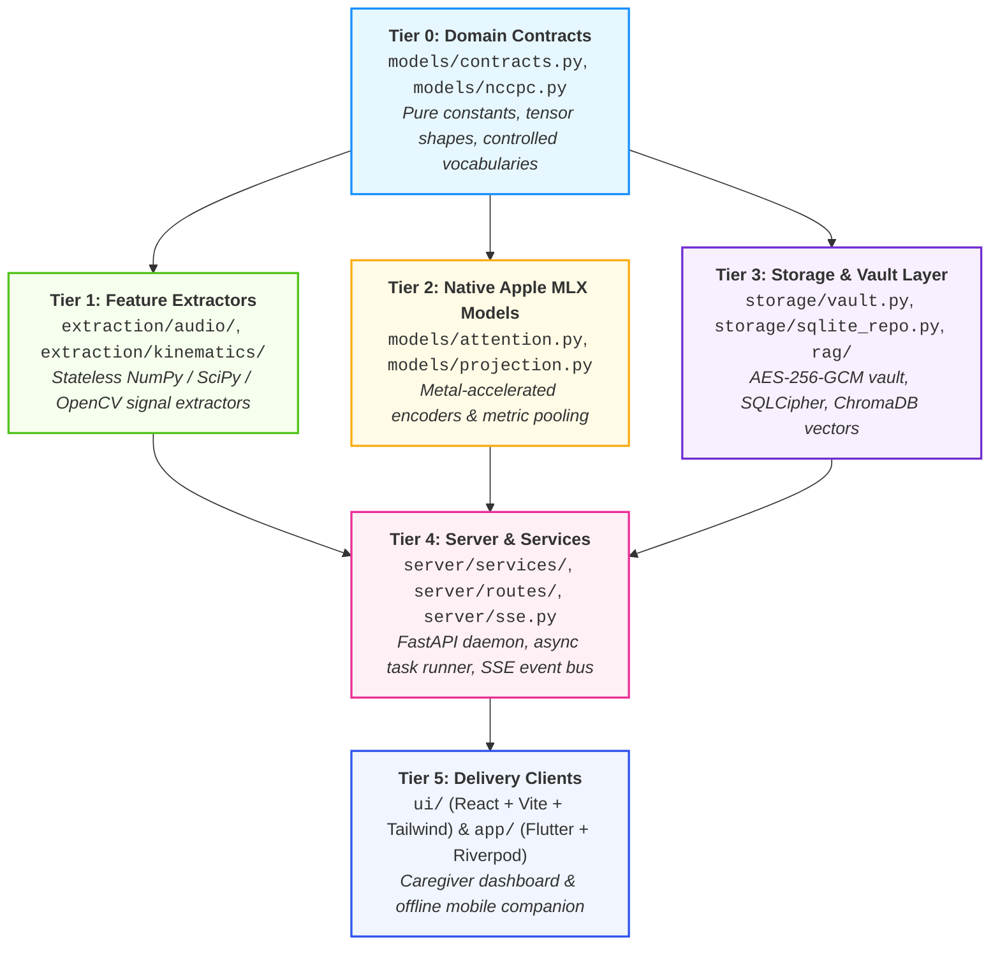

# Project N: Engineering Standards, Architecture & Code Quality Guidelines

---

## 1. Guiding Philosophy & Purpose

Project N is an open-source, local-first assistive observation system engineered for a completely non-verbal autistic child and their caregiver dyad. Because the software operates directly in the family living room and therapy clinic, its engineering foundation must satisfy three uncompromising criteria:

1. **Absolute Reliability & Observability:** The codebase must be transparent, strictly typed, and free of silent failures.
2. **Cognitive Ergonomics & Modularity:** Any developer, clinical researcher, or autonomous AI coding agent must be able to inspect, test, and reason about any file in under two minutes.
3. **Rigorous Quality Automation:** Code hygiene, style, architectural layering, and security invariants must be verified programmatically on every commit.

---

## 2. The 300–400 Line Modularity Mandate

> [!IMPORTANT]
> **Hard File Size Ceiling:** No single source code file in this repository (Python, TypeScript, or Dart) may exceed **400 lines of code**. The target operational length for all implementation files is **150–300 lines**.

### 2.1 Rationale
Long source files ("God classes", monolithic controllers, combined domain-persistence blobs) cause:
- Context fragmentation for both human engineers and AI coding models.
- Entangled side-effects and hidden dependencies.
- Difficult, slow code reviews and high merge conflict rates.
- Inadequate unit test coverage.

### 2.2 The Refactoring Trigger (350 Lines)
When any file approaches **350 lines**, it must immediately be decomposed:
- **Routers:** Extract route handlers into domain controllers or split by resource (`clips_upload.py`, `clips_playback.py`).
- **Processing Pipelines:** Split stages into discrete pipeline units (`audio_stft.py`, `audio_pitch.py`, `audio_cqt.py`).
- **UI Components:** Extract sub-elements into independent, reusable functional components (`WaveformPlayer.tsx`, `SettleRateBadge.tsx`).
- **Flutter Screens:** Move business logic into Riverpod Notifiers and extract presentation sub-widgets.

### 2.3 Automated Enforcement
A dedicated pre-commit quality gate (`tests/check_file_sizes.py`) automatically evaluates all tracked source files. Any file exceeding 400 lines blocks commit and push.

---

## 3. Component Architecture & Dependency Taxonomy

The codebase enforces a **strict unidirectional dependency flow**. Lower layers are pure and know nothing of upper layers. Circular imports are strictly forbidden.



### Directory Structure & Responsibilities

```
project_n/
├── models/                        # Tier 0 & Tier 2
│   ├── contracts.py               # Single source of truth for shapes & vocabularies (<=200 lines)
│   ├── nccpc.py                   # Psychometric instruments & exact scorers (<=250 lines)
│   ├── attention.py               # Metal attention pooling modules (<=250 lines)
│   ├── projection.py              # Multimodal 128-dim metric projection head (<=250 lines)
│   ├── clip_encoder.py            # Macro-trajectory temporal sequence pooling (<=200 lines)
│   └── anomaly.py                 # Baseline distress anomaly screener (<=200 lines)
├── extraction/                    # Tier 1
│   ├── audio_stft.py              # 16kHz STFT & 32 log-mel filterbanks (<=200 lines)
│   ├── audio_pitch.py             # Autocorrelation / pYIN F0 tracking (<=200 lines)
│   ├── audio_cqt.py               # Constant-Q 84-bin harmonic transform (<=200 lines)
│   ├── audio_quality.py           # CPP, jitter, shimmer, HNR voice metrics (<=200 lines)
│   ├── pose_tracker.py            # MediaPipe 33-landmark skeleton tracker (<=250 lines)
│   ├── optical_flow.py            # 4x downscale 320x180 Farnebäck grid flow (<=200 lines)
│   └── windowing.py               # 5.0s window slicing & temporal padding (<=150 lines)
├── storage/                       # Tier 3
│   ├── vault.py                   # AES-256-GCM per-clip encryption & Keychain KEK (<=250 lines)
│   ├── db_schema.py               # SQLite tables & migration DDL (<=200 lines)
│   ├── episode_repo.py            # Typed CRUD for episodes & confirmations (<=250 lines)
│   └── vector_store.py            # ChromaDB collections & HNSW query wrapper (<=200 lines)
├── server/                        # Tier 4
│   ├── main.py                    # FastAPI application setup & lifecycle (<=150 lines)
│   ├── sse_bus.py                 # Real-time event publisher & connection manager (<=200 lines)
│   ├── deps.py                    # Dependency injection (repositories, vault, SSE) (<=150 lines)
│   ├── schemas/                   # Pydantic v2 input/output DTOs (<=150 lines each)
│   ├── services/                  # Business logic orchestration (<=300 lines each)
│   └── routes/                    # Modular API route controllers (<=250 lines each)
├── ui/                            # Tier 5: Zero-Cloud React Dashboard
│   ├── src/components/            # Small, focused presentation components (<=250 lines each)
│   ├── src/hooks/                 # Custom React hooks (e.g., useSSEStream.ts) (<=200 lines)
│   └── src/pages/                 # Screen views composed of components (<=250 lines each)
└── app/                           # Tier 5: Cross-Platform Flutter Companion
    ├── lib/features/              # Feature-first modular organization
    │   ├── capture/               # Camera capture & offline outbox (<=300 lines per file)
    │   ├── timeline/              # Timeline diary & Parent View cards (<=300 lines per file)
    │   └── pairing/               # mTLS & PIN pairing (<=200 lines per file)
    └── lib/core/                  # Shared Riverpod providers & secure storage (<=200 lines each)
```

---

## 4. Backend Engineering Standards (Python / FastAPI / MLX)

### 4.1 Python Standards & Typing
- **Python Version:** 3.11+ strictly required.
- **Strict Typing:** `mypy --strict` is enforced across all modules without exception:
  - Every function, method, and generator must have full argument and return type annotations.
  - `Any` is prohibited unless wrapping untyped C-extensions or external dynamic APIs (and must include an explicit explanatory comment).
  - Use Python 3.10+ union syntax (`int | str` instead of `Union[int, str]`, `list[str]` instead of `List[str]`).
  - Use `collections.abc.Mapping` and `collections.abc.Sequence` for covariant interface arguments.

### 4.2 FastAPI & REST Architecture
- **Async I/O:** All network, database, and disk operations must be asynchronous (`async def`). CPU/Metal-heavy computations (e.g. STFT or MLX forward passes) must be offloaded via `asyncio.to_thread` or background queue workers to keep the event loop responsive.
- **Pydantic v2 Schemas:** All request and response bodies must use `pydantic.BaseModel` with strict field validations, regex constraints, and docstrings.
- **Error Handling:** Use custom domain exceptions mapped to HTTP error handlers in `server/main.py`. Never let raw unhandled Python stack traces leak to HTTP clients.

### 4.3 Real-Time Server-Sent Events (SSE) Channel
- Endpoint: `GET /api/v1/events/stream`.
- Format: Native W3C SSE standard (`text/event-stream`) with typed JSON data payloads.
- **Heartbeat:** Server transmits a `:keep-alive` heartbeat every 15 seconds to prevent client proxy timeout.
- **Connection Resilience:** The client sends `Last-Event-ID` on reconnection; the server's in-memory buffer replays missed events up to 60 seconds.

### 4.4 Apple Silicon MLX Rules
- **Import Purity (Invariant 10):** Only `import mlx.core as mx`, `import mlx.nn as nn`, and `import mlx.optimizers as opt`. Zero `torch` or `cuda` imports in runtime modules.
- **Deterministic Graph Evaluation:** Call `mx.eval()` at explicit boundaries (e.g., after each batch loss or before storing embedding vectors) to release Metal memory nodes.
- **Hardware Acceleration:** Use `mx.fast.scaled_dot_product_attention` for all multi-head attention blocks.
- **Parameter Freezing:** Use `model.freeze()`, never attribute assignment (`trainable = False`).

---

## 5. Frontend Engineering Standards (React 18 / Vite / Tailwind)

### 5.1 Architecture & Stack
- **Framework:** React 18+ with TypeScript (in full strict mode `tsconfig.json`).
- **Bundler:** Vite 5+ configured for production single-origin local delivery.
- **Styling:** Tailwind CSS with explicit design tokens.
- **100% Offline / Zero-Cloud Invariant (Invariant 1):**
  - Zero external CDN links (`<script src="https://...">` or `<link href="https://fonts.googleapis.com...">` are build breaks).
  - All fonts (e.g. Inter / JetBrains Mono), SVG icons, and vendor libraries must be bundled locally into `dist/`.
  - The build output `dist/` is served directly by the local FastAPI daemon as static files.

### 5.2 Component Guidelines
- **Size Limit:** Max **250 lines** per `.tsx` component.
- **Separation of Concerns:**
  - **Hooks (`src/hooks/`):** Encapsulate data fetching, SSE event listening, and state subscriptions (e.g., `useSSEStream()`, `useEpisodes()`).
  - **Presentation Components (`src/components/`):** Pure functional components receiving typed props.
  - **Pages (`src/pages/`):** Layout containers assembling presentation components.
- **Real-Time Updates via SSE:**
  ```typescript
  // Canonical SSE subscription hook pattern
  export function useSSEStream(url: string) {
    const [status, setStatus] = useState<PipelineStage | null>(null);
    useEffect(() => {
      const es = new EventSource(url);
      es.addEventListener("pipeline_progress", (e) => {
        const data = JSON.parse(e.data) as PipelineProgressEvent;
        setStatus(data.stage);
      });
      return () => es.close();
    }, [url]);
    return { status };
  }
  ```

### 5.3 Quality & Linting
- **Linter:** ESLint with `@typescript-eslint/recommended-type-checked` and `eslint-plugin-react-hooks`.
- **Formatter:** Prettier with Tailwind CSS plugin (`prettier-plugin-tailwindcss`).
- **Build Check:** `tsc --noEmit` and `vite build` must exit with code 0 and zero warnings.

---

## 6. Mobile Companion Standards (Flutter / Dart / Riverpod)

### 6.1 Architecture & Stack
- **Framework:** Flutter 3.24+ (Dart 3.5+).
- **Target Platforms:** iOS and Android.
- **State Management:** **Riverpod 2.x** with code-generation (`@riverpod`, `AsyncNotifierProvider`).
- **Local Persistence:** SQLite via `sqflite` / `drift` encrypted with SQLCipher.
- **Network Layer:** `dio` configured with mutual TLS (mTLS) client certificates.

### 6.2 The Offline-First Encrypted Outbox
Clips captured at playgrounds, schools, or therapy sessions must be completely protected:
1. **Immediate Local Encryption:** Video/audio recorded on the device is immediately encrypted with a local AES-256-GCM key before being saved to the client SQLite outbox.
2. **Background Upload Worker:** When the mobile device reconnects to the home Wi-Fi network and verifies the local Mac daemon's TLS certificate, the background queue flushes queued chunks over authenticated local mTLS.
3. **Hardware Keystore:** Client private keys and mTLS certificates reside strictly in **Android Keystore** or **iOS Keychain (Secure Enclave)** via `flutter_secure_storage`.

### 6.3 Code Quality & Riverpod Best Practices
- **Component Size:** Max **300 lines** per Dart file. Complex UI widgets must extract helper sub-widgets.
- **State Separation:** No `setState()` in complex business views. All mutable state must be managed via Riverpod `Notifier` or `AsyncNotifier`:
  ```dart
  @riverpod
  class OutboxSyncNotifier extends _$OutboxSyncNotifier {
    @override
    FutureOr<List<QueuedClip>> build() async {
      return ref.watch(outboxRepositoryProvider).getPendingClips();
    }

    Future<void> retryUpload(String clipId) async {
      state = const AsyncValue.loading();
      state = await AsyncValue.guard(() => ref.read(uploadServiceProvider).sync(clipId));
    }
  }
  ```
- **Linting:** `flutter_lints` with `very_good_analysis` rules enabled.
- **Verification:** `dart analyze --fatal-infos` and `dart format --set-exit-if-changed` must pass with zero issues.

---

## 7. Automated Testing & Verification Suite

Every level of the system must have dedicated, automated tests:

| Test Tier | Scope | Target Duration | Command |
| :--- | :--- | :--- | :--- |
| **Lint & Format** | Ruff, ESLint, Prettier, Dart Format | $< 5\text{s}$ | `uv run ruff check .` / `npm run lint` |
| **Type Safety** | Mypy strict, TypeScript strict, Dart Analyze | $< 10\text{s}$ | `uv run mypy models tests` / `npm run typecheck` |
| **Shape & Contract** | Tensor dimensions, vocabularies, NCCPC | $< 2\text{s}$ | `uv run python tests/test_shapes.py` |
| **File Size Enforcement**| Maximum 400 lines per source file | $< 1\text{s}$ | `uv run python tests/check_file_sizes.py` |
| **Documentation** | Relative links, strict MkDocs build | $< 5\text{s}$ | `uv run python tests/check_markdown_links.py` |
| **Academic Citations** | Crossref/DataCite DOI validation | $< 15\text{s}$ | `uv run python tests/verify_citations.py` |
| **Integration** | FastAPI endpoints & SSE streams | $< 15\text{s}$ | `uv run pytest tests/` |

---

## 8. Summary Checklist for Every Code Change

Before committing or submitting a PR, verify:
- [ ] Is every new or modified file strictly **$\le 400$ lines** (ideally $\le 300$)?
- [ ] Does the change follow the **unidirectional dependency flow** without circular imports?
- [ ] Are all functions, methods, and parameters **strictly typed**?
- [ ] Is the base LLM kept **100% frozen** and out of primary classification paths?
- [ ] Are all frontend and backend assets **100% offline** (zero remote CDNs or cloud APIs)?
- [ ] Do all local quality gates (`pre-commit run --all-files`) pass with zero errors?
