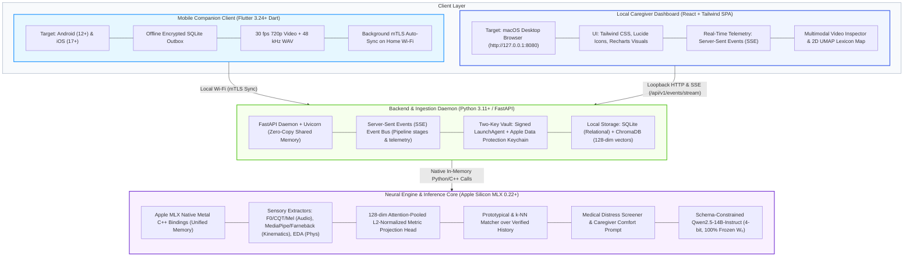
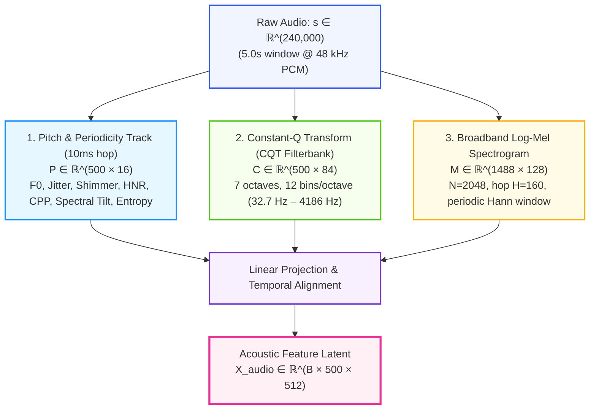
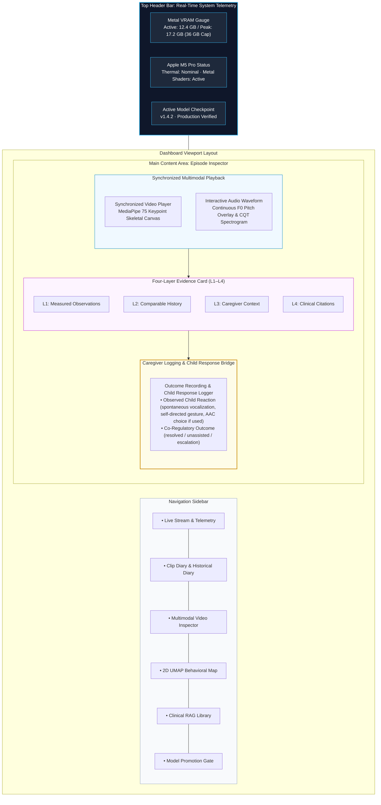
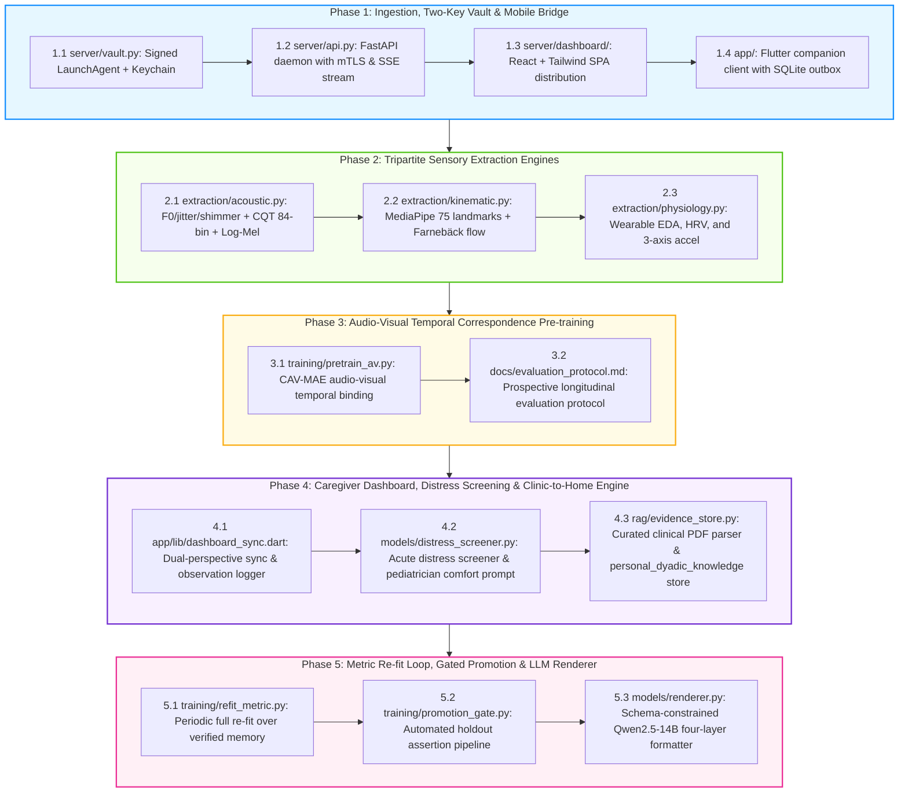

# Project N: Technical Specifications & System Architecture Blueprint

---

## 1. System Technology Stack & Architectural Decisions

Project N is engineered specifically for local execution on Apple Silicon (targeting an M5 Pro with 48GB Unified Memory), maintaining 100% offline privacy while serving an intuitive, rich interface for caregivers.



### 1.1 Stack Decision Rationale: Python over Go for the Server
- **Zero-Copy Metal Shared Memory:** Apple MLX features first-class Python and C++ bindings. MLX arrays allocate directly into Apple Silicon Unified Memory without IPC serialization. Using Go would require cgo wrappers around unofficial C++ bridges or an external Python sidecar over TCP sockets, introducing double-buffering and memory bandwidth bottlenecks across large video/audio buffers.
- **Asynchronous Concurrency:** FastAPI running on `uvloop` easily delivers sub-millisecond local REST endpoints and handles persistent Server-Sent Events (SSE) streaming connections concurrently with Metal GPU compute.

---

## 2. Mathematical Definitions, Feature Extraction & Signal Progression

### 2.1 Audio Feature Extraction Pipeline (48 kHz)
A 5-second acoustic window contains exactly $S = 240,000$ discrete samples at $f_s = 48,000\text{ Hz}$.



1. **Short-Time Fourier Transform (STFT):**
   $$S(m, k) = \sum_{n=0}^{N-1} s(n + mH) \cdot w(n) e^{-j \frac{2\pi}{N} k n}$$

   - FFT Window: $N = 2048$ (yielding linear bin width $\Delta f = 48000 / 2048 = 23.4375\text{ Hz}$).
   - Hop Length: $H = 160$ samples ($3.333\text{ ms}$ temporal resolution).
   - Window Function: Periodic Hann window $w(n) = 0.5 \left(1 - \cos\left(\frac{2\pi n}{N}\right)\right)$.
   - Frame Count (Uncentered): $T_m = 1 + \lfloor(240000 - 2048) / 160\rfloor = 1488$ frames.
2. **Dedicated Pitch & Periodicity Tracking:**
   To overcome the $\sim 27\text{ Hz}$ mel-filterbank resolution limit, fundamental frequency ($F_0$) is tracked via autocorrelation / pYIN over a candidate range of $50\text{ Hz}$ to $600\text{ Hz}$ at a $10\text{ ms}$ hop ($T_p = 500$ frames per 5s):

   - **Local Jitter:** Relative period-to-period perturbation $\frac{\frac{1}{T-1} \sum |T_i - T_{i+1}|}{\frac{1}{T} \sum T_i}$.
   - **Local Shimmer:** Amplitude perturbation $\frac{\frac{1}{T-1} \sum |A_i - A_{i+1}|}{\frac{1}{T} \sum A_i}$.
   - **Harmonics-to-Noise Ratio (HNR):** $10 \log_{10} \frac{E_{harmonic}}{E_{noise}}$ (in dB).
   - **Cepstral Peak Prominence (CPP):** Prominence of the highest quefrency peak normalized by linear regression baseline, measuring periodic-to-aperiodic energy ratio (correlate of overall vocal quality/dysphonia).
3. **CQT Harmonic Filterbank:**
   Applies 84 geometrically spaced filters across 7 octaves ($f_{min} = 32.7\text{ Hz}$, 12 bins/octave), delivering logarithmic frequency resolution in the human voice range.
4. **Acoustic Projection:** $\mathbf{X}_{audio} = \text{LinearAlign}([\mathbf{P} \;\|\; \mathbf{C} \;\|\; \text{Downsample}(\mathbf{M})]) \in \mathbb{R}^{B \times 500 \times 512}$.

### 2.2 Kinematic Feature Extraction Pipeline (30 fps @ 720p)
A 5-second video recording yields exactly $T_v = 150$ frames at $30\text{ fps}$.

1. **Body-Relative Landmark Extraction (MediaPipe Holistic / BlazePose):**
   - 33 Pose landmarks (torso, shoulders, elbows, wrists, head), outputting $(x, y, z, \text{visibility})$ ($33 \times 4 = 132$ features).
   - 21 Hand landmarks per hand ($2 \times 21 = 42$ hand keypoints), outputting spatial coordinates $(x, y, z)$ ($42 \times 3 = 126$ features; note that MediaPipe does not provide visibility scores for hand keypoints).
   - Total landmarks: $K = 75$ keypoints (258 features per frame).
   - **Torso-Relative Normalization:** Coordinates are normalized relative to shoulder-hip center and scaled by inter-shoulder width:
     $$\tilde{\mathbf{p}}_k = \frac{\mathbf{p}_k - \mathbf{p}_{mid\_hip}}{\|\mathbf{p}_{left\_shoulder} - \mathbf{p}_{right\_shoulder}\|_2}$$
     This reduces distance, zoom, and scale variations (though monocular depth and severe 3D rotation limits apply).

   - Landmark matrix: $\mathbf{K} \in \mathbb{R}^{B \times 150 \times 258}$.
2. **Dense Optical Flow (OpenCV Farnebäck):**
   Extracts horizontal and vertical displacement fields $(u, v)$ between consecutive frames using OpenCV's native, CPU-bound Farnebäck algorithm (`cv2.calcOpticalFlowFarneback`; $T_{diff} = 149$ steps), spatially pooled to an $8 \times 8$ grid ($128$ dimensions per frame). This eliminates external PyTorch dependencies while running with minimal CPU overhead. To align temporally with the 150-frame pose sequence, the flow sequence is left-padded with a zero-displacement initial frame $\mathbf{0} \in \mathbb{R}^{B \times 1 \times 128}$, yielding $\tilde{\mathbf{O}} \in \mathbb{R}^{B \times 150 \times 128}$.
3. **Kinematic Projection:** $\mathbf{X}_{kinematic} = \text{TemporalTransformer}([\mathbf{K} \;\|\; \tilde{\mathbf{O}}]) \in \mathbb{R}^{B \times 150 \times 512}$.

### 2.3 Physiological Feature Extraction (Optional Auxiliary Channel)
When wearable sensor streams (e.g., paired Apple Watch or research biosensors) are available:

1. **Electrodermal Activity (EDA @ 4 Hz):** Continuous decomposition into tonic Skin Conductance Level (SCL) and phasic Skin Conductance Response (SCR) using convex optimization:
   $$G(t) = SCL(t) + SCR(t) + \epsilon(t)$$
2. **Heart Rate & Autonomic Variability (HRV):**
   - Over short 5-second video windows, physiological telemetry provides exploratory **time-domain metrics**: mean Heart Rate (BPM), pulse-interval variance, and Root Mean Square of Successive Differences (RMSSD).
   - Frequency-domain spectral metrics (such as High-Frequency vagal power, HF $0.15–0.40\text{ Hz}$) require rolling buffers of 1–5 minutes of continuous data (ESC/NASPE standards) and are computed only when continuous background buffers are available.
   - When ingesting from consumer devices like Apple Watch via HealthKit, samples are received as discrete episodic quantities (e.g. episodic HR, SDNN) rather than continuous 100 Hz raw photoplethysmography (PPG), whereas research devices (e.g., Empatica) stream continuous raw PPG/EDA when paired.
3. **3-Axis Accelerometry (@ 50 Hz):** Wrist tremor energy and gross motor magnitude: $a_{mag}(t) = \sqrt{a_x^2 + a_y^2 + a_z^2}$.
4. **Output Dimension:** $\mathbf{X}_{physio} \in \mathbb{R}^{B \times 50 \times 64}$.

### 2.4 Graceful Degradation & Missing Modality Masking
Because wearable sensors are **completely optional** (and may not be tolerated by Child N), the multimodal projection head implements explicit modality gating:
$$\mathbf{m} = [m_{audio}, m_{kinematic}, m_{physio}] \in \{0, 1\}^3$$
When wearable telemetry is absent ($m_{physio} = 0$):

- $\mathbf{X}_{physio}$ is replaced by a learned null-modality embedding $\mathbf{e}_{\emptyset}^{physio} \in \mathbb{R}^{64}$ broadcast across the temporal sequence.
- The resulting metric vector $\mathbf{z}_{metric} \in \mathbb{R}^{128}$ resides in the identical geometric space, allowing continuous matching against historical episodes with or without physiological records.

---

## 3. Metric Learning, Episodic Retrieval & Medical Safety

### 3.1 128-Dimensional Metric Learning Architecture
The high-dimensional sensory representations are compressed into an attention-pooled, L2-normalized 128-dimensional metric vector:

```python
# Metric Representation
z_metric = MetricProjectionHead(x_audio, x_kinematic, x_physio)  # Shape: (B, 128)
assert mx.allclose(mx.sum(mx.square(z_metric), axis=-1), mx.array([1.0])), (
    "L2 Norm Invariant Violated!"
)
```

### 3.2 Episodic Prototype Matching & Calibrated Abstention
Matching is performed via cosine distance against historical prototype vectors $\mathbf{c}_k$ in ChromaDB / SQLite:
$$d(\mathbf{z}, \mathbf{c}_k) = 1 - \mathbf{z} \cdot \mathbf{c}_k$$

- **Calibrated Abstention Rule:** If $\min_k d(\mathbf{z}, \mathbf{c}_k) > \tau_{abstain}$ (where default $\tau_{abstain} = 0.35$, tuned to 95th percentile holdout distance):
  $$\text{Decision} = \text{ABSTAIN} \implies \text{"Unrecognized behavioral pattern; insufficient historical similarity."}$$

- The system offers open-ended caregiver observation or environmental check-in rather than guessing.

### 3.3 Medical Safety Protocol & Distress Screening (Triage First)
Physical distress and somatic pain must always take absolute priority over behavioral or sensory interpretations. In clinical practice, pain in non-communicating children is evaluated using validated instruments:

- **The Clinical Instruments & Home Adaptation Disclosure:**
  - **NCCPC-PV** ([Breau et al., 2002](WHITE_PAPER.md#ref-2); doi:10.1097/00000542-200203000-00004): Evaluated across 24 children postoperatively; comprises 27 items across 6 subscales ($0 \le S_{NCCPC} \le 81$) standardized over a **10-minute structured human caregiver observation**; validated cut-off $S_{NCCPC} \ge 11$ indicates moderate-to-severe pain.
  - **NCCPC-R** ([Breau et al., 2002](WHITE_PAPER.md#ref-2); doi:10.1016/S0304-3959(02)00179-3): Evaluated in home/residential settings across 71 children; comprises 30 items across 7 subscales ($0 \le S_{NCCPC} \le 90$) over a **2-hour observation window**; validated cut-off $S_{NCCPC} \ge 7$ indicates presence of pain (84% sensitivity, up to 77% specificity).
  - *Exploratory Home Protocol Disclosure:* Because the 2-hour observation window of the NCCPC-R makes it infeasible for acute, immediate post-episode checks, the in-the-moment mobile companion checklist adapts the 10-minute, 27-item observation of the NCCPC-PV. **This application outside postoperative acute care is an exploratory adaptation, not a formally validated setting; use of this protocol at home must be explicitly reviewed, selected, and approved by the child's personal pediatrician.**
- **Decoupling Automated Signal Deviation from Medical Diagnosis:**
  A 5-second computer vision and audio clip cannot compute a 10-minute clinical checklist. Project N therefore strictly separates automated sensor telemetry from medical diagnosis:
  - **Configured Signal-Deviation Screener (`AcuteDistressAnomalyDetector`):** At inference time, the local MLX engine screens for sharp acoustic excursions ($F_0$ spike, severe CPP drop) and rapid guarding/flinching kinematics relative to the child's calibrated personal baseline. If no calibrated personal baseline is available, the screener abstains. These thresholds represent configured signal-deviation triggers, not diagnostic markers of pain or internal strain.
  - **Two-Stage Triage Separation:**
    1. **Physical Comfort Check Nudge (Triggered by Sensor Deviation):**
       When automated acoustic or kinematic excursion is detected, the system immediately presents a **Physical Comfort Check Card**, suppressing behavioral interpretations:
       ```text
       [PHYSICAL COMFORT CHECK SUGGESTED]
       Acoustic and kinematic signals show acute deviation from calibrated personal baseline.
       Prompt: Check for physical discomfort, temperature, hydration, fatigue, or acute sensory overload.
       All behavioral, communicative, and sensory interpretations are suppressed.
       ```
    2. **Medical Escalation Card (Triggered by Caregiver Pain Instrument / Red Flag):**
       When the caregiver records a clinical red flag or completes an observation checklist exceeding validated pain thresholds (NCCPC-PV $\ge 11$ or NCCPC-R $\ge 7$), the system triggers the **Medical Escalation Card**:
       ```text
       [MEDICAL ESCALATION REQUIRED]
       Caregiver pain observation threshold exceeded or clinical red flag recorded.
       Prompt: Follow your family pediatrician-approved medical escalation protocol.
       All behavioral, sensory, and communication interpretations are suppressed.
       ```
  - **Non-Reassurance Rule:** If no signal deviation is triggered, the system explicitly communicates:
    `"No configured signal deviation was detected. This does not assess or exclude pain, illness, or distress."`
- **Cost Asymmetry & Triage Priority:**
  Physical distress and somatic discomfort must always take absolute priority over behavioral or sensory explanations. While alerts require parental attention and caregiving effort, prioritizing physical comfort checks prevents acute somatic conditions (such as otitis media, dental abscess, or GI pain) from being misattributed to behavioral bids or sensory seeking.

---

## 4. Database Schemas & Literature RAG Engine

### 4.1 Client-Side SQLite Outbox Schema (`app/databases/outbox.db`)
Maintained on mobile companion devices (Android / iOS) for store-and-forward offline recording:

```sql
CREATE TABLE offline_clips_outbox (
    id TEXT PRIMARY KEY,               -- UUIDv4
    file_path TEXT NOT NULL,           -- Local AES-encrypted video/audio file path
    captured_at TEXT NOT NULL,         -- ISO 8601 UTC
    duration_ms INTEGER NOT NULL,      -- Clip length
    caregiver_tag TEXT,                -- Optional offline hypothesis
    antecedent_notes TEXT,             -- Notes (e.g., 'playground transition', 'OT swing')
    child_aac_response TEXT,           -- Child selection if made offline
    sha256_checksum TEXT NOT NULL,     -- File integrity hash
    sync_status TEXT DEFAULT 'pending',-- 'pending' | 'syncing' | 'completed' | 'failed'
    retry_count INTEGER DEFAULT 0,
    created_at TIMESTAMP DEFAULT CURRENT_TIMESTAMP
);
CREATE INDEX idx_sync_status ON offline_clips_outbox(sync_status);
```

### 4.2 Server-Side SQLite Relational Schema (`server/data/project_n.db`)
Maintained locally on the Mac M5 Pro host:

```sql
CREATE TABLE episodes (
    id TEXT PRIMARY KEY,
    vault_uri TEXT NOT NULL,           -- Encrypted file URI in macOS Data Protection vault
    encoder_version_id TEXT NOT NULL,  -- Git commit / checkpoint ID
    captured_at TEXT NOT NULL,
    duration_ms INTEGER NOT NULL,
    observed_f0_mean REAL,
    observed_motion_rhythm_hz REAL,
    eda_tonic_level REAL,
    antecedent_context TEXT,
    caregiver_hypothesis TEXT,
    action_offered TEXT,               -- Grounded co-regulatory technique offered to child
    caregiver_accepted INTEGER DEFAULT 1, -- 1 if caregiver approved/conducted action, else 0
    outcome_state TEXT CHECK(outcome_state IN ('settled_immediately', 'settled_delayed', 'no_change', 'escalated')),
    settled_within_sec INTEGER,        -- Measured or caregiver-reported latency to baseline return
    child_response TEXT CHECK(child_response IN ('reach', 'gesture', 'vocal_signal', 'aac_selection', 'none')),
    response_channel TEXT CHECK(response_channel IN ('motor', 'vocal', 'aac', 'none')),
    observer TEXT,                     -- De-identified role (e.g., 'primary_caregiver', 'ot_clinician')
    nccpc_instrument TEXT CHECK(nccpc_instrument IN ('nccpc_pv', 'nccpc_r', 'none')),
    nccpc_score INTEGER,               -- Validated checklist total (0-81 for PV, 0-90 for R)
    pain_cutoff_breached INTEGER DEFAULT 0, -- 1 if score >= cutoff (11 for PV, 7 for R)
    created_at TIMESTAMP DEFAULT CURRENT_TIMESTAMP
);

CREATE TABLE model_checkpoints (
    id TEXT PRIMARY KEY,
    checkpoint_path TEXT NOT NULL,
    retrieval_mrr REAL NOT NULL,       -- Top-k retrieval Mean Reciprocal Rank
    holdout_coverage REAL NOT NULL,    -- Percentage of holdout queries with d <= tau_abstain
    ece_score REAL,                    -- Expected Calibration Error on validation splits
    zero_distress_misses INTEGER DEFAULT 0, -- Fail-closed: must be verified on locked test set
    caregiver_utility_score REAL,      -- Average Likert score on validation sets
    is_production INTEGER DEFAULT 0,
    promoted_at TEXT,
    notes TEXT
);

CREATE TABLE child_profile_facts (
    id TEXT PRIMARY KEY,               -- UUIDv4
    category TEXT NOT NULL,            -- 'comfort_object' | 'calming_cue' | 'sensory_trigger' | 'therapist_technique' | 'communication_routine'
    fact_title TEXT NOT NULL,          -- e.g. 'Red squishy dinosaur toy', 'Forearm joint compression'
    description TEXT NOT NULL,         -- e.g. 'Provides rapid tactile grounding within 2-4 min during auditory overload'
    source_type TEXT NOT NULL,         -- 'home_observation' | 'ot_session' | 'slp_session' | 'school'
    clinician_role TEXT,               -- e.g. 'OT', 'SLP', 'Pediatrician' (De-identified role; Zero personal names/PHI)
    clinician_id TEXT,                 -- De-identified pseudonymized identifier (e.g. 'clinician_01')
    provenance_episode_id TEXT,        -- Foreign key to episodes.id
    confirmed_by_caregiver INTEGER DEFAULT 0, -- Fail-closed: requires human review before active retrieval
    times_tried INTEGER DEFAULT 0,     -- Denominator: total times this action was offered
    times_helpful INTEGER DEFAULT 0,   -- Numerator: times followed by verified settling
    created_at TIMESTAMP DEFAULT CURRENT_TIMESTAMP,
    updated_at TIMESTAMP DEFAULT CURRENT_TIMESTAMP
);
CREATE INDEX idx_fact_category ON child_profile_facts(category);
CREATE INDEX idx_fact_source ON child_profile_facts(source_type);
```

### 4.3 ChromaDB Collections
1. **`nd_confirmed_episodes`:**
   - Vector: 128-dimensional L2-normalized metric embedding.
   - Distance metric: `cosine`.
   - Metadata: `episode_id`, `encoder_version_id`, `action_offered`, `caregiver_accepted`, `outcome_state`, `settled_within_sec`, `child_response`, `response_channel`, `nccpc_instrument`, `nccpc_score`, `pain_cutoff_breached`.
2. **`clinical_evidence`:**
   - Vector: 768-dimensional text embedding (`nomic-embed-text-v1.5`).
   - Distance metric: `cosine`.
   - Metadata: `source_title`, `author`, `year`, `framework`, `study_population`, `evidence_level`, `license_status`.
3. **`personal_dyadic_knowledge` (Personal & Clinic-to-Home RAG):**
   - Vector: 768-dimensional text embedding (`nomic-embed-text-v1.5`).
   - Distance metric: `cosine`.
   - Metadata: `fact_id`, `category`, `source_type`, `clinician_role`, `clinician_id`, `provenance_episode_id`, `confirmed_by_caregiver`, `times_tried`, `times_helpful`.

---

## 5. Local Server API, SSE Stream & Client Communication

### 5.1 REST API Endpoint Specifications

All endpoints (except initial user-present pairing) require a local mutual-pairing token passed via `Authorization: Bearer <local_paired_token>`. Sensitive media access and model modifications require biometric confirmation (Touch ID / system admin credential).

| HTTP Verb | Path | Request Payload / Headers | Response Payload | Description |
| :--- | :--- | :--- | :--- | :--- |
| `POST` | `/api/v1/auth/pair` | `{ "device_id": str, "nonce": str, "pairing_pin": str }` | `{ "client_cert": str, "token": str, "vault_id": str }` | User-present physical PIN/QR pairing of mobile companion. |
| `POST` | `/api/v1/clips/upload` | Multipart: `file`, `metadata_json`<br/>Header: `Authorization: Bearer` | `{ "clip_id": str, "sha256": str, "status": str }` | Resumable chunked upload from mobile outbox. |
| `POST` | `/api/v1/clips/{id}/analyze` | `{ "generate_render": bool }`<br/>Header: `Authorization: Bearer` | `{ "task_id": str, "stream_url": str }` | Triggers feature extraction & retrieval pass. |
| `GET` | `/api/v1/episodes` | Query: `limit`, `offset`, `tag`, `distress`<br/>Header: `Authorization: Bearer` | `{ "episodes": List[Episode], "total": int }` | Timeline and diary browser for dashboard. |
| `GET` | `/api/v1/episodes/{id}/media` | Header: `Authorization: Bearer`<br/>Header: `X-TouchID-Auth: token` | Decrypted binary video stream (`video/mp4`) | Stream video for review (Touch ID gated). |
| `GET` | `/api/v1/events/stream` | Header: `Accept: text/event-stream`<br/>Header: `Authorization: Bearer` | Continuous Server-Sent Events (SSE) stream | Real-time progress, telemetry, and training logs. |
| `POST` | `/api/v1/models/promote` | `{ "candidate_id": str }`<br/>Header: `X-TouchID-Auth: token` | `{ "status": "promoted", "timestamp": str }` | One-click candidate model promotion (biometric gated). |
| `POST` | `/api/v1/models/rollback` | `{}`<br/>Header: `X-TouchID-Auth: token` | `{ "status": "rolled_back", "active_id": str }` | Rollback to prior stable checkpoint (biometric gated). |

### 5.2 Server-Sent Events (SSE) Protocol Specification
Clients subscribe to `GET /api/v1/events/stream`. Events are formatted as standard UTF-8 text frames:

```text
event: processing_progress
data: {"task_id": "9b1deb4d-3b7d-4bad-9bdd-2b0d7b3dcb6d", "stage": "acoustic_extraction", "progress": 0.45, "metrics": {"f0_current_hz": 268.4, "cpp_db": 4.1}, "timestamp": "2026-09-09T20:45:00.123Z"}

event: system_telemetry
data: {"active_vram_gb": 12.4, "peak_vram_gb": 17.2, "memory_ceiling_gb": 36.0, "thermal_state": "nominal", "mlx_device": "Apple M5 Pro (Metal GPU)"}

event: four_layer_card
data: {"task_id": "9b1deb4d-3b7d-4bad-9bdd-2b0d7b3dcb6d", "L1_measured": "Vocalization: 4.2s, F0 mean 268 Hz. Kinematics: 3.8 Hz wrist oscillation.", "L2_historical": "Matched 3 prior episodes. Top resolution: deep pressure (2 of 3).", "L3_context": "Caregiver noted post-school fatigue, 45 min since water.", "L4_evidence": "Van de Cruys et al. (2014) - repetitive motions as uncertainty reduction.", "view_mode": "parent", "parent_view_text": "Child N's vocal pitch and wrist movement are elevated, which in past episodes occurred during noise overload or fatigue; you might explore offering deep pressure or water.", "abstained": false}
```

---

## 6. Local Mac Caregiver Web Dashboard (React + Tailwind)

The local web interface is built as a zero-cloud React 18+ Single-Page Application (SPA) styled with Tailwind CSS, bundled into static assets, and served directly by FastAPI at `http://127.0.0.1:8080`.

### 6.1 Dashboard UI Architecture & Components



### 6.2 Key Dashboard Screens
1. **Live Multimodal Inspector & Dual-Perspective Insight Card:**
   - HTML5 Video Player synchronized via `<canvas>` overlay showing MediaPipe skeletal joints and Farnebäck motion vectors frame-by-frame.
   - Synchronized audio waveform with interactive pitch trace ($F_0$ curve) and CQT spectrogram heatmaps.
   - **Perspective Switcher Toggle (`[ 🟢 Parent View (Default) ] | [ 🔬 Therapist View ]`):**
     - **Parent View:** Plain-English translation of acoustic/kinematic patterns into everyday sensory insights (*e.g., "Child N's vocal pitch and wrist movement are elevated, similar to past fatigue episodes"*), gentle exploratory hypotheses (*"What Child N might be experiencing..."*), concrete low-risk things to try based on past co-regulatory successes (*"Give his favorite red toy", "Dim lights and give 3 minutes quiet break"*, *"Offer water"*), and an explicit non-diagnostic parental notice.
     - **Therapist View:** Full bioacoustic figures ($F_0$, CPP, CQT harmonics), kinematic tracking (MediaPipe joints, Farnebäck displacement), SCERTS and Ayres Sensory Integration mapping, and exact peer-reviewed literature citations.
2. **Interactive 2D Lexicon Cluster Map:**
   - WebGL-accelerated 2D scatter plot (UMAP projection of 128-dim metric vectors) displaying Child N's behavioral clusters (e.g., clusters for deep pressure, hydration, sensory breaks).
   - Clicking any cluster dot opens the underlying video clip and recorded caregiver outcome.
3. **Candidate Model Promotion Gate:**
   - Visual displays of forward-chaining temporal validation curves, selective risk coverage, calibration reliability diagrams, and safety assertion logs.
   - One-click button to promote candidate weights to active production.

---

## 7. Architectural Reference Sketch & Component Signatures

Below is an illustrative architectural specification and pseudo-code sketch outlining the component interfaces: the multimodal metric projection head with missing-modality gating, episodic prototype retrieval, acute distress anomaly screening, and schema-constrained Qwen2.5-14B rendering.

> [!NOTE]
> **Implementation Scope & Architectural Normative Note**
> This section serves as an interface contract and dataflow blueprint for implementation. Production feature extraction routines, validation assertions, and runtime pipeline modules will reside in the repository source packages (`extraction/`, `models/`, `rag/`, `server/`) upon execution of their respective roadmap phases.
>
> **Normative Baseline vs. Research Branch:**
> - **Normative Baseline (Phase 1–2):** Modality-specific attention pooling with missing-sensor gating (`AttentionPool` + `MetricProjectionHead`) represents the primary normative implementation path for device-local inference.
> - **Exploratory Research Branch:** CAV-MAE / Perceiver cross-attention audio-visual temporal binding is maintained as an experimental pre-training investigation.

```python
"""
Project N: Core Multimodal Metric Learning, Safety & Rendering Pipeline Interface Sketch.
Targeted natively for Apple Silicon Metal Unified Memory (mlx >= 0.22.0).
"""

from typing import Dict, Any, List, Optional, Tuple, Set, ClassVar
from dataclasses import dataclass, asdict
from collections import Counter
import json
import mlx.core as mx
import mlx.nn as nn
import numpy as np


class AttentionPool(nn.Module):
    """
    Learned temporal attention pooling condensing arbitrary sequence lengths
    into a unified latent summary representation.
    """

    def __init__(self, d_in: int):
        super().__init__()
        self.attn_vector = nn.Linear(d_in, 1, bias=False)

    def __call__(self, x: mx.array, mask: Optional[mx.array] = None) -> mx.array:
        # x: (B, T, D)
        # mask convention: 1 = masked/ignored, 0 = valid (additive bias of -1e9 applied to masked tokens)
        scores = self.attn_vector(x)  # (B, T, 1)
        if mask is not None:
            if mask.ndim == 2:
                mask = mask[:, :, None]  # Expand (B, T) -> (B, T, 1) to match score dimensions
            scores = scores + (mask * -1e9)
        weights = mx.softmax(scores, axis=1)  # (B, T, 1)
        pooled = mx.sum(x * weights, axis=1)  # (B, D)
        return pooled


class MetricProjectionHead(nn.Module):
    """
    Multimodal projection head supporting graceful degradation when
    optional physiological sensors are absent. Maps inputs into an
    L2-normalized 128-dimensional metric space.
    """

    def __init__(
        self,
        d_audio: int = 512,
        d_kinematic: int = 512,
        d_physio: int = 64,
        d_hidden: int = 512,
        d_metric: int = 128,
    ):
        super().__init__()
        # Modal attention pools
        self.pool_audio = AttentionPool(d_audio)
        self.pool_kinematic = AttentionPool(d_kinematic)
        self.pool_physio = AttentionPool(d_physio)

        # Dimension alignment
        self.proj_audio = nn.Linear(d_audio, d_hidden)
        self.proj_kinematic = nn.Linear(d_kinematic, d_hidden)
        self.proj_physio = nn.Linear(d_physio, d_hidden)

        # Learned null-modality embedding for missing physiological telemetry
        self.null_physio = mx.random.normal((1, d_physio)) * 0.02

        # Multimodal fusion layers
        self.fusion_norm = nn.LayerNorm(d_hidden * 3)
        self.fc1 = nn.Linear(d_hidden * 3, d_hidden)
        self.fc_metric = nn.Linear(d_hidden, d_metric, bias=False)

    def __call__(
        self, x_audio: mx.array, x_kinematic: mx.array, x_physio: Optional[mx.array] = None
    ) -> mx.array:
        B = x_audio.shape[0]

        # 1. Pool and project acoustic and kinematic features
        h_a = nn.gelu(self.proj_audio(self.pool_audio(x_audio)))
        h_k = nn.gelu(self.proj_kinematic(self.pool_kinematic(x_kinematic)))

        # 2. Graceful degradation: substitute null embedding if physiology is missing
        if x_physio is None:
            broadcast_null = mx.broadcast_to(self.null_physio, (B, 1, 64))
            h_p = nn.gelu(self.proj_physio(self.pool_physio(broadcast_null)))
        else:
            h_p = nn.gelu(self.proj_physio(self.pool_physio(x_physio)))

        # 3. Concatenation and metric projection
        fused = mx.concatenate([h_a, h_k, h_p], axis=-1)
        fused = self.fusion_norm(fused)
        hidden = nn.gelu(self.fc1(fused))
        raw_metric = self.fc_metric(hidden)

        # 4. Explicit L2-normalization for cosine distance metric geometry
        norm = mx.sqrt(mx.sum(mx.square(raw_metric), axis=-1, keepdims=True) + 1e-8)
        z_metric = raw_metric / norm
        return z_metric  # (B, 128)


class EpisodicPrototypeMatcher:
    """
    Episodic prototype and k-NN retrieval engine with calibrated abstention.
    """

    def __init__(self, tau_abstain: float = 0.35):
        self.tau_abstain = tau_abstain

    def match(
        self, query_vector: mx.array, confirmed_collection: Any, top_k: int = 3
    ) -> Dict[str, Any]:
        q_list = query_vector[0].tolist()
        results = confirmed_collection.query(query_embeddings=[q_list], n_results=top_k)

        distances = results["distances"][0] if results["distances"] else [1.0]
        nearest_distance = distances[0]

        # Calibrated abstention cutoff
        if nearest_distance > self.tau_abstain:
            return {
                "abstained": True,
                "reason": f"Distance ({nearest_distance:.3f}) exceeds threshold ({self.tau_abstain:.3f})",
                "nearest_distance": nearest_distance,
                "candidates": [],
            }

        candidates = []
        for meta, dist in zip(results["metadatas"][0], distances):
            candidates.append(
                {
                    "episode_id": meta.get("episode_id", "unknown_ep"),
                    "action_offered": meta.get("action_offered"),
                    "caregiver_accepted": bool(meta.get("caregiver_accepted") == 1),
                    "outcome_state": meta.get("outcome_state"),
                    "settled_within_sec": meta.get("settled_within_sec"),
                    "child_response": meta.get("child_response", "none"),
                    "response_channel": meta.get("response_channel", "none"),
                    "child_communicative_response": meta.get("child_response", "none"),
                    "distance": dist,
                }
            )

        return {"abstained": False, "nearest_distance": nearest_distance, "candidates": candidates}


class AcuteDistressAnomalyDetector:
    """
    Automated acoustic and kinematic anomaly screener executing on raw 5s sensory frames.
    Screens for acute acoustic excursions and flinching/guarding kinematics relative to
    the child's calibrated personal baseline. If no calibrated personal baseline is
    available, the screener explicitly abstains from anomaly evaluation.
    Configured signal-deviation trigger only; does not diagnose or exclude somatic pain, illness,
    or distress. Prompts caregiver to conduct a physical comfort check.
    """

    @classmethod
    def evaluate(
        cls, measured_features: Dict[str, Any], baseline_stats: Optional[Dict[str, float]] = None
    ) -> Dict[str, Any]:
        if not baseline_stats or "f0_upper_limit_hz" not in baseline_stats:
            return {
                "screener_available": False,
                "distress_anomaly": False,
                "reason": "No calibrated personal baseline available; anomaly screener abstaining.",
                "recommendation": (
                    "No calibrated personal baseline available. Automated anomaly screening paused. "
                    "This does not assess or exclude pain, illness, or distress."
                ),
            }

        f0_mean = measured_features.get("f0_mean_hz")
        cpp_val = measured_features.get("cpp_db")
        flinch_guarding = measured_features.get("acute_guarding_detected", False)

        f0_thresh = baseline_stats["f0_upper_limit_hz"]
        cpp_thresh = baseline_stats.get("cpp_lower_limit_db", 4.0)

        f0_spike = bool(isinstance(f0_mean, (int, float)) and f0_mean > f0_thresh)
        cpp_strain = bool(isinstance(cpp_val, (int, float)) and cpp_val < cpp_thresh)

        is_anomaly = bool(f0_spike or cpp_strain or flinch_guarding)
        return {
            "screener_available": True,
            "distress_anomaly": is_anomaly,
            "indicators": {
                "f0_spike": f0_spike,
                "cpp_strain": cpp_strain,
                "flinch_guarding": flinch_guarding,
            },
            "recommendation": (
                "PHYSICAL COMFORT CHECK SUGGESTED: Bioacoustic or kinematic signals deviate from calibrated baseline. "
                "Prompt caregiver to check physical comfort, hydration, temperature, or sensory environment. "
                "Behavioral and sensory interpretations are suppressed."
                if is_anomaly
                else "No configured signal deviation was detected. This does not assess or exclude pain, illness, or distress."
            ),
        }


class NCCPCChecklist:
    """
    Caregiver-completed Non-Communicating Children's Pain Checklist (Breau et al., 2002).
    - NCCPC-PV (Breau et al., 2002, Anesthesiology, doi:10.1097/00000542-200203000-00004):
      27 canonical items across 6 subscales (0 to 81) over a 10-minute observation. Cut-off >= 11 indicates moderate-to-severe pain.
      Exploratory in-home adaptation on mobile companion devices; requires pediatrician review and selection.
    - NCCPC-R (Breau et al., 2002, Pain, doi:10.1016/S0304-3959(02)00179-3):
      30 canonical items across 7 subscales (0 to 90) over a 2-hour observation. Cut-off >= 7 indicates presence of pain.
    """

    NCCPC_PV_MODERATE_CUTOFF = 11
    NCCPC_R_CUTOFF = 7

    CANONICAL_PV_ITEMS: ClassVar[Set[str]] = {
        # Vocal (3)
        "whimpering_crying",
        "screaming_yelling",
        "groaning_moaning",
        # Social (3)
        "not_cooperative",
        "less_interaction",
        "seeking_comfort",
        # Facial (3)
        "furrowed_brow",
        "change_in_eyes",
        "clenched_teeth",
        # Activity (3)
        "not_moving",
        "less_active",
        "jumping_around",
        # Body & Limbs (7)
        "floppy",
        "stiff_spastic",
        "gesturing_to_part",
        "guarding_protecting",
        "flinching_retracting",
        "moving_limbs",
        "curled_up",
        # Physiological (8)
        "shivering",
        "cold_sweating",
        "tears",
        "sharp_breath",
        "breath_holding",
        "pale_flushed",
        "racing_heart",
        "gasps",
    }

    CANONICAL_R_ITEMS: ClassVar[Set[str]] = CANONICAL_PV_ITEMS | {
        # Eating / Sleeping (3 additional items for NCCPC-R 2-hr observation)
        "eating_less",
        "sleep_disrupted",
        "restless_posture",
    }

    @classmethod
    def score_pv(cls, item_scores: Dict[str, int]) -> Dict[str, Any]:
        if set(item_scores.keys()) != cls.CANONICAL_PV_ITEMS:
            missing = cls.CANONICAL_PV_ITEMS - set(item_scores.keys())
            unexpected = set(item_scores.keys()) - cls.CANONICAL_PV_ITEMS
            raise ValueError(
                f"NCCPC-PV requires canonical 27 item identifiers. Missing: {missing}, Unexpected: {unexpected}"
            )
        for k, v in item_scores.items():
            if not isinstance(v, int) or v < 0 or v > 3:
                raise ValueError(f"Item '{k}' score must be integer between 0 and 3; received {v}.")
        total_score = sum(item_scores.values())
        return {
            "total_score": total_score,
            "instrument": "NCCPC-PV (27 items, 10-min, exploratory home adaptation)",
            "exceeds_threshold": total_score >= cls.NCCPC_PV_MODERATE_CUTOFF,
        }

    @classmethod
    def score_r(cls, item_scores: Dict[str, int]) -> Dict[str, Any]:
        if set(item_scores.keys()) != cls.CANONICAL_R_ITEMS:
            missing = cls.CANONICAL_R_ITEMS - set(item_scores.keys())
            unexpected = set(item_scores.keys()) - cls.CANONICAL_R_ITEMS
            raise ValueError(
                f"NCCPC-R requires canonical 30 item identifiers. Missing: {missing}, Unexpected: {unexpected}"
            )
        for k, v in item_scores.items():
            if not isinstance(v, int) or v < 0 or v > 3:
                raise ValueError(f"Item '{k}' score must be integer between 0 and 3; received {v}.")
        total_score = sum(item_scores.values())
        return {
            "total_score": total_score,
            "instrument": "NCCPC-R (30 items, 2-hr, community validated)",
            "exceeds_threshold": total_score >= cls.NCCPC_R_CUTOFF,
        }


@dataclass
class ParentCard:
    """Typed Parent View card strictly enforcing epistemic grounding and provenance."""

    observed_signals: str
    precedent_summary: str
    context_notes: str
    gentle_possibilities: List[Dict[str, str]]  # list of {"action": ..., "source_id": ...}
    non_diagnostic_notice: str


def execute_inference_cycle(
    raw_audio: mx.array,
    raw_kinematic: mx.array,
    raw_physio: Optional[mx.array],
    measured_features: Dict[str, Any],  # Extracted L1 features (F0, CPP, motion freq, etc.)
    caregiver_context: Dict[str, Any],  # L3 antecedents (time elapsed, transition state, etc.)
    caregiver_nccpc_scores: Optional[
        Dict[str, int]
    ],  # Optional caregiver 10-min observation scores
    metric_head: MetricProjectionHead,
    matcher: EpisodicPrototypeMatcher,
    confirmed_collection: Any,
    evidence_collection: Any,
    personal_knowledge_collection: Optional[
        Any
    ],  # Personal facts & clinic-learned OT/SLP techniques
    llm_renderer: Any,
    tokenizer: Any,
    view_mode: str = "parent",  # "parent" (default) or "therapist"
    baseline_stats: Optional[Dict[str, float]] = None,
) -> Dict[str, Any]:
    """
    Executes an end-to-end Project N inference cycle adhering to the four-layer output contract.
    Returns a comprehensive caregiver analysis card with observational insights, historical
    precedents, antecedent context, and grounded hypotheses to support parent decision-making.
    """
    # 1. MEDICAL SAFETY & DISTRESS TRIAGE (Triage First)
    anomaly_check = AcuteDistressAnomalyDetector.evaluate(measured_features, baseline_stats)
    caregiver_pain_flag = False
    nccpc_total = None
    if caregiver_nccpc_scores is not None:
        nccpc_result = NCCPCChecklist.score_pv(caregiver_nccpc_scores)
        nccpc_total = nccpc_result["total_score"]
        caregiver_pain_flag = nccpc_result["exceeds_threshold"]

    # Stage 1: True Medical Escalation (Caregiver pain instrument or clinical red flag)
    if caregiver_pain_flag:
        return {
            "layer": "MEDICAL_ESCALATION",
            "escalation_type": "clinical_pain_threshold_exceeded",
            "caregiver_nccpc_score": nccpc_total,
            "escalation_card": (
                "MEDICAL ESCALATION REQUIRED: Caregiver pain observation checklist threshold exceeded. "
                "Prompt caregiver to follow family pediatrician-approved comfort and medical escalation protocol. "
                "All behavioral, communicative, and sensory interpretations are suppressed."
            ),
            "actionable_hints": [
                "Examine child for acute somatic symptoms, illness, or physical distress",
                "Execute pediatrician-approved comfort and escalation protocol",
            ],
            "suggested_observations": ["pediatrician_protocol", "physical_symptom_check"],
        }

    # Stage 2: Physical Comfort Check (Triggered by automated acoustic/kinematic deviation)
    if anomaly_check.get("distress_anomaly"):
        return {
            "layer": "COMFORT_CHECK",
            "escalation_type": "sensor_signal_deviation",
            "indicators": anomaly_check.get("indicators", {}),
            "comfort_card": (
                "PHYSICAL COMFORT CHECK SUGGESTED: Bioacoustic or kinematic signals deviate from calibrated baseline. "
                "Examine child for physical discomfort, hydration, temperature, or sensory noise before behavioral exploration. "
                "Behavioral and sensory interpretations are suppressed."
            ),
            "actionable_hints": [
                "Offer water or check time since last meal/hydration",
                "Check room temperature, clothing comfort, or tactile irritants",
                "Assess ambient noise or lighting changes; offer quiet sensory refuge",
            ],
            "suggested_observations": [
                "hydration_check",
                "environmental_noise_check",
                "temperature_check",
            ],
        }

    # 2. METRIC PROJECTION (128-dim L2 space)
    z_metric = metric_head(raw_audio, raw_kinematic, raw_physio)
    mx.eval(z_metric)

    # 3. EPISODIC RETRIEVAL & ABSTENTION
    match_result = matcher.match(z_metric, confirmed_collection, top_k=3)
    if match_result["abstained"]:
        return {
            "layer": "ABSTAIN",
            "message": "Unrecognized behavioral pattern; insufficient historical similarity.",
            "nearest_distance": match_result["nearest_distance"],
            "actionable_hints": [
                "Observe child without immediate intervention",
                "Offer open-ended visual schedule or preferred comfort object",
            ],
            "suggested_observations": ["open_choice_board", "check_in"],
        }

    # 4. CLINICAL EVIDENCE & PERSONAL KNOWLEDGE RETRIEVAL (L4 + Clinic-to-Home RAG)
    candidates = match_result["candidates"]
    action_stats: Dict[str, Dict[str, int]] = {}
    candidate_source_map: Dict[str, List[str]] = {}
    for c in candidates:
        act = c.get("action_offered")
        ep_id = c.get("episode_id", "unknown_ep")
        if not act:
            continue
        if act not in action_stats:
            action_stats[act] = {"offered": 0, "settled": 0}
            candidate_source_map[act] = []
        action_stats[act]["offered"] += 1
        candidate_source_map[act].append(ep_id)
        if (
            c.get("outcome_state") in ("settled_immediately", "settled_delayed")
            and c.get("caregiver_accepted") is True
        ):
            action_stats[act]["settled"] += 1

    # Filter strictly for actions that have observed at least one settling outcome
    beneficial_actions = [
        (act, stats) for act, stats in action_stats.items() if stats["settled"] > 0
    ]

    top_action: Optional[str] = None
    provenance_id: Optional[str] = None
    if beneficial_actions:
        # Sort by Laplace-smoothed settle rate: (settled + 1) / (offered + 2), tie-break by total settled count
        sorted_actions = sorted(
            beneficial_actions,
            key=lambda item: (
                (item[1]["settled"] + 1) / (item[1]["offered"] + 2),
                item[1]["settled"],
            ),
            reverse=True,
        )
        top_action, stats = sorted_actions[0]
        provenance_id = (
            candidate_source_map[top_action][0]
            if candidate_source_map.get(top_action)
            else "ep_prior"
        )
        history_ratio_str = f"{top_action} (settling observed in {stats['settled']} of {stats['offered']} similar episodes)"
    else:
        top_action = None
        provenance_id = None
        history_ratio_str = "no previous calming action recorded for this pattern"

    evidence_query = (
        f"Sensory regulation and environmental support for {top_action} in pediatric autism"
        if top_action
        else "Sensory regulation and co-regulatory scaffolding in pediatric autism"
    )
    lit_results = evidence_collection.query(query_texts=[evidence_query], n_results=1)
    if lit_results.get("documents") and lit_results["documents"][0]:
        doc_text = lit_results["documents"][0][0]
        meta = (
            lit_results["metadatas"][0][0]
            if lit_results.get("metadatas") and lit_results["metadatas"][0]
            else {}
        )
        author = meta.get("author", "Peer-Reviewed Literature")
        year = meta.get("year", "n.d.")
        framework = meta.get("framework", "Clinical Framework")
        evidence_level = meta.get("evidence_level", "Observational")
        l4 = f"Research literature: {author} ({year}) [{framework}, Level {evidence_level}]: {doc_text[:200]}..."
    else:
        l4 = "Research literature: No direct literature match found."

    # Retrieve personalized child anchors and professional techniques learned in OT/SLP clinic sessions
    personal_facts = []
    personal_fact_items = []
    if personal_knowledge_collection is not None:
        fact_query = (
            f"{top_action} comfort toy calming phrase sensory trigger OT technique"
            if top_action
            else "comfort toy calming phrase sensory trigger OT technique"
        )
        fact_results = personal_knowledge_collection.query(
            query_texts=[fact_query],
            n_results=3,
            where={"confirmed_by_caregiver": 1},  # Strict human gate: only verified facts eligible
        )
        if fact_results.get("documents") and fact_results["documents"][0]:
            personal_facts = fact_results["documents"][0]
            metas = fact_results.get("metadatas", [[]])[0]
            for doc, m in zip(personal_facts, metas):
                personal_fact_items.append(
                    {
                        "text": doc,
                        "category": m.get("category", "personal_anchor"),
                        "source_id": m.get("fact_id", "fact_prior"),
                        "clinician_role": m.get("clinician_role", "caregiver"),
                    }
                )
    personal_facts_str = (
        "; ".join(personal_facts)
        if personal_facts
        else "No specific verified personal anchors or clinic techniques recorded yet."
    )

    # 5. DYNAMIC FOUR-LAYER EVIDENCE ASSEMBLY (Without Fabricated Defaults)
    f0_mean = measured_features.get("f0_mean_hz")
    cpp_val = measured_features.get("cpp_db")
    motion_type = measured_features.get("dominant_motion", "unspecified motion")
    motion_freq = measured_features.get("motion_freq_hz")
    signal_qual = measured_features.get("signal_quality", "unspecified")

    f0_str = f"{f0_mean:.1f} Hz" if isinstance(f0_mean, (int, float)) else "not detected"
    cpp_str = f"{cpp_val:.2f} dB" if isinstance(cpp_val, (int, float)) else "not computed"
    freq_str = f"{motion_freq:.1f} Hz" if isinstance(motion_freq, (int, float)) else "not computed"

    l1 = (
        f"Acoustic: F0 mean {f0_str}, Cepstral Peak Prominence {cpp_str}. "
        f"Kinematic: {motion_type} at {freq_str}. Signal quality: {signal_qual}."
    )
    l2 = (
        f"Matched {len(match_result['candidates'])} prior episodes in historical vault. "
        f"Historical co-regulation precedent: {history_ratio_str}."
    )
    transition = caregiver_context.get("transition_state", "unknown")
    hydration = caregiver_context.get("elapsed_min_since_hydration", "unknown")
    noise = caregiver_context.get("noise_level", "unknown")
    l3 = f"Antecedents: transition={transition}, elapsed_min_since_water={hydration}, ambient_noise={noise}."

    # 6. SCHEMA-CONSTRAINED RENDERING WITH DETERMINISTIC FALLBACK
    gentle_possibilities: List[Dict[str, str]] = []
    if top_action and provenance_id:
        gentle_possibilities.append(
            {
                "action": f"Offer previous calming support: {top_action}",
                "provenance_id": provenance_id,
                "source_type": "historical_precedent",
            }
        )
    for item in personal_fact_items[:2]:
        gentle_possibilities.append(
            {
                "action": f"Offer known anchor ({item['clinician_role']}): {item['text']}",
                "provenance_id": item["source_id"],
                "source_type": f"verified_{item['category']}",
            }
        )
    if not gentle_possibilities:
        gentle_possibilities.append(
            {
                "action": "Observe child without immediate intervention; offer open choice board or quiet space",
                "provenance_id": "clinical_scerts_baseline",
                "source_type": "scerts_transactional_support",
            }
        )

    fallback_parent_card = ParentCard(
        observed_signals=f"Child N's vocal pitch ({f0_str}) and movement ({motion_type} at {freq_str}) show noticeable rhythm.",
        precedent_summary=f"In similar past episodes, {history_ratio_str}.",
        context_notes=f"Context notes: {transition} transition, {hydration} min since hydration, ambient noise {noise}.",
        gentle_possibilities=gentle_possibilities,
        non_diagnostic_notice=(
            "Supportive co-regulatory hypotheses based on past verified episodes and sensory literature, "
            "not a medical diagnosis. Prioritize physical comfort and consult your pediatrician for health concerns."
        ),
    )
    fallback_therapist_card = (
        f"[Therapist Telemetry Card]\n"
        f"Measured L1: {l1}\n"
        f"Precedent L2: {l2}\n"
        f"Context L3: {l3}\n"
        f"Evidence L4: {l4}"
    )

    rendered_parent_card = fallback_parent_card
    rendered_therapist_card = fallback_therapist_card

    if llm_renderer is not None and tokenizer is not None:
        try:
            import mlx_lm

            parent_render_prompt = (
                f"You are a compassionate companion for the parents of Child N. Output a valid JSON object matching ParentCard.\n"
                f"Do not invent diagnoses or untracked actions. Suggested actions must be selected strictly from available possibilities.\n\n"
                f"[L1 Measured]: {l1}\n"
                f"[L2 History]: {l2}\n"
                f"[L3 Context]: {l3}\n"
                f"[L4 Evidence]: {l4}\n"
                f"[Available Grounded Possibilities]: {json.dumps(gentle_possibilities)}\n"
            )
            gen_parent_json = mlx_lm.generate(
                llm_renderer, tokenizer, prompt=parent_render_prompt, max_tokens=400, verbose=False
            )
            parsed = json.loads(gen_parent_json)
            # Strict Post-Generation Grounding Validation
            if (
                isinstance(parsed, dict)
                and "observed_signals" in parsed
                and "precedent_summary" in parsed
                and "gentle_possibilities" in parsed
                and isinstance(parsed["gentle_possibilities"], list)
                and len(parsed["gentle_possibilities"]) > 0
            ):
                # Verify that all returned actions reference valid provenance IDs
                valid_ids = {p["provenance_id"] for p in gentle_possibilities}
                validated_possibilities = [
                    p
                    for p in parsed["gentle_possibilities"]
                    if isinstance(p, dict) and p.get("provenance_id") in valid_ids
                ]
                if validated_possibilities:
                    rendered_parent_card = ParentCard(
                        observed_signals=str(parsed["observed_signals"]),
                        precedent_summary=str(parsed["precedent_summary"]),
                        context_notes=str(
                            parsed.get("context_notes", fallback_parent_card.context_notes)
                        ),
                        gentle_possibilities=validated_possibilities,
                        non_diagnostic_notice=fallback_parent_card.non_diagnostic_notice,
                    )
        except Exception:
            rendered_parent_card = fallback_parent_card

    child_responses = [
        c.get("child_response")
        for c in match_result["candidates"]
        if c.get("child_response") and c.get("child_response") != "none"
    ]

    return {
        "structured_data": {
            "L1_measured": l1,
            "L2_history": l2,
            "L3_context": l3,
            "L4_evidence": l4,
        },
        "view_mode": view_mode,
        "parent_card": asdict(rendered_parent_card),
        "therapist_view": rendered_therapist_card,
        "active_card": (
            asdict(rendered_parent_card) if view_mode == "parent" else rendered_therapist_card
        ),
        "practical_things_to_try": [p["action"] for p in rendered_parent_card.gentle_possibilities],
        "historical_child_responses": child_responses,
        "disclaimer": rendered_parent_card.non_diagnostic_notice,
    }
```

---

## 8. Five Implementation Phases Roadmap


