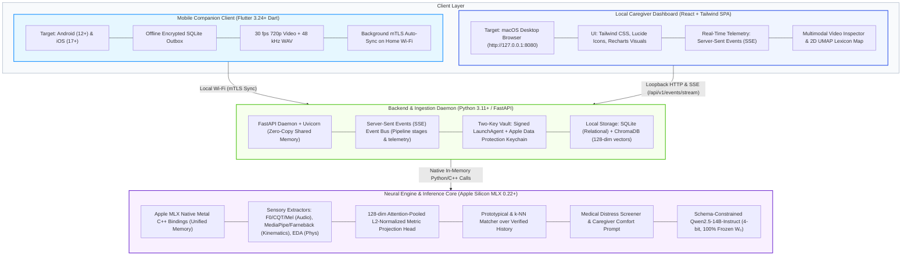
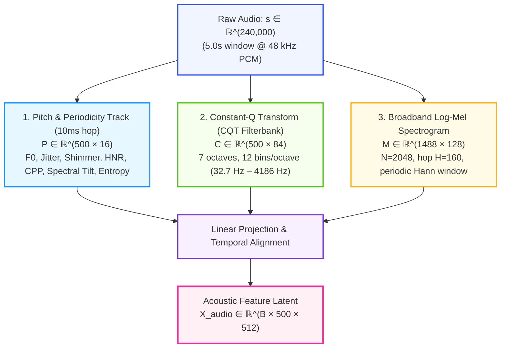
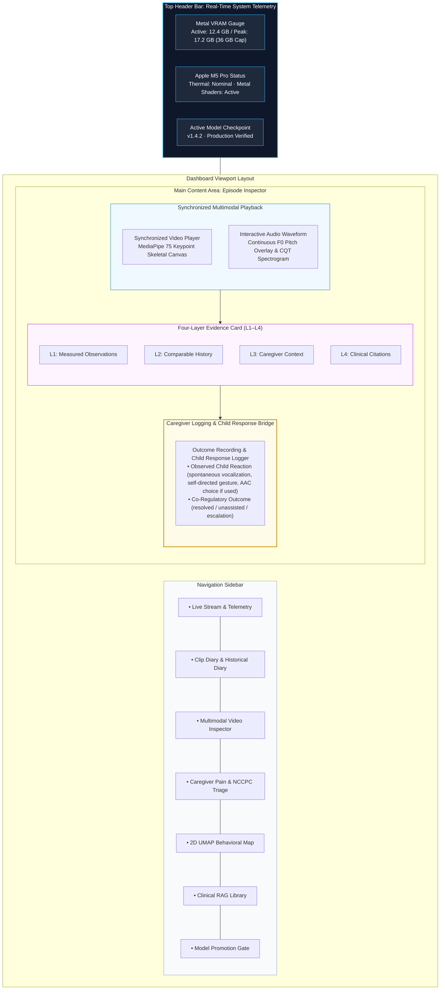
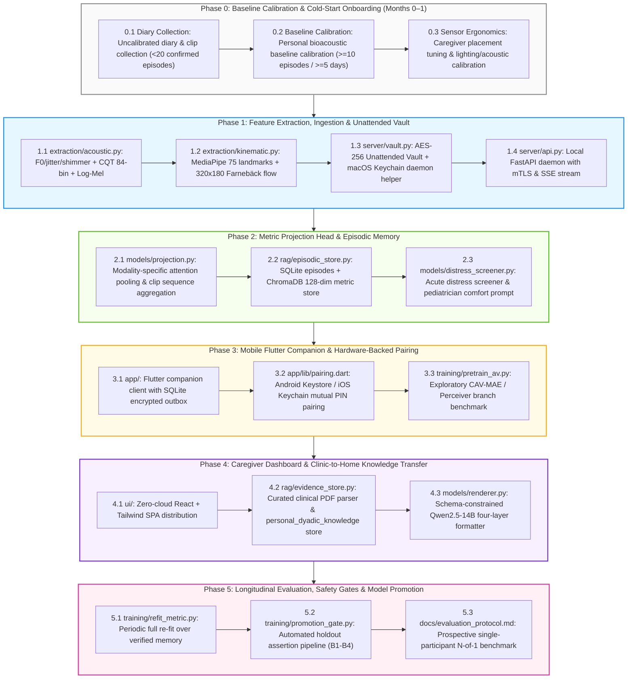

# Project N: Technical Specifications & System Architecture Blueprint

---

## 1. System Technology Stack & Architectural Decisions

Project N is engineered specifically for local execution on Apple Silicon (targeting an M5 Pro with 48GB Unified Memory), maintaining 100% offline privacy while serving an intuitive, rich interface for caregivers.



### 1.1 Stack Decision Rationale: Python over Go for the Server
- **Zero-Copy Metal Shared Memory:** Apple MLX features first-class Python and C++ bindings. MLX arrays allocate directly into Apple Silicon Unified Memory without IPC serialization. Using Go would require cgo wrappers around unofficial C++ bridges or an external Python sidecar over TCP sockets, introducing double-buffering and memory bandwidth bottlenecks across large video/audio buffers.
- **Asynchronous Concurrency:** FastAPI running on `uvloop` easily delivers sub-millisecond local REST endpoints and handles persistent Server-Sent Events (SSE) streaming connections concurrently with Metal GPU compute.

---

## 2. Mathematical Definitions, Feature Extraction & Signal Progression

### 2.1 Audio Feature Extraction Pipeline (48 kHz)
A 5-second acoustic window contains exactly $S = 240,000$ discrete samples at $f_s = 48,000\text{ Hz}$.



1. **Short-Time Fourier Transform (STFT):**
   $$S(m, k) = \sum_{n=0}^{N-1} s(n + mH) \cdot w(n) e^{-j \frac{2\pi}{N} k n}$$

   - FFT Window: $N = 2048$ (yielding linear bin width $\Delta f = 48000 / 2048 = 23.4375\text{ Hz}$).
   - Hop Length: $H = 160$ samples ($3.333\text{ ms}$ temporal resolution).
   - Window Function: Periodic Hann window $w(n) = 0.5 \left(1 - \cos\left(\frac{2\pi n}{N}\right)\right)$.
   - Frame Count (Uncentered): $T_m = 1 + \lfloor(240000 - 2048) / 160\rfloor = 1488$ frames.
2. **Dedicated Pitch & Periodicity Tracking:**
   To overcome the $\sim 27\text{ Hz}$ mel-filterbank resolution limit, fundamental frequency ($F_0$) is tracked via autocorrelation / pYIN over a candidate range of $50\text{ Hz}$ to $600\text{ Hz}$ at a $10\text{ ms}$ hop ($T_p = 500$ frames per 5s). The 16 explicit dimensions of the pitch vector $\mathbf{P} \in \mathbb{R}^{500 \times 16}$ comprise:
   - $d_0$: **Fundamental Frequency ($F_0$):** Instantaneous pitch in Hz.
   - $d_1$: **$\Delta F_0$:** First temporal difference of $F_0$.
   - $d_2$: **$\Delta^2 F_0$:** Second temporal difference (pitch acceleration).
   - $d_3$: **Local Jitter:** Relative period-to-period perturbation $\frac{\frac{1}{T-1} \sum |T_i - T_{i+1}|}{\frac{1}{T} \sum T_i}$.
   - $d_4$: **Jitter RAP:** Relative Average Perturbation over 3 consecutive pitch periods.
   - $d_5$: **Local Shimmer:** Relative amplitude perturbation $\frac{\frac{1}{T-1} \sum |A_i - A_{i+1}|}{\frac{1}{T} \sum A_i}$.
   - $d_6$: **Shimmer APQ3:** Amplitude Perturbation Quotient over 3 consecutive periods.
   - $d_7$: **Harmonics-to-Noise Ratio (HNR):** $10 \log_{10} \frac{E_{harmonic}}{E_{noise}}$ (in dB).
   - $d_8$: **Cepstral Peak Prominence (CPP):** Prominence of the highest quefrency peak normalized by linear regression baseline, measuring periodic-to-aperiodic energy ratio (correlate of overall vocal quality/dysphonia).
   - $d_9$: **Spectral Tilt:** Linear regression slope of the log magnitude spectrum across 0–4000 Hz.
   - $d_{10}$: **Spectral Entropy:** Wiener entropy measuring spectral energy dispersion vs. tonal concentration.
   - $d_{11}$: **Spectral Centroid:** Frequency center of mass of the magnitude spectrum.
   - $d_{12}$: **Spectral Spread:** Second central moment (spectral variance) around the centroid.
   - $d_{13}$: **Voicing Probability:** Frame voicing confidence metric $\in [0, 1]$ from pYIN / autocorrelation.
   - $d_{14}$: **RMS Energy:** Frame-level Root Mean Square energy in dB.
   - $d_{15}$: **$\Delta \text{RMS}$:** First temporal derivative of RMS energy (onset velocity).
3. **CQT Harmonic Filterbank:**
   Applies 84 geometrically spaced filters across 7 octaves ($f_{min} = 32.703\text{ Hz}$ [$C_1$], 12 bins/octave). The filter center frequencies are given by $f_k = f_{min} \cdot 2^{k/12}$ for $k \in \{0, \dots, 83\}$, spanning from $32.70\text{ Hz}$ to $3951.07\text{ Hz}$ ($B_7$), with the exclusive upper octave boundary at $4186.01\text{ Hz}$ ($C_8$). This delivers logarithmic frequency resolution matching human pitch perception.
4. **Acoustic Projection:** $\mathbf{X}_{audio} = \text{LinearAlign}([\mathbf{P} \;\|\; \mathbf{C} \;\|\; \text{Downsample}(\mathbf{M})]) \in \mathbb{R}^{B \times 500 \times 512}$.

### 2.2 Kinematic Feature Extraction Pipeline (30 fps @ 720p)
A 5-second video recording yields exactly $T_v = 150$ frames at $30\text{ fps}$.

1. **Body-Relative Landmark Extraction (MediaPipe Holistic / BlazePose):**
   - 33 Pose landmarks (torso, shoulders, elbows, wrists, head), outputting $(x, y, z, \text{visibility})$ ($33 \times 4 = 132$ features).
   - 21 Hand landmarks per hand ($2 \times 21 = 42$ hand keypoints), outputting spatial coordinates $(x, y, z)$ ($42 \times 3 = 126$ features; note that MediaPipe does not provide visibility scores for hand keypoints).
   - Total landmarks: $K = 75$ keypoints (258 features per frame).
   - **Torso-Relative Normalization:** Coordinates are normalized relative to shoulder-hip center and scaled by inter-shoulder width:
     $$\tilde{\mathbf{p}}_k = \frac{\mathbf{p}_k - \mathbf{p}_{mid\_hip}}{\|\mathbf{p}_{left\_shoulder} - \mathbf{p}_{right\_shoulder}\|_2}$$
     This reduces distance, zoom, and scale variations (though monocular depth and severe 3D rotation limits apply).
   - Landmark matrix: $\mathbf{K} \in \mathbb{R}^{B \times 150 \times 258}$.
2. **Dense Optical Flow with Pre-Downscaling (OpenCV Farnebäck):**
   - **Pre-Flow Spatial Downscaling ($4\times$):** To prevent CPU bottlenecks on full-resolution 720p/1080p frames, frame pairs are downscaled by $4\times$ to $320 \times 180$ (`FLOW_PRE_DOWNSCALE_WIDTH = 320`, `FLOW_PRE_DOWNSCALE_HEIGHT = 180`) before optical flow calculation. This accelerates computation by $\sim 10\times$ without signal loss, as subsequent spatial grid pooling ($8 \times 8$ bins) discards high-frequency pixel variations.
   - **Flow Extraction:** Extracts horizontal and vertical displacement fields $(u, v)$ between consecutive frames using OpenCV's native Farnebäck algorithm (`cv2.calcOpticalFlowFarneback`; $T_{diff} = 149$ steps), spatially pooled to an $8 \times 8$ grid ($128$ dimensions per frame). This eliminates external PyTorch dependencies while running with deterministic CPU bounds. To align temporally with the 150-frame pose sequence, the flow sequence is left-padded with a zero-displacement initial frame $\mathbf{0} \in \mathbb{R}^{B \times 1 \times 128}$, yielding $\tilde{\mathbf{O}} \in \mathbb{R}^{B \times 150 \times 128}$.
3. **Kinematic Projection:** $\mathbf{X}_{kinematic} = \text{TemporalTransformer}([\mathbf{K} \;\|\; \tilde{\mathbf{O}}]) \in \mathbb{R}^{B \times 150 \times 512}$.

### 2.3 Physiological Feature Extraction (Optional Auxiliary Channel)
When wearable sensor streams (e.g., paired Apple Watch or research biosensors) are available:

1. **Electrodermal Activity (EDA @ 4 Hz):** Continuous decomposition into tonic Skin Conductance Level (SCL) and phasic Skin Conductance Response (SCR) using convex optimization:
   $$G(t) = SCL(t) + SCR(t) + \epsilon(t)$$
2. **Heart Rate & Autonomic Variability (HRV):**
   - Over short 5-second video windows, physiological telemetry provides exploratory **time-domain metrics**: mean Heart Rate (BPM), pulse-interval variance, and Root Mean Square of Successive Differences (RMSSD).
   - Frequency-domain spectral metrics (such as High-Frequency vagal power, HF $0.15–0.40\text{ Hz}$) require rolling buffers of 1–5 minutes of continuous data (ESC/NASPE standards) and are computed only when continuous background buffers are available.
   - When ingesting from consumer devices like Apple Watch via HealthKit, samples are received as discrete episodic quantities (e.g. episodic HR, SDNN) rather than continuous 100 Hz raw photoplethysmography (PPG), whereas research devices stream continuous raw PPG/EDA when paired.
3. **3-Axis Accelerometry (@ 50 Hz):** Wrist tremor energy and gross motor magnitude: $a_{mag}(t) = \sqrt{a_x^2 + a_y^2 + a_z^2}$.
4. **Resampling, Temporal Alignment & Unified Mask Polarity:**
   - Multi-rate physiological telemetry is resampled onto a uniform temporal grid of $T_{physio} = 50$ steps (10 Hz) using linear interpolation for continuous signals (EDA, HR) and anti-aliased polyphase decimation for 50 Hz accelerometry.
   - **Unified Mask Polarity (`True = valid`):** Project-wide convention establishes that boolean mask $\mathbf{M}_{physio} \in \{\text{True}, \text{False}\}^{B \times 50}$ indicates valid observations ($\text{True} = 1 = \text{valid sample}$, $\text{False} = 0 = \text{dropped/missing}$). When passed into Metal scaled dot product attention, the valid mask is converted via `mx.where(mask, 0.0, -1e9)` to supply additive $-\infty$ attention masking for invalid timesteps.
   - When wearable sensors are unpaired, $\mathbf{M}_{physio} = \text{False}$, and missing streams are zero-imputed.
5. **Output Dimension:** $\mathbf{X}_{physio} \in \mathbb{R}^{B \times 50 \times 64}$.

### 2.4 Hierarchical Clip-to-Window Modeling & Multi-Stream Ingestion

Mobile companion recordings capture real-world behavioral episodes spanning $L \in [30.0, 120.0]\text{ seconds}$. Rather than collapsing or truncating long-range context, Project N implements a two-tier hierarchical temporal architecture:

```
30–120s Episode Clip (e.g. L = 60s -> W = 12 contiguous 5.0s windows)
│
├── Tier 1: Micro-Dynamics (5.0s Window Encoders @ 30 fps)
│   • Acoustic: 240,000 samples -> P (500x16), C (84 bins), M -> X_audio (500x512)
│   • Kinematic: 150 frames @ 30 fps -> K (150x258), O (150x128) -> X_kinematic (150x512)
│   • Physiological: 50 steps (10 Hz) -> X_physio (50x64) [Optional]
│   • Window Projection Head: z^(w) in R^128 (L2-normalized)
│
└── Tier 2: Macro-Trajectory Modeling (Clip-Level Sequence Pooling)
    • Sequence of window embeddings: [z^(1), z^(2), ..., z^(W)] in R^(W x 128)
    • Temporal Positional Encoding: p_w used for attention scoring to preserve temporal order
    • Narrative Arc: Captures transition [Baseline Calm -> Escalation -> Action Offered -> Settling]
    • Clip-Level Attention Pool: z_clip = L2Norm(sum_w alpha_w * z^(w)) in R^128 (pure sensory values)
    • Stored in ChromaDB `nd_confirmed_episodes` as the canonical episode representation
```

1. **Window Slicing:** A clip of duration $L$ seconds is partitioned into $W = \lfloor L / 5.0 \rfloor$ non-overlapping, contiguous $5.0\text{s}$ windows ($W \in [6, 24]$ for clips spanning $30\text{--}120\text{s}$). Any remainder $L - 5.0 \cdot W < 5.0\text{s}$ is handled via trailing edge padding or included in the final window.
2. **Window-Level Embeddings:** Each window $w \in \{1, \dots, W\}$ is independently processed through the acoustic, kinematic, and physiological encoders, producing window latent embedding $\mathbf{z}^{(w)} \in \mathbb{R}^{128}$ via `MetricProjectionHead`.
3. **Macro-Trajectory Sequence Attention & Positional Magnitude Decoupling:**
   To retain the complete narrative arc without smearing temporal context, window vectors are augmented with sinusoidal temporal positional encodings $\mathbf{p}_w \in \mathbb{R}^{128}$ for **attention scoring only**.

   > [!IMPORTANT]
   > **Positional Magnitude Decoupling Invariant:** Each window embedding $\mathbf{z}^{(w)}$ is L2-normalized ($\|\mathbf{z}^{(w)}\|_2 = 1$), whereas standard sinusoidal positional encodings have magnitude $\|\mathbf{p}_w\|_2 = \sqrt{128/2} = 8$. Directly adding $\mathbf{p}_w$ into the pooled value vector would cause the positional component to dominate sensory features $8:1$, causing clips to cluster by duration rather than behavioral content. Therefore, $\mathbf{p}_w$ is used strictly to score attention weights $\alpha_w$, while pooling computes a weighted sum of pure sensory representations $\mathbf{z}^{(w)}$:
   > $$\alpha_w = \text{Softmax}\left(\frac{(\mathbf{z}^{(w)} + \mathbf{p}_w) \mathbf{q}_{clip}^T}{\sqrt{128}}\right)$$
   > $$\mathbf{z}_{clip} = \text{L2Normalize}\left(\sum_{w=1}^W \alpha_w \mathbf{z}^{(w)}\right) \in \mathbb{R}^{128}$$
   > Temporal progression governs *which* windows get attended to, not the direction of the stored embedding vector.
4. **Multi-Camera & External Microphone Extensibility:**
   - **Multi-Camera Alignment:** When multiple cameras capture an episode (e.g. mobile phone camera + room tripod camera), streams are time-aligned via UTC timestamps or audio cross-correlation. For any window $w$, kinematic pose and flow features from all available angles are fused using cross-view attention pooling, ensuring robust tracking even if Child N turns away from one camera view.
   - **Multi-Microphone Ingestion:** When an external microphone (lapel or room boundary mic) is active, audio channels are aligned, and the feature extractor selects the channel with the highest Signal-to-Noise Ratio (SNR) or fuses multi-channel spectral envelopes.
5. **Graceful Degradation & Null Modality Gating:**
   When physiological telemetry is absent ($m_{physio} = 0$), $\mathbf{X}_{physio}$ is replaced by a learned null-modality embedding $\mathbf{e}_{\emptyset}^{physio} \in \mathbb{R}^{64}$ broadcast across the temporal sequence, ensuring all metric vectors $\mathbf{z}_{clip}$ inhabit an identical geometric space.

---

## 3. Metric Learning, Episodic Retrieval & Medical Safety

### 3.1 128-Dimensional Metric Learning Architecture
The high-dimensional sensory representations are compressed into an attention-pooled, L2-normalized 128-dimensional metric vector:

```python
# Metric Representation
z_metric = MetricProjectionHead(x_audio, x_kinematic, x_physio)  # Shape: (B, 128)
assert mx.allclose(mx.sum(mx.square(z_metric), axis=-1), mx.array([1.0])), (
    "L2 Norm Invariant Violated!"
)
```

### 3.2 Episodic Prototype Matching & Calibrated Abstention
Matching is performed via cosine distance against historical prototype vectors $\mathbf{c}_k$ in ChromaDB / SQLite:
$$d(\mathbf{z}, \mathbf{c}_k) = 1 - \mathbf{z} \cdot \mathbf{c}_k$$

- **Calibrated Abstention Rule:** If $\min_k d(\mathbf{z}, \mathbf{c}_k) > \tau_{abstain}$ (where default $\tau_{abstain} = 0.35$, tuned to 95th percentile holdout distance):
  $$\text{Decision} = \text{ABSTAIN} \implies \text{"Unrecognized behavioral pattern; insufficient historical similarity."}$$

- The system offers open-ended caregiver observation or environmental check-in rather than guessing.

### 3.3 Medical Safety Protocol & Distress Screening (Triage First)
Physical distress and somatic pain must always take absolute priority over behavioral or sensory interpretations. In clinical practice, pain in non-communicating children is evaluated using validated instruments:

- **The Clinical Instruments & Home Adaptation Disclosure:**
  - **NCCPC-PV** ([Breau et al., 2002](WHITE_PAPER.md#ref-2); doi:10.1097/00000542-200203000-00004): Evaluated across 24 children postoperatively; comprises 27 items across 6 subscales ($0 \le S_{NCCPC} \le 81$) standardized over a **10-minute structured human caregiver observation**; validated cut-off $S_{NCCPC} \ge 11$ indicates moderate-to-severe pain.
  - **NCCPC-R** ([Breau et al., 2002](WHITE_PAPER.md#ref-2); doi:10.1016/S0304-3959(02)00179-3): Evaluated in home/residential settings across 71 children; comprises 30 items across 7 subscales ($0 \le S_{NCCPC} \le 90$) over a **2-hour observation window**; validated cut-off $S_{NCCPC} \ge 7$ indicates presence of pain (84% sensitivity, up to 77% specificity).
  - *Exploratory Home Protocol Disclosure:* Because the 2-hour observation window of the NCCPC-R makes it infeasible for acute, immediate post-episode checks, the in-the-moment mobile companion checklist adapts the 10-minute, 27-item observation of the NCCPC-PV. **This application outside postoperative acute care is an exploratory adaptation, not a formally validated setting; use of this protocol at home must be explicitly reviewed, selected, and approved by the child's personal pediatrician.**
- **Decoupling Automated Signal Deviation from Medical Diagnosis:**
  A 5-second computer vision and audio clip cannot compute a 10-minute clinical checklist. Project N therefore strictly separates automated sensor telemetry from medical diagnosis:
  - **Configured Signal-Deviation Screener (`AcuteDistressAnomalyDetector`):** At inference time, the local MLX engine screens for sharp acoustic excursions ($F_0$ spike, severe CPP drop) and rapid guarding/flinching kinematics relative to the child's calibrated personal baseline. If no calibrated personal baseline is available, the screener abstains. These thresholds represent configured signal-deviation triggers, not diagnostic markers of pain or internal strain.
  - **Two-Stage Triage Separation:**
    1. **Physical Comfort Check Nudge (Triggered by Sensor Deviation):**
       When automated acoustic or kinematic excursion is detected, the system immediately presents a **Physical Comfort Check Card**, suppressing behavioral interpretations:
       ```text
       [PHYSICAL COMFORT CHECK SUGGESTED]
       Acoustic and kinematic signals show acute deviation from calibrated personal baseline.
       Prompt: Check for physical discomfort, temperature, hydration, fatigue, or acute sensory overload.
       All behavioral, communicative, and sensory interpretations are suppressed.
       ```
    2. **Medical Escalation Card (Triggered by Caregiver Pain Instrument / Red Flag):**
       When the caregiver records a clinical red flag or completes an observation checklist exceeding validated pain thresholds (NCCPC-PV $\ge 11$ or NCCPC-R $\ge 7$), the system triggers the **Medical Escalation Card**:
       ```text
       [MEDICAL ESCALATION REQUIRED]
       Caregiver pain observation threshold exceeded or clinical red flag recorded.
       Prompt: Follow your family pediatrician-approved medical escalation protocol.
       All behavioral, sensory, and communication interpretations are suppressed.
       ```
  - **Non-Reassurance Rule:** If no signal deviation is triggered, the system explicitly communicates:
    `"No configured signal deviation was detected. This does not assess or exclude pain, illness, or distress."`
- **Cost Asymmetry & Triage Priority:**
  Physical distress and somatic discomfort must always take absolute priority over behavioral or sensory explanations. While alerts require parental attention and caregiving effort, prioritizing physical comfort checks prevents acute somatic conditions (such as otitis media, dental abscess, or GI pain) from being misattributed to behavioral bids or sensory seeking.

---

## 4. Database Schemas & Literature RAG Engine

### 4.1 Client-Side SQLite Outbox Schema (`app/databases/outbox.db`)
Maintained on mobile companion devices (Android / iOS) for store-and-forward offline recording:

```sql
CREATE TABLE offline_clips_outbox (
    id TEXT PRIMARY KEY,               -- UUIDv4
    file_path TEXT NOT NULL,           -- Local AES-encrypted video/audio file path
    captured_at TEXT NOT NULL,         -- ISO 8601 UTC
    duration_ms INTEGER NOT NULL,      -- Clip length
    caregiver_tag TEXT,                -- Optional offline hypothesis
    antecedent_notes TEXT,             -- Notes (e.g., 'playground transition', 'OT swing')
    child_aac_response TEXT,           -- Child selection if made offline
    sha256_checksum TEXT NOT NULL,     -- File integrity hash
    sync_status TEXT DEFAULT 'pending',-- 'pending' | 'syncing' | 'completed' | 'failed'
    retry_count INTEGER DEFAULT 0,
    created_at TIMESTAMP DEFAULT CURRENT_TIMESTAMP
);
CREATE INDEX idx_sync_status ON offline_clips_outbox(sync_status);
```

### 4.2 Server-Side SQLite Relational Schema (`server/data/project_n.db`)
Maintained locally on the Mac M5 Pro host:

```sql
CREATE TABLE episodes (
    id TEXT PRIMARY KEY,
    vault_uri TEXT NOT NULL,           -- Encrypted file URI in macOS Data Protection vault
    encoder_version_id TEXT NOT NULL,  -- Git commit / checkpoint ID
    captured_at TEXT NOT NULL,         -- ISO 8601 UTC
    duration_ms INTEGER NOT NULL,      -- Full clip length (30,000 to 120,000 ms)
    windows_count INTEGER NOT NULL,    -- Number of 5.0s windows aggregated (W in [6, 24])
    observed_f0_mean REAL,
    observed_motion_rhythm_hz REAL,
    eda_tonic_level REAL,
    antecedent_id TEXT NOT NULL CHECK(antecedent_id IN (
        'post_school_transition',
        'mealtime',
        'bedtime_routine',
        'loud_environment',
        'unfamiliar_setting',
        'physical_transition',
        'preferred_activity_ended',
        'unknown'
    )),                                -- Controlled antecedent vocabulary for reproducible retrieval metrics
    antecedent_notes TEXT,             -- Contextual free-text notes (e.g., 'playground noisy transition')
    caregiver_hypothesis TEXT,
    action_offered TEXT NOT NULL CHECK(action_offered IN (
        'quiet_refuge',
        'dimmed_lighting',
        'hydration_water',
        'deep_pressure_proprioceptive',
        'vestibular_rocking',
        'preferred_comfort_object',
        'sensory_break',
        'motor_movement_break',
        'warm_compress',
        'aac_choice_board',
        'open_observation',
        'other_custom'
    )),                                -- Controlled suggested action vocabulary preventing denominator fragmentation
    action_custom_label TEXT,          -- Caregiver custom label if action_offered == 'other_custom'
    action_performed TEXT CHECK(action_performed IN (
        'quiet_refuge',
        'dimmed_lighting',
        'hydration_water',
        'deep_pressure_proprioceptive',
        'vestibular_rocking',
        'preferred_comfort_object',
        'sensory_break',
        'motor_movement_break',
        'warm_compress',
        'aac_choice_board',
        'open_observation',
        'other_custom'
    )),                                -- Actual action executed by caregiver
    performance_status TEXT CHECK(performance_status IN (
        'completed',
        'attempted_refused',
        'aborted',
        'not_attempted'
    )),                                -- Operational status of the intervention
    action_notes TEXT,                 -- Descriptive notes / execution context
    caregiver_decision TEXT CHECK(caregiver_decision IN (
        'accepted',
        'modified',
        'rejected',
        'open_observation'
    )),                                -- Caregiver's human decision on the suggestion
    outcome_state TEXT CHECK(outcome_state IN (
        'settled_immediately',
        'settled_delayed',
        'no_change',
        'escalated'
    )),                                -- Observational outcome state following intervention
    settled_within_sec INTEGER,        -- Measured or reported latency in seconds from start of clip to baseline return
    child_response TEXT CHECK(child_response IN ('reach', 'gesture', 'vocal_signal', 'aac_selection', 'none')),
    response_channel TEXT CHECK(response_channel IN ('motor', 'vocal', 'aac', 'none')),
    response_independence TEXT CHECK(response_independence IN ('independent', 'prompted', 'passive', 'refusal', 'none')),
    prompt_level TEXT CHECK(prompt_level IN ('none', 'visual_cue', 'verbal_model', 'gestural', 'physical_prompt')),
    observer TEXT,                     -- De-identified role (e.g., 'primary_caregiver', 'ot_clinician')
    nccpc_instrument TEXT CHECK(nccpc_instrument IN ('nccpc_pv', 'nccpc_r', 'none')),
    nccpc_score INTEGER,               -- Validated checklist total (0-81 for PV, 0-90 for R)
    pain_cutoff_breached INTEGER DEFAULT -1 CHECK(pain_cutoff_breached IN (-1, 0, 1)), -- -1 = not evaluated, 0 = negative, 1 = breached
    created_at TIMESTAMP DEFAULT CURRENT_TIMESTAMP
);

CREATE TABLE model_checkpoints (
    id TEXT PRIMARY KEY,
    checkpoint_path TEXT NOT NULL,
    extractor_version TEXT NOT NULL,   -- Acoustic & kinematic extractor git SHA / version
    schema_version TEXT NOT NULL,      -- Database & event schema version
    dataset_version TEXT NOT NULL,     -- Hash / version of training split
    validation_manifest_hash TEXT,     -- SHA-256 manifest of locked validation set
    retrieval_mrr REAL NOT NULL,       -- Top-k retrieval Mean Reciprocal Rank
    holdout_coverage REAL NOT NULL,    -- Percentage of holdout queries with d <= tau_abstain
    ece_score REAL,                    -- Expected Calibration Error on validation splits
    evaluation_status TEXT NOT NULL DEFAULT 'pending' CHECK(evaluation_status IN ('pending', 'passed', 'failed')),
    distress_cases_evaluated INTEGER DEFAULT 0, -- Total positive distress/pain cases in evaluation split
    zero_distress_misses INTEGER,      -- NULL until validated on locked test set (0 if passed)
    validation_timestamp TEXT,         -- ISO 8601 UTC timestamp of formal evaluation run
    validation_report_hash TEXT,       -- Cryptographic hash of evaluation artifact
    caregiver_utility_score REAL,      -- Average Likert score on validation sets
    is_production INTEGER DEFAULT 0,
    promoted_at TEXT,
    notes TEXT
);

CREATE TABLE child_profile_facts (
    id TEXT PRIMARY KEY,               -- UUIDv4
    category TEXT NOT NULL,            -- 'comfort_object' | 'calming_cue' | 'sensory_trigger' | 'therapist_technique' | 'communication_routine'
    fact_title TEXT NOT NULL,          -- e.g. 'Red squishy dinosaur toy', 'Forearm joint compression'
    description TEXT NOT NULL,         -- e.g. 'Provides rapid tactile grounding within 2-4 min during auditory overload'
    source_type TEXT NOT NULL,         -- 'home_observation' | 'ot_session' | 'slp_session' | 'school'
    clinician_role TEXT,               -- e.g. 'OT', 'SLP', 'Pediatrician' (De-identified role; Zero personal names/PHI)
    clinician_id TEXT,                 -- De-identified pseudonymized identifier (e.g. 'clinician_01')
    provenance_episode_id TEXT,        -- Foreign key to episodes.id
    confirmed_by_caregiver INTEGER DEFAULT 0, -- Fail-closed: requires human review before active retrieval
    times_tried INTEGER DEFAULT 0,     -- Denominator: total times this action was offered
    times_helpful INTEGER DEFAULT 0,   -- Numerator: times followed by verified settling
    created_at TIMESTAMP DEFAULT CURRENT_TIMESTAMP,
    updated_at TIMESTAMP DEFAULT CURRENT_TIMESTAMP
);
CREATE INDEX idx_fact_category ON child_profile_facts(category);
CREATE INDEX idx_fact_source ON child_profile_facts(source_type);
```

### 4.3 ChromaDB Collections
1. **`nd_confirmed_episodes`:**
   - Vector: 128-dimensional L2-normalized metric embedding ($\mathbf{z}_{clip}$).
   - Distance metric: `cosine`.
   - Metadata: `episode_id`, `encoder_version_id`, `windows_count`, `antecedent_id`, `action_offered`, `action_performed`, `action_custom_label`, `caregiver_decision`, `performance_status`, `outcome_state`, `settled_within_sec`, `child_response`, `response_channel`, `response_independence`, `nccpc_instrument`, `nccpc_score`, `pain_cutoff_breached`.
2. **`clinical_evidence`:**
   - Vector: 768-dimensional text embedding (`nomic-embed-text-v1.5`).
   - Distance metric: `cosine`.
   - Metadata: `source_title`, `author`, `year`, `framework`, `study_population`, `evidence_level`, `doi_or_url`, `locator`, `corpus_version`, `license_status`.
3. **`personal_dyadic_knowledge` (Personal & Clinic-to-Home RAG):**
   - Vector: 768-dimensional text embedding (`nomic-embed-text-v1.5`).
   - Distance metric: `cosine`.
   - Metadata: `fact_id`, `category`, `source_type`, `clinician_role`, `clinician_id`, `provenance_episode_id`, `confirmed_by_caregiver`, `times_tried`, `times_helpful`.

---

## 5. Local Server API, SSE Stream & Client Communication

### 5.1 REST API Endpoint Specifications

All endpoints (except initial user-present pairing) require an authenticated local mutual-pairing token passed via `Authorization: Bearer <local_paired_token>`. Unattended streaming and review are supported for paired clients without requiring biometric interruptions during everyday caregiver playback. Biometric confirmation (Touch ID / system admin credential) is strictly reserved for high-risk administrative operations (such as model promotion, rollback, key rotation, or database purge).

**Transport Authentication & Replay Prevention:**
- Requests over local Wi-Fi use mutual TLS (mTLS) with client certificates issued during initial pairing.
- Each sensitive request carries `X-Timestamp` (valid within a 300-second window) and `X-Signature` computed via HMAC-SHA256 over `<timestamp>.<method>.<path>.<body_sha256>`. The local daemon maintains a rolling in-memory nonce cache to reject replayed requests.

| HTTP Verb | Path | Request Payload / Headers | Response Payload | Description |
| :--- | :--- | :--- | :--- | :--- |
| `POST` | `/api/v1/auth/pair` | `{ "device_id": str, "csr_pem": str, "pairing_pin": str }` | `{ "client_cert_pem": str, "token": str, "expires_at": str }` | User-present PIN pairing: client submits Keystore/Secure Enclave CSR; server signs 1-year client cert. |
| `POST` | `/api/v1/clips/upload/init` | `{ "file_name": str, "file_size": int, "sha256": str, "total_chunks": int }`<br/>Header: `Authorization: Bearer` | `{ "upload_id": str, "chunk_size": int }` | Initializes authenticated resumable chunked upload. |
| `PUT` | `/api/v1/clips/upload/{id}/chunk/{idx}` | Binary chunk payload<br/>Header: `Authorization: Bearer`, `X-Chunk-SHA256` | `{ "chunk_index": int, "received": bool }` | Streams sequential authenticated chunk to upload buffer. |
| `POST` | `/api/v1/clips/upload/{id}/finalize` | `{ "metadata_json": dict }`<br/>Header: `Authorization: Bearer` | `{ "clip_id": str, "sha256": str, "status": "stored" }` | Validates assembled hash, encrypts into vault with per-clip DEK. |
| `POST` | `/api/v1/clips/{id}/analyze` | `{ "generate_render": bool }`<br/>Header: `Authorization: Bearer` | `{ "task_id": str, "stream_url": str }` | Triggers feature extraction & retrieval pass. |
| `POST` | `/api/v1/episodes/{id}/nccpc` | `{ "instrument": "nccpc_pv" \| "nccpc_r", "scores": dict, "duration_min": int }`<br/>Header: `Authorization: Bearer` | `{ "episode_id": str, "total_score": int, "pain_cutoff_breached": bool, "na_count": int, "escalation_required": bool, "guidance": str }` | Submits caregiver pain observation checklist, triggers immediate medical triage scoring. |
| `GET` | `/api/v1/episodes` | Query: `limit`, `offset`, `antecedent_id`, `distress`<br/>Header: `Authorization: Bearer` | `{ "episodes": List[Episode], "total": int }` | Timeline and diary browser for mobile app and dashboard. |
| `GET` | `/api/v1/episodes/{id}/media` | Header: `Authorization: Bearer` | Decrypted binary video stream (`video/mp4`) | Streams video for review to paired Flutter client or dashboard (unattended playback). |
| `GET` | `/api/v1/facts` | Query: `category`, `source_type`, `confirmed_only`<br/>Header: `Authorization: Bearer` | `{ "facts": List[ChildProfileFact], "total": int }` | Lists personal facts and clinic-learned techniques. |
| `POST` | `/api/v1/facts` | `{ "category": str, "fact_title": str, "description": str, "source_type": str, "clinician_role": str, "clinician_id": str }`<br/>Header: `Authorization: Bearer` | `{ "fact_id": str, "status": "created", "confirmed_by_caregiver": false }` | Stages extracted clinical technique into Confirmation Gate. |
| `POST` | `/api/v1/facts/{id}/confirm` | `{ "confirmed": bool, "custom_notes": Optional[str] }`<br/>Header: `Authorization: Bearer` | `{ "fact_id": str, "confirmed_by_caregiver": bool }` | Human-in-the-Loop confirmation card for therapist technique. |
| `GET` | `/api/v1/events/stream` | Header: `Accept: text/event-stream`<br/>Header: `Authorization: Bearer` | Continuous Server-Sent Events (SSE) stream | Real-time progress, telemetry, and training logs. |
| `GET` | `/api/v1/models/checkpoints` | None<br/>Header: `Authorization: Bearer` | `{ "checkpoints": List[ModelCheckpoint], "total": int }` | Lists registered candidate and production checkpoints with evaluation metrics. |
| `POST` | `/api/v1/models/promote` | `{ "candidate_id": str }`<br/>Header: `X-Admin-Auth: token` | `{ "status": "promoted", "timestamp": str }` | One-click candidate model promotion (admin/Touch ID gated). |
| `POST` | `/api/v1/models/rollback` | `{}`<br/>Header: `X-Admin-Auth: token` | `{ "status": "rolled_back", "active_id": str }` | Rollback to prior stable checkpoint (admin/Touch ID gated). |

### 5.2 Storage Encryption Hierarchy & Unattended macOS Keychain Semantics

- **Encryption Hierarchy:** Media files are encrypted with per-clip random AES-256-GCM Data Encryption Keys (DEKs). Relational records in `project_n.db` are encrypted using SQLCipher with a dedicated database key.
- **Unattended Keychain Access:** Both keys are secured in the macOS Data Protection Keychain using `kSecAttrAccessibleAfterFirstUnlockThisDeviceOnly`. Following a Mac restart, the background LaunchAgent remains paused until the user logs in and unlocks the Mac once. Once unlocked, background LaunchAgent ingestion, ML inference, and video streaming continue operating seamlessly while the Mac screen is locked or unattended, allowing immediate playback on paired Flutter apps without requiring Touch ID interaction.
- **Biometric Separation:** Touch ID is reserved strictly for destructive administrative actions (such as database wipe, key rotation, or unencrypted bulk export), keeping everyday family use and therapy review frictionless.
- **Pairing Key Separation:** Mobile companion pairing keys are generated in hardware-backed Android Keystore / iOS Keychain and are never exported or combined with host master keys.

### 5.3 Server-Sent Events (SSE) Protocol & Latency Expectations

Clients subscribe to `GET /api/v1/events/stream`. For a 60-second clip, dense feature extraction ($4\times$ downscaled Farnebäck flow + MediaPipe pose + STFT/CQT pitch) and temporal attention pooling execute in approximately **$15\text{--}35\text{ seconds}$** on an Apple Silicon M-series chip. Progress events reflect realistic pipeline stages:

```text
event: processing_progress
data: {"task_id": "9b1deb4d-3b7d-4bad-9bdd-2b0d7b3dcb6d", "stage": "kinematic_flow_extraction", "progress": 0.35, "windows_processed": 4, "total_windows": 12, "timestamp": "2026-09-09T20:45:00.123Z"}

event: system_telemetry
data: {"active_vram_gb": 12.4, "peak_vram_gb": 17.2, "memory_ceiling_gb": 36.0, "thermal_state": "nominal", "mlx_device": "Apple M5 Pro (Metal GPU)"}

event: four_layer_card
data: {"task_id": "9b1deb4d-3b7d-4bad-9bdd-2b0d7b3dcb6d", "L1_measured": "Vocalization: 4.2s, F0 mean 268 Hz. Kinematics: 3.8 Hz wrist oscillation across 12 windows.", "L2_historical": "Matched 3 prior episodes. Top resolution: deep pressure (2 of 3).", "L3_context": "Caregiver noted post-school transition, 45 min since water.", "L4_evidence": "Van de Cruys et al. (2014) - repetitive motions as uncertainty reduction.", "view_mode": "parent", "parent_view_text": "Child N's vocal pitch and wrist movement are elevated, which in past episodes occurred during noise overload or fatigue; you might explore offering deep pressure or water.", "abstained": false}
```

---

## 6. Local Mac Caregiver Web Dashboard (React + Tailwind)

The local web interface is built as a zero-cloud React 18+ Single-Page Application (SPA) styled with Tailwind CSS, bundled into static assets, and served directly by FastAPI at `http://127.0.0.1:8080`.

### 6.1 Dashboard UI Architecture & Components



### 6.2 Key Dashboard Screens & Components (`ui/src/`)

1. **Live Stream & Ingestion Telemetry (`pages/LiveTelemetryPage.tsx`):**
   - Metal unified VRAM gauge (`components/telemetry/VRAMGauge.tsx`) tracking real-time active and peak Metal allocations against the 36.0 GB ceiling.
   - Thermal state indicator (`components/telemetry/ThermalIndicator.tsx`) displaying Apple Silicon thermal state (`Nominal`, `Fair`, `Warm`, `Throttled`) and model calibration ID.
   - Background pipeline task progress tracker (`components/telemetry/PipelineTaskTracker.tsx`) visualizing real-time SSE extraction stages (`demuxing`, `kinematic_flow_extraction`, `audio_spectral_extraction`, `temporal_pooling`, `metric_projection`, `completed`).
   - Real-time Server-Sent Events stream log (`hooks/useSSEStream.ts`).

2. **Historical Episode Diary (`pages/DiaryPage.tsx`):**
   - Filterable timeline browser (`components/diary/EpisodeFilters.tsx`) supporting antecedent filters (`mealtime`, `post_school_transition`, `loud_environment`, etc.), date sorting, and outcome filtering.
   - Episode preview cards (`components/diary/EpisodeCard.tsx`) displaying duration, bioacoustic summary ($F_0$ mean, motion rhythm), outcome badges, and acute pain breach alerts.
   - Direct navigation to Video Inspector and NCCPC Triage screens.

3. **Multimodal Video Inspector & Four-Layer Insight Card (`pages/InspectorPage.tsx`):**
   - HTML5 Video Player (`components/inspector/VideoPlayer.tsx`) with 30 fps (33.3 ms) frame stepping, scrubber, rate control, and vault stream integration (`GET /api/v1/episodes/{id}/media`).
   - Synchronized MediaPipe skeletal canvas overlay (`components/inspector/SkeletalCanvasOverlay.tsx`) rendering 33 pose landmarks, hand keypoints, and Farnebäck motion velocity vectors frame-by-frame.
   - Synchronized audio waveform with interactive pitch trace ($F_0$ contour in Hz; `components/inspector/AudioPitchTrack.tsx`) allowing bidirectional scrubbing.
   - **Four-Layer Card (`components/inspector/FourLayerCard.tsx`):** Strictly partitions L1 (Measured), L2 (History), L3 (Context), and L4 (Evidence), with first-class abstention banners.
   - **Perspective Switcher Toggle (`[ 🟢 Parent View (Default) ] | [ 🔬 Therapist View ]`):**
     - **Parent View (`components/inspector/ParentViewContent.tsx`):** Warm, everyday English translation of acoustic/kinematic patterns, gentle exploratory possibilities (*"What Child N might be experiencing..."*), concrete co-regulatory calming cues (*"Offer water"*, *"Deep pressure"*, *"3-minute quiet break"*), and non-diagnostic advisory notice.
     - **Therapist View (`components/inspector/TherapistViewContent.tsx`):** Full bioacoustic figures ($F_0$, CPP, CQT harmonics), kinematic tracking, SCERTS framework mapping, Ayres Sensory Integration domain, and peer-reviewed citations with DOI links.
   - **Dyadic Outcome Recording Modal (`components/inspector/OutcomeLoggerModal.tsx`):** Form for recording caregiver decisions, intervention outcomes, settling times, and child agency responses (reach, gesture, vocal signal, independent AAC selection) to trigger ChromaDB vector indexing.

4. **Caregiver Pain Observation & NCCPC Triage Flow (`pages/PainTriagePage.tsx`):**
   - Digital checklist (`components/triage/NCCPCSubscaleSection.tsx`) for **NCCPC-PV** (27 items, 6 subscales) and **NCCPC-R** (30 items, 7 subscales) with single-touch `0`, `1`, `2`, `3`, and `NA` buttons.
   - Live running score indicator (`components/triage/ScoreIndicator.tsx`) displaying total score, subscale breakdowns, and cut-off detection ($\ge 11$ for PV, $\ge 7$ for R).
   - Medical safety escalation banner (`components/triage/MedicalEscalationBanner.tsx`): immediately locks out behavioral interpretations and renders the pediatrician-approved physical comfort protocol when cut-offs are breached.

5. **2D Behavioral Lexicon Visualizer (`pages/LexiconPage.tsx`):**
   - Interactive 2D scatter plot (`components/lexicon/UMAPCanvas.tsx`) projecting 128-dimensional metric clusters in 2D space.
   - Color legend (`components/lexicon/LexiconLegend.tsx`) color-coding points by co-regulatory action resolution.
   - Interactive hover tooltips (`components/lexicon/ClusterTooltip.tsx`) and click-to-inspect linking directly to the Multimodal Inspector.

6. **Clinical RAG & Facts Library (`pages/FactsLibraryPage.tsx`):**
   - Management of child profile facts, comfort objects, sensory triggers, and clinician-suggested OT/SLP techniques.
   - Fail-closed caregiver confirmation gate (`components/facts/FactItemCard.tsx`): unconfirmed techniques require explicit caregiver review and confirmation (`POST /api/v1/facts/{id}/confirm`).
   - Modal for staging new clinician techniques (`components/facts/CreateFactModal.tsx`).

7. **Candidate Model Promotion Gate (`pages/PromotionGatePage.tsx`):**
   - Checkpoint registry browser (`components/promotion/CheckpointRow.tsx`) showing retrieval MRR ($\ge 0.65$), holdout coverage (60–85%), ECE, and zero acute distress misses.
   - Calibration reliability diagram (`components/promotion/CalibrationCurve.tsx`) across $M=5$ confidence bins ($\text{ECE} \le 0.12$).
   - Explicit caregiver promotion sign-off modal (`components/promotion/PromotionConfirmModal.tsx`) and one-click rollback flow via `/api/v1/models/promote` and `/api/v1/models/rollback`.

---

## 7. Architectural Reference Sketch & Component Signatures

Below is an illustrative architectural specification and pseudo-code sketch outlining the component interfaces: the multimodal metric projection head with missing-modality gating, episodic prototype retrieval, acute distress anomaly screening, and schema-constrained Qwen2.5-14B rendering.

> [!NOTE]
> **Implementation Scope & Architectural Normative Note**
> This section serves as an interface contract and dataflow blueprint for implementation. Production feature extraction routines, validation assertions, and runtime pipeline modules will reside in the repository source packages (`extraction/`, `models/`, `rag/`, `server/`) upon execution of their respective roadmap phases.
>
> **Normative Baseline vs. Research Branch:**
> - **Normative Baseline (Phase 1–2):** Modality-specific attention pooling with missing-sensor gating (`AttentionPool` + `MetricProjectionHead`) represents the primary normative implementation path for device-local inference.
> - **Exploratory Research Branch:** CAV-MAE / Perceiver cross-attention audio-visual temporal binding is maintained as an experimental pre-training investigation.

```python
"""
Project N: Core Multimodal Metric Learning, Safety & Rendering Pipeline Interface Sketch.
Targeted natively for Apple Silicon Metal Unified Memory (mlx >= 0.22.0).
"""

from typing import Dict, Any, List, Optional, Tuple, Set, ClassVar
from dataclasses import dataclass, asdict
from collections import Counter
import json
import mlx.core as mx
import mlx.nn as nn
import numpy as np


class AttentionPool(nn.Module):
    """
    Learned temporal attention pooling condensing arbitrary sequence lengths
    into a unified latent summary representation.
    """

    def __init__(self, d_in: int):
        super().__init__()
        self.attn_vector = nn.Linear(d_in, 1, bias=False)

    def __call__(self, x: mx.array, mask: Optional[mx.array] = None) -> mx.array:
        # x: (B, T, D)
        # mask convention: 1 = masked/ignored, 0 = valid (additive bias of -1e9 applied to masked tokens)
        scores = self.attn_vector(x)  # (B, T, 1)
        if mask is not None:
            if mask.ndim == 2:
                mask = mask[:, :, None]  # Expand (B, T) -> (B, T, 1) to match score dimensions
            scores = scores + (mask * -1e9)
        weights = mx.softmax(scores, axis=1)  # (B, T, 1)
        pooled = mx.sum(x * weights, axis=1)  # (B, D)
        return pooled


class MetricProjectionHead(nn.Module):
    """
    Multimodal projection head supporting graceful degradation when
    optional physiological sensors are absent. Maps inputs into an
    L2-normalized 128-dimensional metric space.
    """

    def __init__(
        self,
        d_audio: int = 512,
        d_kinematic: int = 512,
        d_physio: int = 64,
        d_hidden: int = 512,
        d_metric: int = 128,
    ):
        super().__init__()
        # Modal attention pools
        self.pool_audio = AttentionPool(d_audio)
        self.pool_kinematic = AttentionPool(d_kinematic)
        self.pool_physio = AttentionPool(d_physio)

        # Dimension alignment
        self.proj_audio = nn.Linear(d_audio, d_hidden)
        self.proj_kinematic = nn.Linear(d_kinematic, d_hidden)
        self.proj_physio = nn.Linear(d_physio, d_hidden)

        # Learned null-modality embedding for missing physiological telemetry
        self.null_physio = mx.random.normal((1, d_physio)) * 0.02

        # Multimodal fusion layers
        self.fusion_norm = nn.LayerNorm(d_hidden * 3)
        self.fc1 = nn.Linear(d_hidden * 3, d_hidden)
        self.fc_metric = nn.Linear(d_hidden, d_metric, bias=False)

    def __call__(
        self, x_audio: mx.array, x_kinematic: mx.array, x_physio: Optional[mx.array] = None
    ) -> mx.array:
        B = x_audio.shape[0]

        # 1. Pool and project acoustic and kinematic features
        h_a = nn.gelu(self.proj_audio(self.pool_audio(x_audio)))
        h_k = nn.gelu(self.proj_kinematic(self.pool_kinematic(x_kinematic)))

        # 2. Graceful degradation: substitute null embedding if physiology is missing
        if x_physio is None:
            broadcast_null = mx.broadcast_to(self.null_physio, (B, 1, 64))
            h_p = nn.gelu(self.proj_physio(self.pool_physio(broadcast_null)))
        else:
            h_p = nn.gelu(self.proj_physio(self.pool_physio(x_physio)))

        # 3. Concatenation and metric projection
        fused = mx.concatenate([h_a, h_k, h_p], axis=-1)
        fused = self.fusion_norm(fused)
        hidden = nn.gelu(self.fc1(fused))
        raw_metric = self.fc_metric(hidden)

        # 4. Explicit L2-normalization for cosine distance metric geometry
        norm = mx.sqrt(mx.sum(mx.square(raw_metric), axis=-1, keepdims=True) + 1e-8)
        z_metric = raw_metric / norm
        return z_metric  # (B, 128)


class ClipSequenceAttentionPool(nn.Module):
    """
    Macro-trajectory sequence attention pooling combining W window vectors z^(w)
    into a clip-level embedding z_clip.

    IMPORTANT (Positional Encoding Magnitude Decoupling):
    Window vectors z^(w) are L2-normalized (||z^(w)|| = 1). Standard sinusoidal
    positional encodings have norm ||p_w|| = sqrt(128/2) = 8. Adding p_w directly
    to the pooled vectors would cause the positional component to overpower the
    sensory content by 8:1. Therefore, p_w is used STRICTLY for computing attention
    weights alpha_w, while the value vectors being pooled are the pure sensory
    representations z^(w):
        alpha_w = Softmax( (z^(w) + p_w) * q_clip / sqrt(128) )
        z_clip = L2Norm( sum_w alpha_w * z^(w) )
    """

    def __init__(self, d_metric: int = 128):
        super().__init__()
        self.d_metric = d_metric
        # Learned clip query vector
        self.query = mx.random.normal((d_metric,)) * 0.02
        self.scale = 1.0 / np.sqrt(d_metric)

    def __call__(self, z_windows: mx.array, p_encodings: mx.array) -> mx.array:
        # z_windows: (B, W, 128), L2-normalized window vectors
        # p_encodings: (W, 128), sinusoidal positional encodings
        # Use (z + p) for attention key/scoring only:
        keys = z_windows + p_encodings[None, :, :]  # (B, W, 128)
        scores = mx.sum(keys * self.query[None, None, :], axis=-1, keepdims=True) * self.scale  # (B, W, 1)
        weights = mx.softmax(scores, axis=1)  # (B, W, 1)

        # Pool pure sensory window representations z^(w) (WITHOUT p_w):
        pooled = mx.sum(z_windows * weights, axis=1)  # (B, 128)
        norm = mx.sqrt(mx.sum(mx.square(pooled), axis=-1, keepdims=True) + 1e-8)
        return pooled / norm  # (B, 128)


class EpisodicPrototypeMatcher:
    """
    Episodic prototype and k-NN retrieval engine with calibrated abstention
    and a 4-state onboarding lifecycle:
    - 'collecting': Insufficient records (<20 verified episodes logged).
    - 'awaiting_calibration': Sufficient records (>=20) but distance threshold tau_abstain uncalibrated on temporal split.
    - 'active': Distance threshold calibrated on temporal holdout split; normal inference enabled.
    - 'stale': Extractor, encoder, or schema version mismatch with active checkpoint.
    """

    def __init__(
        self,
        tau_abstain: float = 0.35,
        is_calibrated: bool = False,
        active_encoder_version: str = "v1.0.0",
    ):
        self.tau_abstain = tau_abstain
        self.is_calibrated = is_calibrated
        self.active_encoder_version = active_encoder_version

    def match(
        self, query_vector: mx.array, confirmed_collection: Any, top_k: int = 3
    ) -> Dict[str, Any]:
        total_records = (
            confirmed_collection.count()
            if hasattr(confirmed_collection, "count")
            else len(confirmed_collection)
        )

        # State 1: Collecting (<20 confirmed episodes)
        if total_records < 20:
            return {
                "abstained": True,
                "matcher_state": "collecting",
                "reason": f"Cold-start onboarding in progress ({total_records}/20 verified episodes logged). Episodic retrieval is suspended.",
                "nearest_distance": 1.0,
                "candidates": [],
            }

        # State 2: Awaiting Calibration (>=20 records, but calibration split not yet computed)
        if not self.is_calibrated:
            return {
                "abstained": True,
                "matcher_state": "awaiting_calibration",
                "reason": f"Sufficient records collected ({total_records} >= 20), but distance threshold tau_abstain is not yet calibrated on temporal split.",
                "nearest_distance": 1.0,
                "candidates": [],
            }

        q_list = query_vector[0].tolist()
        results = confirmed_collection.query(
            query_embeddings=[q_list],
            n_results=top_k,
            where={"encoder_version_id": self.active_encoder_version},  # Version consistency
        )

        distances = results["distances"][0] if results["distances"] else [1.0]
        nearest_distance = distances[0]

        # Calibrated abstention cutoff
        if nearest_distance > self.tau_abstain:
            return {
                "abstained": True,
                "matcher_state": "active_abstaining",
                "reason": f"Distance ({nearest_distance:.3f}) exceeds calibrated threshold ({self.tau_abstain:.3f})",
                "nearest_distance": nearest_distance,
                "candidates": [],
            }

        candidates = []
        for meta, dist in zip(results["metadatas"][0], distances):
            candidates.append(
                {
                    "episode_id": meta.get("episode_id", "unknown_ep"),
                    "action_offered": meta.get("action_offered", "open_observation"),
                    "action_performed": meta.get("action_performed") or meta.get("action_offered", "open_observation"),
                    "action_custom_label": meta.get("action_custom_label"),
                    "caregiver_decision": meta.get("caregiver_decision", "accepted"),
                    "performance_status": meta.get("performance_status", "completed"),
                    "outcome_state": meta.get("outcome_state"),
                    "settled_within_sec": meta.get("settled_within_sec"),
                    "child_response": meta.get("child_response", "none"),
                    "response_channel": meta.get("response_channel", "none"),
                    "distance": dist,
                }
            )

        return {
            "abstained": False,
            "matcher_state": "active",
            "nearest_distance": nearest_distance,
            "candidates": candidates,
        }


class AcuteDistressAnomalyDetector:
    """
    Automated acoustic and kinematic anomaly screener executing on raw sensory frames.
    Screens for acute acoustic excursions and flinching/guarding kinematics relative to
    the child's calibrated personal baseline. Requires a minimum personal baseline of >=10
    verified clean episodes across >=5 days before activating to prevent alarm fatigue.
    Configured signal-deviation trigger only; does not diagnose or exclude somatic pain, illness,
    or distress. Prompts caregiver to conduct a physical comfort check.
    """

    @classmethod
    def evaluate(
        cls, measured_features: Dict[str, Any], baseline_stats: Optional[Dict[str, float]] = None
    ) -> Dict[str, Any]:
        # Fail-closed / Cold-Start gate: require calibrated baseline statistics
        if not baseline_stats or baseline_stats.get("calibrated_episodes_count", 0) < 10:
            return {
                "screener_available": False,
                "distress_anomaly": False,
                "screener_status": "uncalibrated_collecting_baseline",
                "reason": "Personal baseline collecting (requires >=10 clean episodes across >=5 days). Anomaly screening paused to prevent alarm fatigue.",
                "recommendation": (
                    "Personal bioacoustic baseline uncalibrated. Automated anomaly screening paused. "
                    "Use timeline diary and check physical comfort manually if Child N appears unsettled."
                ),
            }

        f0_mean = measured_features.get("f0_mean_hz")
        cpp_val = measured_features.get("cpp_db")
        flinch_guarding = measured_features.get("acute_guarding_detected", False)

        f0_thresh = baseline_stats.get("f0_upper_limit_hz", 450.0)
        cpp_thresh = baseline_stats.get("cpp_lower_limit_db", 4.0)

        f0_spike = bool(isinstance(f0_mean, (int, float)) and f0_mean > f0_thresh)
        cpp_strain = bool(isinstance(cpp_val, (int, float)) and cpp_val < cpp_thresh)

        is_anomaly = bool(f0_spike or cpp_strain or flinch_guarding)
        return {
            "screener_available": True,
            "screener_status": "calibrated_active",
            "distress_anomaly": is_anomaly,
            "indicators": {
                "f0_spike": f0_spike,
                "cpp_strain": cpp_strain,
                "flinch_guarding": flinch_guarding,
            },
            "recommendation": (
                "PHYSICAL COMFORT CHECK SUGGESTED: Bioacoustic or kinematic signals deviate from calibrated baseline. "
                "Prompt caregiver to check physical comfort, hydration, temperature, or sensory environment. "
                "Behavioral and sensory interpretations are suppressed."
                if is_anomaly
                else "No configured signal deviation was detected. This does not assess or exclude pain, illness, or distress."
            ),
        }


class NCCPCChecklist:
    """
    Caregiver-completed Non-Communicating Children's Pain Checklist (Breau et al., 2002).
    Delegates to canonical models.nccpc definitions and scoring engine:
    - NCCPC-PV: 27 canonical items across 6 subscales (cut-off >= 11 indicates pain, Breau et al. 2002).
    - NCCPC-R: 30 canonical items across 7 subscales (cut-off >= 7 indicates pain, Breau et al. 2002).
    """

    PV_CUTOFF = 11
    R_CUTOFF = 7

    @classmethod
    def score_pv(cls, item_scores: Mapping[str, int | str]) -> Dict[str, Any]:
        from models.nccpc import score_nccpc_pv

        res = score_nccpc_pv(item_scores)
        return {
            "total_score": res.score,
            "na_count": res.na_count,
            "instrument": "NCCPC-PV (27 items, 10-min observation)",
            "exceeds_threshold": res.cutoff_breached,
            "caution_high_na_count": res.high_missingness_advisory,
            "subscales": res.subscale_scores,
        }

    @classmethod
    def score_r(cls, item_scores: Mapping[str, int | str]) -> Dict[str, Any]:
        from models.nccpc import score_nccpc_r

        res = score_nccpc_r(item_scores)
        return {
            "total_score": res.score,
            "na_count": res.na_count,
            "instrument": "NCCPC-R (30 items, 2-hr observation)",
            "exceeds_threshold": res.cutoff_breached,
            "caution_high_na_count": res.high_missingness_advisory,
            "subscales": res.subscale_scores,
        }


@dataclass
class SignalQuality:
    """Deterministic, tamper-proof signal quality model computed directly from sensor telemetry."""

    audio_snr_db: float
    clipping_ratio: float
    pose_tracking_confidence: float
    lighting_lux: float
    optical_flow_magnitude: float

    @property
    def quality_passed(self) -> bool:
        return (
            self.audio_snr_db >= 10.0
            and self.clipping_ratio <= 0.02
            and self.pose_tracking_confidence >= 0.50
            and self.lighting_lux >= 15.0
        )

    @property
    def rejection_reason(self) -> Optional[str]:
        reasons = []
        if self.audio_snr_db < 10.0:
            reasons.append(f"Audio SNR too low ({self.audio_snr_db:.1f} dB < 10.0 dB)")
        if self.clipping_ratio > 0.02:
            reasons.append(f"Audio clipping too high ({self.clipping_ratio*100:.1f}% > 2.0%)")
        if self.pose_tracking_confidence < 0.50:
            reasons.append(f"Pose tracking confidence too low ({self.pose_tracking_confidence:.2f} < 0.50)")
        if self.lighting_lux < 15.0:
            reasons.append(f"Ambient lighting inadequate ({self.lighting_lux:.1f} lux < 15.0 lux)")
        return "; ".join(reasons) if reasons else None


@dataclass
class MetricInputs:
    x_audio: mx.array  # (B, 500, 512)
    x_kinematic: mx.array  # (B, 150, 512)
    x_physio: Optional[mx.array] = None  # (B, 50, 64)
    audio_mask: Optional[mx.array] = None  # (B, 500) boolean (True = valid)
    kinematic_mask: Optional[mx.array] = None  # (B, 150) boolean (True = valid)
    physio_mask: Optional[mx.array] = None  # (B, 50) boolean (True = valid)


@dataclass
class ParentCard:
    """Typed Parent View card strictly enforcing epistemic grounding and bound pair provenance."""

    observed_signals: str
    precedent_summary: str
    context_notes: str
    gentle_possibilities: List[
        Dict[str, str]
    ]  # list of {"action_id": ..., "action_label": ..., "provenance_id": ...}
    non_diagnostic_notice: str


CONTROLLED_ACTION_LABELS: Dict[str, str] = {
    "quiet_refuge": "Provide quiet sensory refuge",
    "dimmed_lighting": "Dim ambient room lighting",
    "hydration_water": "Offer water or hydration",
    "deep_pressure_proprioceptive": "Offer firm deep pressure or joint compression",
    "vestibular_rocking": "Offer gentle vestibular rocking or swing",
    "preferred_comfort_object": "Offer preferred comfort toy or object",
    "sensory_break": "Offer a short sensory break",
    "motor_movement_break": "Offer motor movement or walking break",
    "warm_compress": "Apply warm compress or gentle warmth",
    "aac_choice_board": "Present open AAC communication choice board",
    "open_observation": "Engage in patient, quiet observation without intervention",
    "other_custom": "Custom family co-regulatory routine",
}


def execute_inference_cycle(
    metric_inputs: MetricInputs,
    signal_quality: SignalQuality,
    measured_features: Dict[str, Any],  # Extracted L1 features (F0, CPP, motion freq, etc.)
    caregiver_context: Dict[str, Any],  # L3 antecedents (time elapsed, transition state, etc.)
    caregiver_nccpc_scores: Optional[
        Mapping[str, int | str]
    ],  # Optional caregiver 10-min observation scores
    caregiver_red_flags: Optional[
        List[str]
    ],  # Clinical red flags (e.g. fever, vomiting, acute trauma)
    metric_head: MetricProjectionHead,
    matcher: EpisodicPrototypeMatcher,
    confirmed_collection: Any,
    evidence_collection: Any,
    personal_knowledge_collection: Optional[
        Any
    ],  # Personal facts & clinic-learned OT/SLP techniques
    llm_renderer: Any,
    tokenizer: Any,
    view_mode: str = "parent",  # "parent" (default) or "therapist"
    baseline_stats: Optional[Dict[str, float]] = None,
) -> Dict[str, Any]:
    """
    Executes an end-to-end Project N inference cycle adhering to the four-layer output contract.
    Medical Safety Precedence: Caregiver red flags and validated pain checklists are evaluated
    FIRST, guaranteeing that sensor quality issues (dark rooms, noise) never suppress medical triage.
    """
    # 1. MEDICAL SAFETY & DISTRESS TRIAGE (Evaluated FIRST unconditionally)
    # Stage 1A: Caregiver Reported Clinical Red Flags
    if caregiver_red_flags:
        return {
            "layer": "MEDICAL_ESCALATION",
            "escalation_type": "caregiver_reported_clinical_red_flag",
            "red_flags": caregiver_red_flags,
            "escalation_card": (
                "MEDICAL ESCALATION REQUIRED: Caregiver observed acute clinical red flags. "
                "Consult family pediatrician or emergency services immediately. "
                "All behavioral, communicative, and sensory interpretations are suppressed."
            ),
            "actionable_hints": [
                "Follow family pediatrician acute medical protocol",
                "Monitor vitals and physical symptoms closely",
            ],
            "suggested_observations": ["pediatrician_protocol", "physical_symptom_check"],
        }

    # Stage 1B: Validated Caregiver Pain Checklist
    caregiver_pain_flag = False
    nccpc_total = None
    if caregiver_nccpc_scores is not None:
        if len(caregiver_nccpc_scores) == 30:
            nccpc_result = NCCPCChecklist.score_r(caregiver_nccpc_scores)
        else:
            nccpc_result = NCCPCChecklist.score_pv(caregiver_nccpc_scores)
        nccpc_total = nccpc_result["total_score"]
        caregiver_pain_flag = nccpc_result["exceeds_threshold"]

    if caregiver_pain_flag:
        return {
            "layer": "MEDICAL_ESCALATION",
            "escalation_type": "clinical_pain_threshold_exceeded",
            "caregiver_nccpc_score": nccpc_total,
            "escalation_card": (
                "MEDICAL ESCALATION REQUIRED: Caregiver pain observation checklist threshold exceeded. "
                "Prompt caregiver to follow family pediatrician-approved comfort and medical escalation protocol. "
                "All behavioral, communicative, and sensory interpretations are suppressed."
            ),
            "actionable_hints": [
                "Examine child for acute somatic symptoms, illness, or physical distress",
                "Execute pediatrician-approved comfort and escalation protocol",
            ],
            "suggested_observations": ["pediatrician_protocol", "physical_symptom_check"],
        }

    # 2. DETERMINISTIC SENSOR SIGNAL QUALITY GATE
    if not signal_quality.quality_passed:
        return {
            "layer": "ABSTAIN",
            "message": f"Signal quality insufficient for reliable automated inference: {signal_quality.rejection_reason}",
            "signal_quality": asdict(signal_quality),
            "actionable_hints": [
                "Reposition companion camera for direct line of sight",
                "Ensure adequate ambient lighting for kinematic tracking",
                "Reduce acoustic background noise or move closer to Child N",
            ],
            "suggested_observations": ["lighting_check", "camera_line_of_sight"],
        }

    # 3. PHYSICAL COMFORT CHECK (Triggered by automated acoustic/kinematic deviation)
    anomaly_check = AcuteDistressAnomalyDetector.evaluate(measured_features, baseline_stats)
    if anomaly_check.get("distress_anomaly"):
        return {
            "layer": "COMFORT_CHECK",
            "escalation_type": "sensor_signal_deviation",
            "indicators": anomaly_check.get("indicators", {}),
            "comfort_card": (
                "PHYSICAL COMFORT CHECK SUGGESTED: Bioacoustic or kinematic signals deviate from calibrated baseline. "
                "Examine child for physical discomfort, hydration, temperature, or sensory noise before behavioral exploration. "
                "Behavioral and sensory interpretations are suppressed."
            ),
            "actionable_hints": [
                "Offer water or check time since last meal/hydration",
                "Check room temperature, clothing comfort, or tactile irritants",
                "Assess ambient noise or lighting changes; offer quiet sensory refuge",
            ],
            "suggested_observations": [
                "hydration_check",
                "environmental_noise_check",
                "temperature_check",
            ],
        }

    # 4. METRIC PROJECTION & EPISODIC RETRIEVAL
    z_metric = metric_head(metric_inputs.x_audio, metric_inputs.x_kinematic, metric_inputs.x_physio)
    mx.eval(z_metric)

    match_result = matcher.match(z_metric, confirmed_collection, top_k=3)
    if match_result["abstained"]:
        return {
            "layer": "ABSTAIN",
            "message": match_result.get(
                "reason", "Unrecognized behavioral pattern; insufficient historical similarity."
            ),
            "matcher_state": match_result.get("matcher_state", "active"),
            "nearest_distance": match_result["nearest_distance"],
            "actionable_hints": [
                "Observe child without immediate intervention",
                "Offer open-ended visual schedule or preferred comfort object",
            ],
            "suggested_observations": ["open_choice_board", "check_in"],
        }

    # 5. CLINICAL EVIDENCE & PERSONAL KNOWLEDGE RETRIEVAL
    # Settle statistics group strictly on action_performed (filtered to performance_status == 'completed').
    # This guarantees that when a caregiver modifies a suggestion, the intervention that ACTUALLY
    # took place and settled the child receives proper empirical credit.
    # Separately, action_offered + caregiver_decision tracks suggestion acceptance rates.
    candidates = match_result["candidates"]
    action_stats: Dict[Tuple[str, Optional[str]], Dict[str, int]] = {}
    candidate_source_map: Dict[Tuple[str, Optional[str]], List[str]] = {}
    suggestion_feedback_counts: Dict[str, int] = {
        "accepted": 0,
        "modified": 0,
        "rejected": 0,
        "open_observation": 0,
    }

    for c in candidates:
        # Track suggestion acceptance rate independently
        decision = c.get("caregiver_decision", "accepted")
        if decision in suggestion_feedback_counts:
            suggestion_feedback_counts[decision] += 1

        # Settle statistics group strictly on completed action_performed
        perf_status = c.get("performance_status", "completed")
        if perf_status != "completed":
            continue  # Incomplete, refused, or abandoned actions do not receive settle-rate credit

        act_performed = c.get("action_performed") or c.get("action_offered", "open_observation")
        custom_label = c.get("action_custom_label")
        group_key = (act_performed, custom_label if act_performed == "other_custom" else None)
        ep_id = c.get("episode_id", "unknown_ep")

        if group_key not in action_stats:
            action_stats[group_key] = {"performed": 0, "settled": 0}
            candidate_source_map[group_key] = []
        action_stats[group_key]["performed"] += 1
        candidate_source_map[group_key].append(ep_id)

        if c.get("outcome_state") in ("settled_immediately", "settled_delayed"):
            action_stats[group_key]["settled"] += 1

    # Filter strictly for actions that observed at least one settling outcome
    beneficial_actions = [
        (key, stats) for key, stats in action_stats.items() if stats["settled"] > 0
    ]

    top_group_key: Optional[Tuple[str, Optional[str]]] = None
    provenance_id: Optional[str] = None
    if beneficial_actions:
        sorted_actions = sorted(
            beneficial_actions,
            key=lambda item: (
                (item[1]["settled"] + 1) / (item[1]["performed"] + 2),
                item[1]["settled"],
            ),
            reverse=True,
        )
        top_group_key, stats = sorted_actions[0]
        provenance_id = (
            candidate_source_map[top_group_key][0]
            if candidate_source_map.get(top_group_key)
            else "ep_prior"
        )
        top_act_id, top_custom = top_group_key
        act_label = (
            top_custom
            if top_act_id == "other_custom" and top_custom
            else CONTROLLED_ACTION_LABELS.get(top_act_id, top_act_id)
        )
        history_ratio_str = (
            f"{act_label} (settling observed in {stats['settled']} of "
            f"{stats['performed']} times performed in similar episodes)"
        )
    else:
        top_group_key = None
        provenance_id = None
        history_ratio_str = "no previous calming action recorded for this pattern"

    top_action_id = top_group_key[0] if top_group_key else None
    evidence_query = (
        f"Sensory regulation and environmental support for {top_action_id} in pediatric autism"
        if top_action_id
        else "Sensory regulation and co-regulatory scaffolding in pediatric autism"
    )
    lit_results = evidence_collection.query(query_texts=[evidence_query], n_results=1)
    if lit_results.get("documents") and lit_results["documents"][0]:
        doc_text = lit_results["documents"][0][0]
        meta = (
            lit_results["metadatas"][0][0]
            if lit_results.get("metadatas") and lit_results["metadatas"][0]
            else {}
        )
        author = meta.get("author", "Peer-Reviewed Literature")
        year = meta.get("year", "n.d.")
        framework = meta.get("framework", "Clinical Framework")
        evidence_level = meta.get("evidence_level", "Observational")
        l4 = f"Research literature: {author} ({year}) [{framework}, Level {evidence_level}]: {doc_text[:200]}..."
    else:
        l4 = "Research literature: No direct literature match found."

    personal_facts = []
    personal_fact_items = []
    if personal_knowledge_collection is not None:
        fact_query = (
            f"{top_action_id} comfort toy calming phrase sensory trigger OT technique"
            if top_action_id
            else "comfort toy calming phrase sensory trigger OT technique"
        )
        fact_results = personal_knowledge_collection.query(
            query_texts=[fact_query],
            n_results=3,
            where={"confirmed_by_caregiver": 1},
        )
        if fact_results.get("documents") and fact_results["documents"][0]:
            personal_facts = fact_results["documents"][0]
            metas = fact_results.get("metadatas", [[]])[0]
            for doc, m in zip(personal_facts, metas):
                personal_fact_items.append(
                    {
                        "text": doc,
                        "category": m.get("category", "personal_anchor"),
                        "source_id": m.get("fact_id", "fact_prior"),
                        "clinician_role": m.get("clinician_role", "caregiver"),
                    }
                )

    # 6. DETERMINISTIC FOUR-LAYER EVIDENCE ASSEMBLY
    f0_mean = measured_features.get("f0_mean_hz")
    cpp_val = measured_features.get("cpp_db")
    motion_type = measured_features.get("dominant_motion", "unspecified motion")
    motion_freq = measured_features.get("motion_freq_hz")
    snr_val = signal_quality.audio_snr_db

    f0_str = f"{f0_mean:.1f} Hz" if isinstance(f0_mean, (int, float)) else "not detected"
    cpp_str = f"{cpp_val:.2f} dB" if isinstance(cpp_val, (int, float)) else "not computed"
    freq_str = f"{motion_freq:.1f} Hz" if isinstance(motion_freq, (int, float)) else "not computed"

    l1 = (
        f"Acoustic: F0 mean {f0_str}, Cepstral Peak Prominence {cpp_str}, SNR {snr_val:.1f} dB. "
        f"Kinematic: {motion_type} at {freq_str}."
    )
    l2 = (
        f"Matched {len(match_result['candidates'])} prior episodes in historical vault. "
        f"Historical co-regulation precedent: {history_ratio_str}."
    )
    antecedent_val = caregiver_context.get("antecedent_id", "unknown")
    hydration = caregiver_context.get("elapsed_min_since_hydration", "unknown")
    noise = caregiver_context.get("noise_level", "unknown")
    l3 = f"Antecedents: context={antecedent_val}, elapsed_min_since_water={hydration}, ambient_noise={noise}."

    # 7. BOUND PAIR POSSIBILITIES & GROUNDED FALLBACK
    gentle_possibilities: List[Dict[str, str]] = []
    if top_group_key and provenance_id:
        top_act, top_custom = top_group_key
        act_label = top_custom if top_act == "other_custom" and top_custom else CONTROLLED_ACTION_LABELS.get(top_act, top_act)
        gentle_possibilities.append(
            {
                "action_id": top_act,
                "action": act_label,
                "provenance_id": provenance_id,
                "source_type": "historical_precedent",
            }
        )
    for item in personal_fact_items[:2]:
        gentle_possibilities.append(
            {
                "action_id": "other_custom",
                "action": f"Offer known anchor ({item['clinician_role']}): {item['text']}",
                "provenance_id": item["source_id"],
                "source_type": f"verified_{item['category']}",
            }
        )
    if not gentle_possibilities:
        gentle_possibilities.append(
            {
                "action_id": "open_observation",
                "action": "Observe child without immediate intervention; offer open choice board or quiet space",
                "provenance_id": "clinical_scerts_baseline",
                "source_type": "scerts_transactional_support",
            }
        )

    fallback_parent_card = ParentCard(
        observed_signals=f"Child N's vocal pitch ({f0_str}) and movement ({motion_type} at {freq_str}) show noticeable rhythm.",
        precedent_summary=f"In similar past episodes, {history_ratio_str}.",
        context_notes=f"Context notes: {antecedent_val}, {hydration} min since hydration, ambient noise {noise}.",
        gentle_possibilities=gentle_possibilities,
        non_diagnostic_notice=(
            "Supportive co-regulatory hypotheses based on past verified episodes and sensory literature, "
            "not a medical diagnosis. Prioritize physical comfort and consult your pediatrician for health concerns."
        ),
    )
    fallback_therapist_card = (
        f"[Therapist Telemetry Card]\n"
        f"Measured L1: {l1}\n"
        f"Precedent L2: {l2}\n"
        f"Context L3: {l3}\n"
        f"Evidence L4: {l4}"
    )

    rendered_parent_card = fallback_parent_card
    rendered_therapist_card = fallback_therapist_card

    if llm_renderer is not None and tokenizer is not None:
        try:
            import mlx_lm

            parent_render_prompt = (
                f"You are a compassionate companion for the parents of Child N. Output a valid JSON object matching ParentCard.\n"
                f"Do not invent diagnoses or untracked actions. Suggested actions must be selected strictly from available possibilities.\n\n"
                f"[L1 Measured]: {l1}\n"
                f"[L2 History]: {l2}\n"
                f"[L3 Context]: {l3}\n"
                f"[L4 Evidence]: {l4}\n"
                f"[Available Grounded Possibilities]: {json.dumps(gentle_possibilities)}\n"
            )
            gen_parent_json = mlx_lm.generate(
                llm_renderer, tokenizer, prompt=parent_render_prompt, max_tokens=400, verbose=False
            )
            parsed = json.loads(gen_parent_json)
            # Strict Post-Generation Grounding Validation: Validate Bound (action_id, provenance_id) Pairs
            if (
                isinstance(parsed, dict)
                and "observed_signals" in parsed
                and "precedent_summary" in parsed
                and "gentle_possibilities" in parsed
                and isinstance(parsed["gentle_possibilities"], list)
                and len(parsed["gentle_possibilities"]) > 0
            ):
                valid_pairs = {(p.get("action_id"), p.get("provenance_id")) for p in gentle_possibilities}
                validated_possibilities = [
                    p
                    for p in parsed["gentle_possibilities"]
                    if isinstance(p, dict)
                    and (p.get("action_id"), p.get("provenance_id")) in valid_pairs
                ]
                if validated_possibilities:
                    rendered_parent_card = ParentCard(
                        observed_signals=str(parsed["observed_signals"]),
                        precedent_summary=str(parsed["precedent_summary"]),
                        context_notes=str(
                            parsed.get("context_notes", fallback_parent_card.context_notes)
                        ),
                        gentle_possibilities=validated_possibilities,
                        non_diagnostic_notice=fallback_parent_card.non_diagnostic_notice,
                    )
        except Exception:
            rendered_parent_card = fallback_parent_card

    child_responses = [
        c.get("child_response")
        for c in match_result["candidates"]
        if c.get("child_response") and c.get("child_response") != "none"
    ]

    return {
        "structured_data": {
            "L1_measured": l1,
            "L2_history": l2,
            "L3_context": l3,
            "L4_evidence": l4,
        },
        "view_mode": view_mode,
        "parent_card": asdict(rendered_parent_card),
        "therapist_view": rendered_therapist_card,
        "active_card": (
            asdict(rendered_parent_card) if view_mode == "parent" else rendered_therapist_card
        ),
        "practical_things_to_try": [p["action"] for p in rendered_parent_card.gentle_possibilities],
        "historical_child_responses": child_responses,
        "disclaimer": rendered_parent_card.non_diagnostic_notice,
    }


---

## 8. Six Implementation Phases Roadmap


