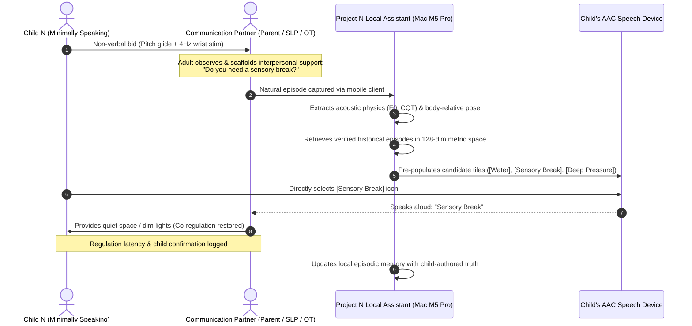
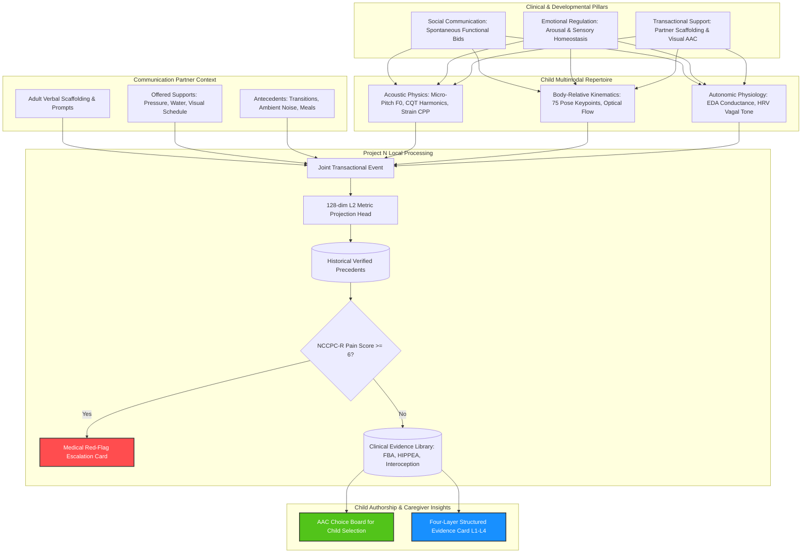
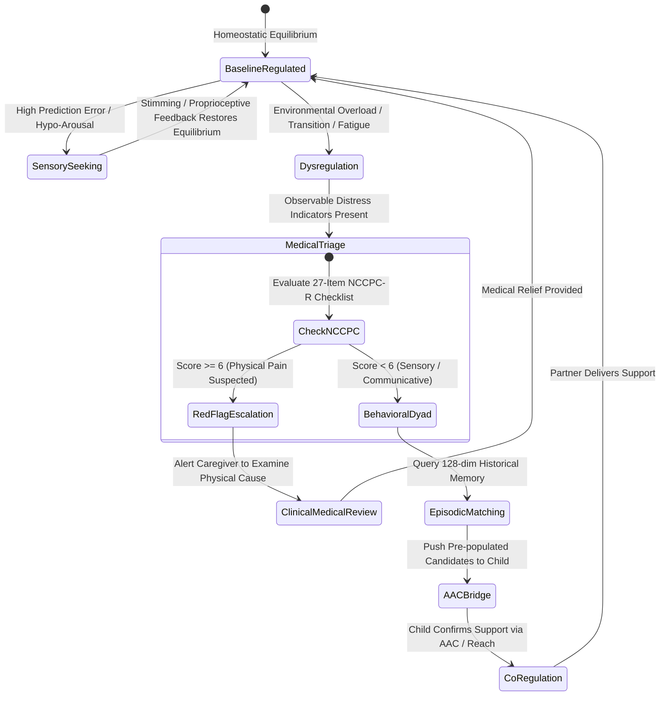
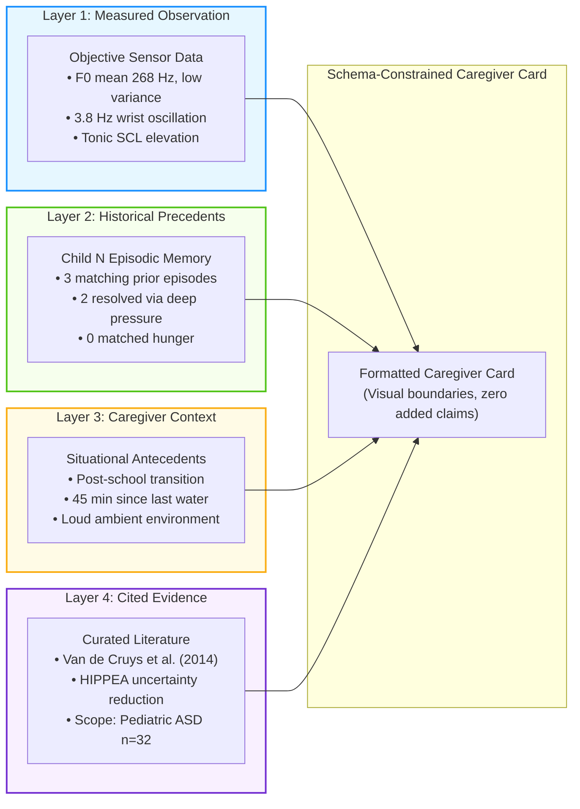

# Project N: A Dyadic, Multimodal, and Transactional Framework for Communication Support in Minimally Speaking Autism

**Lead Researcher & Project Architect:** Valentyn Shybanov ([olostan.me](https://olostan.me/) · [GitHub](https://github.com/olostan))  
**Collaborative Scope:** Speech-Language Pathologists (SLPs), Occupational Therapists (OTs), Developmental Pediatricians, Neurodiversity Researchers, and Assistive Technology Practitioners  
**Document Classification:** Scientific Whitepaper & Clinical Foundations  
**Version:** 1.1.0 — September 2026  

---

## Foreword from the Founder

> *"I am a software engineer, systems architect, and—most importantly—the father of a 7-year-old minimally speaking boy with Level 3 autism. Every single day of my life is shaped by the profound love, challenge, and heartbreak of trying to understand my child.*
>
> *My son cannot speak in words, but he is never silent. He communicates continuously: through subtle pitch inflections in his throat, micro-tremors in his hands, bodily orientations, and rhythms of movement. Traditional society and standard AI models discard these signals as 'meaningless noise.' But to me, as his father, that 'noise' is his entire voice.*
>
> *I did not start Project N as a commercial startup. I have no desire to monetize this software, sell a proprietary device, or exploit vulnerable families. I started this project because I refuse to accept that my son must remain trapped behind a barrier of communication. I am dedicating my twenty-plus years of engineering experience, machine learning knowledge, and systems architecture skills to build an open-source, local-first, privacy-respecting tool that can help parents like me and the dedicated therapists who support our children.*
>
> *This whitepaper outlines the scientific, clinical, and architectural foundation of this initiative. If you are a speech-language pathologist, an occupational therapist, an autism researcher, or an engineer who believes in communication rights: I warmly invite you to read, critique, and contribute to this open endeavor."*
>
> — **Valentyn Shybanov** ([olostan.me](https://olostan.me/))

---

## Abstract

Minimally speaking autistic individuals (such as children requiring Level 3 supports) communicate through an intricate, non-phonetic multimodal repertoire: idiosyncratic vocalizations, continuous tonal hums, micro-pitch inflections, repetitive kinetic motor stims, postural adjustments, and physiological shifts. Traditional artificial intelligence paradigms attempt to process non-verbal communication through an extractive "intent translation" lens—treating the child as an isolated, closed-box signal generator and attempting to decode an internal mental state into neurotypical English text. 

This paper presents the scientific rationale and methodological foundation for **Project N**, a local-first, privacy-preserving computational framework that departs fundamentally from extractive decoding. Grounded in the **Transactional Model of Communication** (Sameroff, 1975; Wetherby & Prizant, 2000) and the **SCERTS Framework** (Prizant, Wetherby, Rubin, & Laurent, 2006), Project N conceptualizes non-verbal communication as an active, **dyadic co-regulatory loop** between the child and their communicative partners (caregivers, therapists, educators). Rather than relying on acoustic features alone, the system evaluates the multimodal convergence of the child's acoustic physics, body-relative kinematics, optional autonomic physiology, and—critically—the adult communication partner's verbal scaffolding, physical interactions, and situational antecedents. By routing candidate possibilities directly through an Augmentative and Alternative Communication (AAC) bridge, the framework preserves child authorship, mitigates Facilitated Communication (FC) epistemic traps, and provides clinicians and families with an evidence-grounded, four-layer decision-support assistant.

---

## 1. Visual Overview: The Dyadic Transactional Architecture

### 1.1 The Dyadic Co-Regulatory Sequence

### 1.2 The SCERTS Framework & Multimodal Integration

---

## 2. Introduction & The Communicative Reality

### 2.1 Beyond the Verbal Threshold: Non-Speaking Is Not Non-Communicative
A substantial proportion (estimated at 25% to 35%) of autistic children remain minimally speaking or non-verbal past school age (Tager-Flusberg & Kasari, 2013). For these individuals, the absence of functional speech does not signify a lack of communicative intent, cognitive agency, or receptive language comprehension. Rather, co-occurring challenges—including Childhood Apraxia of Speech (CAS), oral-motor dyspraxia, sensory processing differences, and atypical sensorimotor feedforward integration—disrupt the complex neuromuscular coordination required to articulate discrete phonemic sequences.

In clinical Speech-Language Pathology (SLP), communication is recognized as inherently multimodal (Light & McNaughton, 2014). Minimally speaking children routinely mobilize an extensive communicative repertoire:
- **Paralinguistic Acoustic Cues:** Continuous vocal fold vibrations, glottal stops, clicks, harmonic overtone sweeps, guttural resonance, and micro-pitch shifts ($\pm 15\text{ to } 50\text{ Hz}$) that reflect physiological equilibrium, affective valence, or protest.
- **Kinematic & Motor Dynamics:** High-frequency repetitive motor behaviors ("stims"), including 3–6 Hz wrist rotations, finger-flicking in peripheral vision, pacing, torso rocking, or intentional physical reaches.
- **Physiological & Autonomic Fluctuations:** Sympathetic nervous system arousal, electrodermal reactivity, and cardiorespiratory shifts (HRV) driven by sensory demands.

### 2.2 The Neurotypical Inductive Bias of Commercial AI
Conventional foundation models (speech-to-text engines like Whisper, audio transformers like AST, and vision transformers like CLIP/ViT) are trained on massive datasets of neurotypical human speech and cinematic macro-actions. Their loss functions are mathematically optimized to enforce **phonemic and spatial collapse**:
1. **Acoustic Phonemic Discretization:** Whisper’s decoder penalizes acoustic variance that does not map onto standardized phonemes or linguistic tokens. Idiosyncratic tonal hums or guttural phonations are filtered out as background noise or collapsed into silence.
2. **Visual Spatial Pooling:** Standard vision models downsample spatial patches across temporal windows, blending a rapid 4 Hz wrist-flick or finger tremor into the static background pixels of a living room.

When applied to a minimally speaking child, commercial AI obliterates the very substrate that constitutes their expressive vocabulary.

---

## 3. The Transactional Paradigm: Communication as a Dyadic Loop

### 3.1 The Limits of "Unidirectional Intent Decoding"
Early artificial intelligence approaches to non-verbal autism conceptualized the child as a standalone transmitter whose "signals" must be translated by an algorithmic receiver. From a clinical speech therapy perspective, this assumption is fundamentally flawed:

In naturalistic pediatric communication, a vocalization or movement does not have an invariant, one-to-one semantic translation. A 350 Hz vocalization paired with hand flapping may represent intense joy during water play, severe vestibular seeking during room transitions, or overwhelming autonomic distress when ambient noise exceeds threshold. Identical surface behaviors arise from divergent internal needs, while a single functional need can manifest through varied behavioral expressions.

### 3.2 The SCERTS Framework & Interpersonal Scaffolding
To achieve clinical validity, Project N is architected around the **SCERTS Model** (Prizant, Wetherby, Rubin, & Laurent, 2006), an internationally recognized, evidence-based multidisciplinary framework focusing on:
- **SC (Social Communication):** Developing spontaneous, functional communication and emotional expression across non-verbal and aided modalities.
- **ER (Emotional Regulation):** Supporting self-regulation and mutual regulation to maintain optimal arousal states for learning and interaction.
- **TS (Transactional Support):** The interpersonal supports, environmental modifications, and learning tools provided by communication partners.

### 3.3 Why Labeling Adult Interaction Is Vital
A central insight of speech-language pathology is that a non-speaking child’s communication is shaped by their communicative partner's behavior (Sameroff, 1975; McLean & Snyder-McLean, 1978). 

Project N incorporates adult interaction data into its core relational schema:
- **What did the adult say or ask?** (e.g., *"Are you hungry?"*, *"Let's go outside"*, verbal pause/wait time).
- **What physical support was offered?** (e.g., offering a visual choice board, providing deep proprioceptive pressure, opening a door, reducing sensory input).
- **How did the child respond to that specific interaction?** (e.g., physical reach, turning away, vocal pitch lowering, respiration settling, or distress escalation).
- **Latency to Resolution:** The elapsed time required for the child to return to a regulated baseline following the adult's interaction.

By modeling the **dyad** rather than the child in isolation, the system learns which adult transactional supports correlate with successful co-regulation and communicative connection.

---

## 4. Regulatory State Progression & Medical Safeguards

---

## 5. Critical Analysis of Prior Art & Scientific Precedents

Project N builds directly upon and synthesizes several empirical research bodies:

### 5.1 Bioacoustics of Non-Verbal Vocalizations
- **The ReCANVo Study (Johnson, Narain, Quatieri, Maes, & Picard, 2023):**
  MIT Media Lab researchers compiled a database of 7,077 real-world communicative and affective non-verbal vocalizations from 8 minimally speaking individuals, annotated in real time by close family members.
  - *Key Finding:* Non-verbal vocalizations carry statistically significant acoustic markers of valence and communicative intent, with personalized (within-subject) models substantially outperforming generalized population-level models.
  - *Engineering Implication:* Validates Project N's individualized (N-of-1) modeling strategy, proving that non-verbal vocalizations are structured physical signals, not random noise.
- **Acoustic Voice Features in Autism Meta-Analyses (Fusaroli et al., 2017; 2026):**
  Systematic reviews demonstrate that across populations, acoustic differences between autistic and neurotypical individuals show modest effect sizes ($d = 0.4–0.5$) with only $\sim 61–64\%$ discriminatory accuracy.
  - *Clinical Implication:* Confirms that population-wide "autism voice classifiers" fail. Only an individualized, longitudinal N-of-1 acoustic baseline can reliably identify a specific child's subtle shifts.

### 5.2 Wearable Biosensing & Autonomic Forecasting
- **Wearable Biosensing in Psychiatric Inpatients (Goodwin et al., 2023):**
  Investigated 20 minimally verbal autistic youth across 1,000+ hours of continuous wearable biosensing (electrodermal activity, heart-rate variability, accelerometry).
  - *Key Finding:* Wearable biosensing predicted imminent aggressive distress episodes 1 minute in advance with an AUROC of **0.84** for person-dependent models (versus 0.71 for population models).
  - *Engineering Implication:* Direct autonomic sensing breaks the circularity of guessing internal arousal from surface behaviors alone.

### 5.3 Motor Stimming, Kinematics & Predictive Coding
- **Self-Stimulatory Behavior Dataset (SSBD; Rajagopalan et al., 2015):**
  Ablation studies examining sequence-based classification of autistic stimming demonstrated that accuracy **peaked at 15–30 frames per second** (LSTM accuracy increased from 90.0% to 97.5%), proving that hyper-dense frame rates (60+ fps) overfit on pose jitter.
- **The HIPPEA Framework (High Inflexible Precision of Prediction Errors; Van de Cruys et al., 2014):**
  Reframes repetitive motor stims not as meaningless symptoms, but as adaptive cognitive strategies to generate predictable sensory feedback in an overwhelming, high-prediction-error world.

### 5.4 Augmentative and Alternative Communication (AAC)
- **Naturalistic Developmental Behavioral Interventions (NDBI) & Aided AAC (Schreibman et al., 2015; Bruinsma et al., 2020):**
  Meta-analyses across decades of aided AAC research confirm that AAC interventions improve vocal production in **87% of participants**, with zero empirical studies reporting speech reduction.
  - *Ethical Implication:* Preserving the child's autonomous communication through AAC must be the primary channel, not an afterthought.

### 5.5 Somatic Distress & Pain Evaluation
- **Non-Communicating Children’s Pain Checklist – Revised (NCCPC-R; Breau et al., 2002; 2004):**
  A validated 27-item clinical instrument with high internal consistency ($\alpha \approx 0.92$) designed specifically for parents and caregivers to detect physical pain in children with severe communication impairments across 6 observable subscales.

---

## 6. The Four-Layer Evidence Model (L1–L4)

To prevent generative AI from fabricating clinical or emotional narratives, Project N enforces a strict four-layer evidence hierarchy:

---

## 7. Implications for Clinical Practice (SLP & OT)

### 7.1 For Speech-Language Pathologists (SLPs)
1. **Ecologically Valid Longitudinal Repertoire:** Rather than relying on 45-minute weekly clinic sessions, SLPs gain access to a continuous, objective timeline of naturalistic vocalizations and communicative bids across home and community settings.
2. **Personalized AAC Target Identification:** Identifies which situations exhibit high child-initiated communication, enabling targeted design of AAC vocabulary boards that match the child's actual lived experiences.
3. **Tracking Dyadic Interaction & Scaffolding:** Allows therapists to review how different communication partner styles (wait time, simplified linguistic modeling, visual cues) correlate with child engagement and vocal variety.

### 7.2 For Occupational Therapists (OTs)
1. **Objective Sensory Profile Tracking:** Maps repetitive motor behaviors and acoustic tension against environmental antecedents (auditory noise, room transitions, sensory overload), grounding Ayres Sensory Integration in empirical physical telemetry.
2. **Co-Regulation Efficacy Assessment:** Provides measurable data on whether specific proprioceptive or vestibular interventions (e.g., deep pressure, swinging) effectively down-regulate autonomic hyper-arousal.

---

## 8. Conclusion & Collaborative Invitation

Project N redefines the role of artificial intelligence in neurodivergent communication: **shifting from an extractive intent translator to a dyadic, transactional, and child-authored communication-support tool.** 

By uniting speech-language pathology principles, occupational therapy sensory frameworks, high-resolution acoustic and kinematic physics, and rigorous privacy engineering on local Apple Silicon hardware, Project N offers a path toward understanding non-verbal communication that honors the child's autonomy, empowers families, and respects scientific integrity.

We warmly invite speech-language pathologists, occupational therapists, assistive technology developers, and neurodiversity researchers to review, critique, and contribute to this open-source architecture.

---

## 9. References & Academic Bibliography

1. Barrett, L. F., Adolphs, R., Marsella, S., Martinez, A. M., & Pollak, S. D. (2019). Emotional expressions reconsidered: Challenges to inferring emotion from human facial movements. *Psychological Science in the Public Interest*, 20(1), 1–68.
2. Breau, L. M., McGrath, P. J., Camfield, C. S., & Rosmus, C. (2002). Psychometric properties of the non-communicating children's pain checklist-revised. *Pain*, 99(1-2), 349–357.
3. Bruinsma, Y., Minjarez, M. B., Schreibman, L., & Stahmer, A. C. (2020). *Naturalistic developmental behavioral interventions for autism spectrum disorder*. Paul H. Brookes Publishing.
4. Fusaroli, R., Lambrechts, A., Bang, D., Bowler, D. M., & Gaigg, S. B. (2017). Is voice a marker for Autism spectrum disorder? A systematic review and meta-analysis. *Autism Research*, 10(3), 384–407.
5. Goodwin, M. S., Mazefsky, C. A., Ioannidis, S., Erdogmus, D., & Siegel, M. (2023). Predicting imminent aggression in psychiatric inpatients with autism using wearable biosensing. *JAMA Network Open*, 6(12), e2347942.
6. Johnson, C., Narain, J., Quatieri, T., Maes, P., & Picard, R. (2023). ReCANVo: A database of real-world communicative and affective nonverbal vocalizations. *Scientific Data*, 10(1), 523.
7. Light, J., & McNaughton, D. (2014). Communicative competence for individuals who require augmentative and alternative communication: A new definition for a new era of communication? *Augmentative and Alternative Communication*, 30(1), 1–18.
8. McLean, J. E., & Snyder-McLean, L. K. (1978). *A transactional approach to early language training*. Charles E. Merrill Publishing.
9. Narain, J., Johnson, C., Quatieri, T., Maes, P., & Picard, R. (2022). Modeling real-world affective and communicative nonverbal vocalizations from minimally speaking individuals. *IEEE Transactions on Affective Computing*, 14(4), 3122–3135.
10. National Autism Center. (2021). *Position statement on Facilitated Communication and Rapid Prompting Method*. National Standards Project.
11. Prizant, B. M., Wetherby, A. M., Rubin, E., & Laurent, A. C. (2006). *The SCERTS model: A comprehensive educational approach for children with autism spectrum disorders*. Paul H. Brookes Publishing.
12. Rajagopalan, S. S., Dhall, A., & Goecke, R. (2015). Self-stimulatory behaviours in the wild for autism diagnosis. *IEEE International Conference on Computer Vision (ICCV)*, 756–764.
13. Sameroff, A. J. (1975). Transactional models in early social relations. *Human Development*, 18(1-2), 65–79.
14. Schreibman, L., Dawson, G., Stahmer, A. C., Landa, R., Rogers, S. J., McGee, G. G., ... & Halladay, A. (2015). Naturalistic developmental behavioral interventions: Empirically validated treatments for autism spectrum disorder. *Journal of Autism and Developmental Disorders*, 45(8), 2411–2428.
15. Tager-Flusberg, H., & Kasari, C. (2013). Minimally verbal school-aged children with autism spectrum disorder: The neglected end of the spectrum. *Autism Research*, 6(6), 468–478.
16. Van de Cruys, S., Evers, K., Van der Hallen, R., Van Eylen, L., Boets, B., de-Wit, L., & Wagemans, J. (2014). Precise minds in uncertain worlds: Predictive coding in autism. *Psychological Review*, 121(4), 649–675.
17. Wetherby, A. M., & Prizant, B. M. (2000). *Autism spectrum disorders: A transactional developmental perspective*. Paul H. Brookes Publishing.
