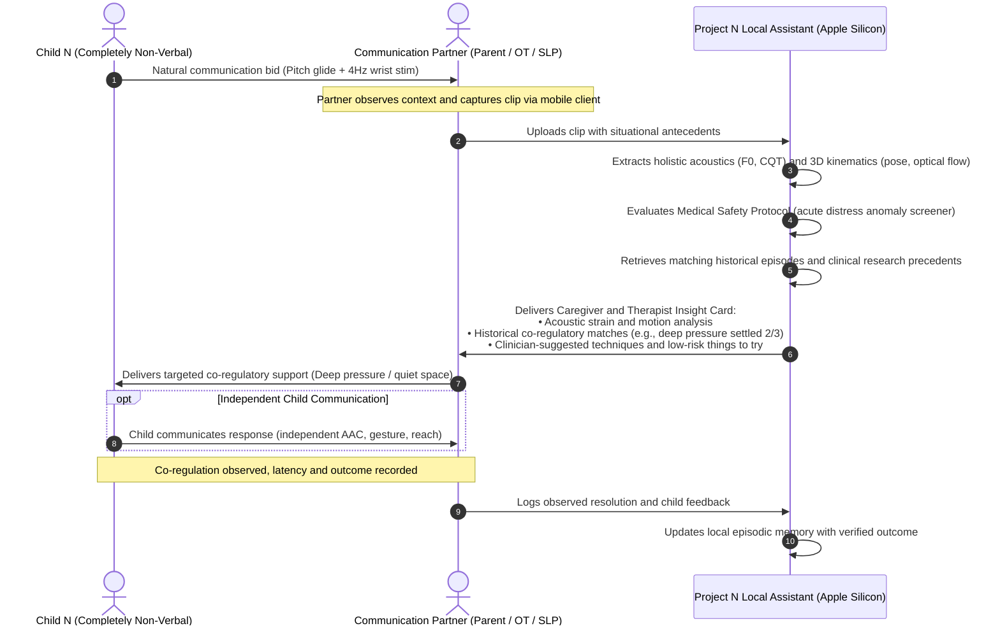
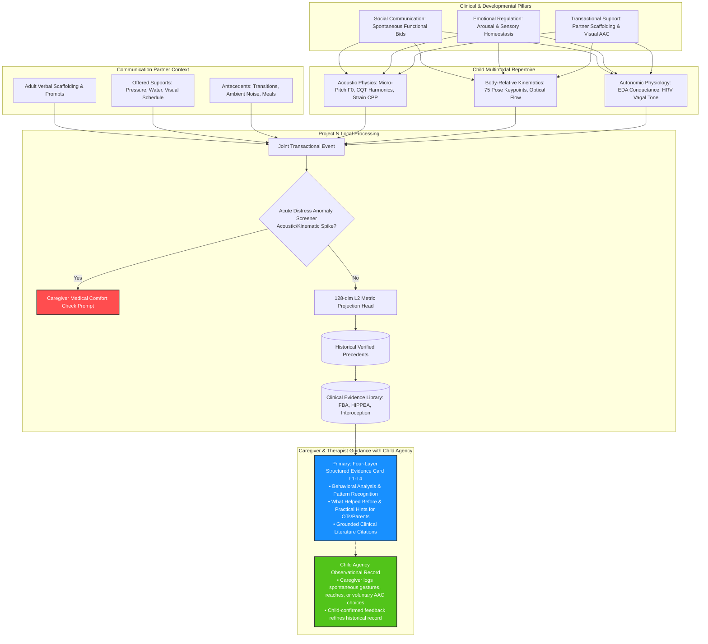
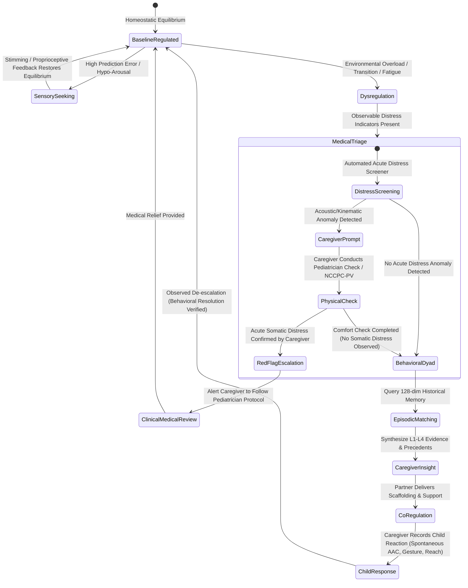
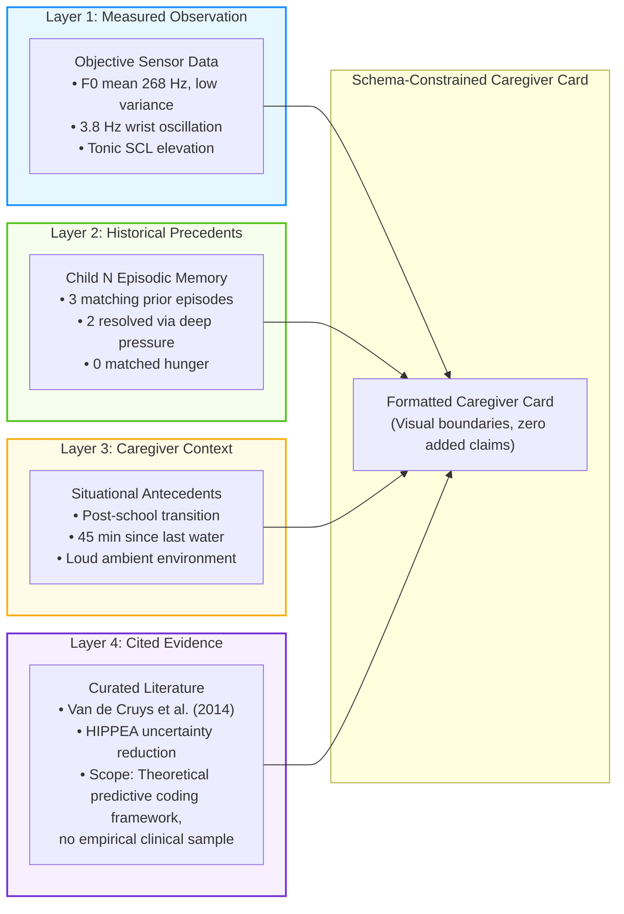

# Project N: A Dyadic, Multimodal, and Transactional Framework for Communication Support in Completely Non-Verbal Autism

**Lead Researcher & Project Architect:** Valentyn Shybanov ([olostan.me](https://olostan.me/) · [GitHub](https://github.com/olostan))
**Collaborative Scope:** Speech-Language Pathologists (SLPs), Occupational Therapists (OTs), Developmental Pediatricians, Neurodiversity Researchers, and Assistive Technology Practitioners
**Document Classification:** Scientific Whitepaper & Clinical Foundations
**Version:** 1.1.0 — September 2026

---

## Foreword from the Project Initiator

> *"I am a software engineer, systems architect, and—most importantly—the father of Nolan, a 7-year-old completely non-verbal boy with Level 3 autism. Every single day of my life is shaped by the profound love, challenge, and heartbreak of trying to understand my child. Nolan is non-verbal. Completely.
>
> *My son cannot speak in words, but he is never silent. He communicates continuously: through subtle pitch inflections in his throat, micro-tremors in his hands, bodily orientations, and rhythms of movement. Traditional society and standard AI models discard these signals as 'meaningless noise.' But to me, as his father, that 'noise' is his entire voice.*
>
> *I did not start Project N as a commercial startup. I have no desire to monetize this software, sell a proprietary device, or exploit vulnerable families. I started this project because I refuse to accept that my son must remain trapped behind a barrier of communication. I am dedicating my twenty-plus years of engineering experience, machine learning knowledge, and systems architecture skills to build an open-source, local-first, privacy-respecting tool that can help parents like me and the dedicated therapists who support our children.*
>
> *This whitepaper outlines the scientific, clinical, and architectural foundation of this initiative. If you are a speech-language pathologist, an occupational therapist, an autism researcher, or an engineer who believes in communication rights: I warmly invite you to read, critique, and contribute to this open endeavor."*
>
> — **Valentyn Shybanov** (Father & Project Initiator · [olostan.me](https://olostan.me/) · [GitHub](https://github.com/olostan))

---

## Abstract

Completely non-verbal autistic individuals (such as children requiring Level 3 supports) communicate through an intricate, non-phonetic multimodal repertoire: idiosyncratic vocalizations, continuous tonal hums, micro-pitch inflections, repetitive kinetic motor stims, postural adjustments, and physiological shifts. Traditional artificial intelligence paradigms attempt to process non-verbal communication through an extractive "intent translation" lens—treating the child as an isolated, closed-box signal generator and attempting to decode an internal mental state into neurotypical English text.

This paper presents the scientific rationale and methodological foundation for **Project N**, a local-first, privacy-preserving computational framework that departs fundamentally from extractive decoding. Grounded in the **Transactional Model of Communication** ([Sameroff, 1975](#ref-16); [Wetherby & Prizant, 2000](#ref-20)) and the **SCERTS Framework** ([Prizant et al., 2006](#ref-14)), Project N conceptualizes non-verbal communication as an active, **dyadic co-regulatory loop** between the child and their communicative partners (caregivers, therapists, educators). Rather than relying on acoustic features alone or optimizing on retrospective adult labels—which risks manufacturing confirmation bias and Facilitated Communication (FC) epistemic traps ([National Autism Center, 2026](#ref-13))—Project N anchors its truth criterion in **prospective Behavioral Resolution** (verifying whether an offered co-regulatory support objectively resolves distress and restores baseline within an observed latency window) augmented by direct, optional child-authored AAC selection. By combining bioacoustics, computer vision kinematics, and episodic memory, the framework provides clinicians, occupational therapists, and families with an evidence-grounded, four-layer decision-support assistant that honors child agency and preserves scientific integrity.

---

## 1. Visual Overview: The Dyadic Transactional Architecture

### 1.1 The Dyadic Co-Regulatory Sequence

### 1.2 The SCERTS Framework & Multimodal Integration

---

## 2. Introduction & The Communicative Reality

### 2.1 Beyond the Verbal Threshold: Non-Speaking Is Not Non-Communicative
A substantial proportion (estimated at 25% to 30%) of autistic children remain minimally speaking or non-verbal past school age ([Tager-Flusberg & Kasari, 2013](#ref-18)). For these individuals, the absence of functional speech does not signify a lack of communicative intent, cognitive agency, or receptive language comprehension. Rather, co-occurring challenges—including Childhood Apraxia of Speech (CAS), oral-motor dyspraxia, sensory processing differences, and atypical sensorimotor feedforward integration—disrupt the complex neuromuscular coordination required to articulate discrete phonemic sequences.

In clinical Speech-Language Pathology (SLP), communication is recognized as inherently multimodal ([Light & McNaughton, 2014](#ref-8)). Non-verbal children routinely mobilize an extensive communicative repertoire:

- **Paralinguistic Acoustic Cues:** Continuous vocal fold vibrations, glottal stops, clicks, harmonic overtone sweeps, guttural resonance, and subtle micro-pitch inflections (hypothesized in this N-of-1 deployment to manifest within $\pm 15\text{ to } 50\text{ Hz}$ excursions) that reflect physiological equilibrium, affective valence, or protest.
- **Kinematic & Motor Dynamics:** High-frequency repetitive motor behaviors ("stims"), including 3–6 Hz wrist rotations, finger-flicking in peripheral vision, pacing, torso rocking, or intentional physical reaches.
- **Physiological & Autonomic Fluctuations:** Sympathetic nervous system arousal, electrodermal reactivity, and cardiorespiratory shifts (HRV) driven by sensory demands.

### 2.2 The Neurotypical Inductive Bias of Commercial AI
Conventional foundation models (speech-to-text engines like Whisper, audio transformers like AST, and vision transformers like CLIP/ViT) are trained on massive datasets of neurotypical human speech and cinematic macro-actions. Their loss functions are mathematically optimized to enforce **phonemic and spatial collapse**:

1. **Acoustic Phonemic Discretization:** Whisper’s autoregressive decoder penalizes acoustic variance that does not map onto standardized phonemes or linguistic tokens. Idiosyncratic tonal hums or guttural phonations are filtered out as background noise or collapsed into silence.
2. **Visual Spatial Pooling:** Standard vision models downsample spatial patches across temporal windows, blending a rapid 4 Hz wrist-flick or finger tremor into the static background pixels of a living room.

When applied to a completely non-verbal child, commercial AI obliterates the very substrate that constitutes their expressive vocabulary.

---

## 3. The Transactional Paradigm: Communication as a Dyadic Loop

### 3.1 The Limits of "Unidirectional Intent Decoding"
Early artificial intelligence approaches to non-verbal autism conceptualized the child as a standalone transmitter whose "signals" must be translated by an algorithmic receiver. From a clinical speech therapy perspective, this assumption is fundamentally flawed:

In naturalistic pediatric communication, a vocalization or movement does not have an invariant, one-to-one semantic translation. A 350 Hz vocalization paired with hand flapping may represent intense joy during water play, severe vestibular seeking during room transitions, or overwhelming autonomic distress when ambient noise exceeds threshold. Identical surface behaviors arise from divergent internal needs, while a single functional need can manifest through varied behavioral expressions (by analogy with the context-dependent emotion-inference critique of [Barrett et al., 2019](#ref-1)).

### 3.2 The SCERTS Framework & Interpersonal Scaffolding
Grounded in the clinical principles of the **SCERTS Model** ([Prizant et al., 2006](#ref-14)), an internationally recognized multidisciplinary framework with promising and emerging empirical evidence focusing on:
- **SC (Social Communication):** Developing spontaneous, functional communication and emotional expression across non-verbal and aided modalities.
- **ER (Emotional Regulation):** Supporting self-regulation and mutual regulation to maintain optimal arousal states for learning and interaction.
- **TS (Transactional Support):** The interpersonal supports, environmental modifications, and learning tools provided by communication partners.

### 3.3 Why Labeling Adult Interaction Is Vital
A central insight of speech-language pathology is that a non-speaking child’s communication is shaped by their communicative partner's behavior ([Sameroff, 1975](#ref-16); [McLean & Snyder-McLean, 1978](#ref-9)).

Project N incorporates adult interaction data into its core relational schema:
- **What did the adult say or ask?** (e.g., *"Are you hungry?"*, *"Let's go outside"*, verbal pause/wait time).
- **What physical support was offered?** (e.g., offering a visual choice board, providing deep proprioceptive pressure, opening a door, reducing sensory input).
- **How did the child respond to that specific interaction?** (e.g., physical reach, turning away, vocal pitch lowering, respiration settling, or distress escalation).
- **Latency to Resolution:** The elapsed time required for the child to return to a regulated baseline following the adult's interaction.

By modeling the **dyad** rather than the child in isolation, the system learns which adult transactional supports correlate with successful co-regulation and communicative connection.

---

## 4. Regulatory State Progression & Medical Safeguards

---

## 5. Critical Analysis of Prior Art & Scientific Precedents

Project N builds directly upon and synthesizes several empirical research bodies:

### 5.1 Bioacoustics of Non-Verbal Vocalizations
- **The ReCANVo Study ([Johnson et al., 2023](#ref-7); [Narain et al., 2022](#ref-12)):**
  MIT Media Lab researchers compiled a database of 7,077 real-world non-verbal vocalizations from 8 minimally speaking individuals, annotated by close family members.
  - *Key Finding:* Demonstrates the technical feasibility of classifying family-assigned communicative and affective labels, showing that personalized (within-subject) acoustic models substantially outperform generalized population models.
  - *Engineering Implication:* Establishes a valuable scientific precedent for individualized acoustic modeling, while underscoring that family annotations reflect naturalistic caregiver interpretation rather than external, objective ground truth.
- **Acoustic Voice Features in Autism Meta-Analyses ([Fusaroli et al., 2017](#ref-4)):**
  Systematic reviews demonstrate that across populations, acoustic differences between autistic and neurotypical individuals show modest effect sizes ($d = 0.4–0.5$) with only $\sim 61–64\%$ discriminatory accuracy.
  - *Clinical Implication:* Confirms that population-wide "autism voice classifiers" fail. This supports exploring personalized N-of-1 longitudinal acoustic baselines to detect individual shifts, rather than assuming population acoustic markers can reliably categorize states.

### 5.2 Wearable Biosensing & Autonomic Forecasting
- **Biosensing in Minimally Verbal Autistic Youth ([Goodwin et al., 2019](#ref-5); [Imbiriba et al., 2023](#ref-6)):**
  In a foundational mobile clinical laboratory study of 20 youth with autism spectrum disorder (85% minimally verbal) across 69 sessions totaling 87 observation hours, Goodwin et al. ([2019](#ref-5)) demonstrated that imminent aggressive distress episodes could be predicted 1 minute in advance with an AUROC of **0.84** using person-dependent time-series models (versus 0.71 for population models).
  Subsequently, in a cohort of 70 psychiatric inpatients across 497 observation hours, Imbiriba, Demirkaya, Singh, et al. ([2023](#ref-6)) expanded prediction horizons to 3 minutes ahead, reporting a mean AUROC of **0.80** (with individual personalization and performance varying across data volume and inpatient cohorts).
  - *Engineering Implication:* Establishes the technical feasibility of wearable autonomic sensing in specialized inpatient settings. However, because these studies evaluated specialized psychiatric inpatient cohorts, their findings demonstrate feasibility of physiological telemetry rather than proving that wearable sensing automatically substantiates behavioral escalations in naturalistic home environments.

### 5.3 Motor Stimming, Kinematics & Predictive Coding
- **Self-Stimulatory Behavior Dataset (SSBD; [Rajagopalan et al., 2013](#ref-15)):**
  Rajagopalan et al. established the SSBD benchmark for video-based detection of repetitive motor behaviors (arm flapping, head banging, spinning). Subsequent temporal ablation studies by Mondal & Washington ([2026](#ref-11)) evaluated classification performance across subsampled video rates, demonstrating that periodic motor classification remained effective at subsampled frame rates (~2 effective fps), indicating that high frame rates are not strictly required for rhythmic stimming classification.
- **The HIPPEA Framework (High Inflexible Precision of Prediction Errors; [Van de Cruys et al., 2014](#ref-19)):**
  Reframes repetitive motor stims not as meaningless pathology, but as adaptive cognitive strategies to generate predictable sensory feedback in an overwhelming, high-prediction-error world.

### 5.4 Augmentative and Alternative Communication (AAC)
- **Speech Production Outcomes in Aided AAC ([Millar et al., 2006](#ref-10)):**
  A systematic review of 23 empirical studies across 67 individuals with developmental disabilities (including autism) demonstrated that among the 27 cases in the 6 methodologically strongest studies evaluated, introducing aided AAC was followed by increased speech production in **89% of cases**, no change in 11%, and **0% exhibited any speech decrease**. A subsequent systematic review by Schlosser & Wendt ([2008](#ref-schlosser-2008)) corroborated that AAC intervention did not impede speech production, with modest speech gains observed across several studies.
- **Naturalistic Developmental Behavioral Interventions (NDBI; [Schreibman et al., 2015](#ref-17); [Bruinsma et al., 2020](#ref-3)):**
  Consensus clinical guidelines demonstrate that communication development accelerates when embedded within shared, child-led everyday routines with contingent partner responsiveness.
  - *Clinical & Epistemic Implication:* Communication development is transactional and partner-supported. Where accessible, AAC serves as an empowering channel for independent child-directed authorship; simultaneously, partner scaffolding and timely co-regulatory interventions—measured through prospective behavioral resolution—form the primary dyadic engine for communicative connection and de-escalation.

### 5.5 Somatic Distress & Pain Evaluation
- **Non-Communicating Children’s Pain Checklist – Postoperative Version (NCCPC-PV; [Breau et al., 2002](#ref-2)):**
  A validated 27-item clinical instrument with high internal consistency ($\alpha = 0.91$) designed for caregivers and clinicians to evaluate postoperative physical pain in children with severe communication impairments across 6 observable subscales (Vocal, Social, Facial, Activity, Body & Limbs, Physiological; total score 0–81 over a 10-minute structured observation). In its validation cohort of 24 children postoperatively, a cut-off of $\ge 11$ indicated moderate-to-severe pain (while in home/residential settings, the 30-item, 2-hour NCCPC-R establishes $\ge 7$ as indicative of pain; [Breau et al., 2002](#ref-breau-2002-r)). Because a 2-hour observation window cannot be performed in-the-moment following an acute episode, Project N structures its acute post-episode caregiver check around the 10-minute, 27-item observation (NCCPC-PV). **This application outside postoperative acute care is an exploratory adaptation, not a formally validated setting; use of this protocol at home must be explicitly reviewed, selected, and approved by Nolan's personal pediatrician.** Real-time acoustic/kinematic signal deviation nudges prompt caregivers to execute their family pediatrician-approved physical comfort protocol, while suppressing behavioral interpretations.

---

## 6. The Four-Layer Evidence Model (L1–L4)

To prevent generative AI from fabricating clinical or emotional narratives, Project N enforces a strict four-layer evidence hierarchy:

### 6.1 The Dual-Perspective Presentation Interface (Parent View vs. Therapist View)

To ensure clinical and practical utility across different stakeholders, the structured L1–L4 evidence is rendered through a toggleable interface:

1. **Parent View (Default — Warm Co-Regulatory Scaffolding):**
   Translates dense bioacoustic physics and kinematic coordinates into accessible, compassionate, and non-pathologizing everyday observations (*e.g., describing elevated vocal pitch and rhythmic wrist movement relative to personal baseline*). It presents gentle exploratory possibilities to investigate and concrete, low-risk things to try grounded in past successes (*"In 2 of 3 similar past episodes, offering his favorite red squishy toy or providing 3 minutes of quiet space was followed by calming"*), accompanied by an explicit reminder that sensors capture physical patterns rather than internal subjective thoughts and that suggestions are gentle possibilities to explore, not medical diagnoses.
2. **Therapist View (Bioacoustic & Motion Telemetry):**
   Surfaces raw fundamental frequency ($F_0$), Cepstral Peak Prominence (CPP), CQT harmonic overtone spacing, pose oscillation frequencies (Hz), SCERTS mutual regulation categories, and exact peer-reviewed literature citations, enabling Speech-Language Pathologists and Occupational Therapists to review objective empirical progress during therapy sessions.

Both views are derived from the exact same deterministic underlying records, ensuring that plain-language translation never compromises empirical grounding.

---

## 7. Implications for Clinical Practice (SLP & OT)

### 7.1 For Speech-Language Pathologists (SLPs)
1. **Ecologically Valid Longitudinal Repertoire:** Rather than relying on 45-minute weekly clinic sessions, SLPs gain access to a continuous, objective timeline of naturalistic vocalizations and communicative bids across home and community settings.
2. **Personalized Communication Support:** Identifies which naturalistic environments exhibit high child engagement, enabling therapists to support authentic dyadic interaction.
3. **Tracking Dyadic Interaction & Scaffolding:** Allows therapists to review how different communication partner styles (wait time, simplified linguistic modeling, visual cues) correlate with child engagement and vocal variety.

### 7.2 For Occupational Therapists (OTs)
1. **Objective Sensory Profile Tracking:** Maps repetitive motor behaviors and acoustic tension against environmental antecedents (auditory noise, room transitions, sensory overload), grounding Ayres Sensory Integration in empirical physical telemetry.
2. **Co-Regulation Efficacy Assessment:** Provides measurable data on whether specific proprioceptive or vestibular interventions (e.g., deep pressure, swinging) effectively down-regulate autonomic hyper-arousal.

### 7.3 The Clinic-to-Home Knowledge Transfer Loop
In pediatric therapy, a persistent clinical challenge is the generalization gap: effective co-regulatory and communicative strategies discovered by therapists during structured 45-minute clinical sessions often fail to transfer into family home environments. Project N bridges this divide through its **Personal & Therapist Knowledge Store**:
1. **Clinical Strategy Ingestion:** Therapists can record brief clip exemplars or session notes detailing successful interventions (e.g., specific joint compression protocols, sensory swing sequences, or visual wait-time scaffolding).
2. **Contextual Living Room Delivery:** When comparable acoustic strain or motor dysregulation occurs at home, the assistant retrieves the therapist's proven technique and presents it directly to parents in plain, supportive language (*"Sarah (OT) suggested, Thursday session: Try firm joint compression on forearms"* — explicitly relaying the licensed clinician's own instructions for Child N rather than having the AI autonomously recommend medical treatment).
3. **Bidirectional Longitudinal Review:** Therapists review objective home resolution outcomes during weekly check-ins, verifying whether clinical scaffolding successfully generalized to naturalistic family routines.

---

## 8. Conclusion & Collaborative Invitation

Project N redefines the role of artificial intelligence in neurodivergent communication: **shifting from an extractive intent translator to a dyadic, transactional, and partner-empowering behavioral observation and insight assistant.**

By uniting speech-language pathology principles, occupational therapy sensory frameworks, high-resolution acoustic and kinematic physics, and rigorous privacy engineering on local Apple Silicon hardware, Project N offers a path toward understanding non-verbal communication that honors the child's autonomy, empowers families, and respects scientific integrity.

We warmly invite speech-language pathologists, occupational therapists, assistive technology developers, and neurodiversity researchers to review, critique, and contribute to this open-source architecture.

---

## 9. References & Academic Bibliography

1. **Barrett, L. F., Adolphs, R., Marsella, S., Martinez, A. M., & Pollak, S. D. (2019).** Emotional expressions reconsidered: Challenges to inferring emotion from human facial movements. *Psychological Science in the Public Interest*, 20(1), 1–68. [doi:10.1177/1529100619832930](https://doi.org/10.1177/1529100619832930)
2. **Breau, L. M., Finley, G. A., McGrath, P. J., & Camfield, C. S. (2002).** Validation of the Non-communicating Children’s Pain Checklist–Postoperative Version. *Anesthesiology*, 96(3), 528–535. [doi:10.1097/00000542-200203000-00004](https://doi.org/10.1097/00000542-200203000-00004)
3. **Bruinsma, Y., Minjarez, M. B., Schreibman, L., & Stahmer, A. C. (2020).** *Naturalistic developmental behavioral interventions for autism spectrum disorder*. Paul H. Brookes Publishing. [Brookes Publishing](https://products.brookespublishing.com/Naturalistic-Developmental-Behavioral-Interventions-for-Autism-Spectrum-Disorder-P1180.aspx)
4. **Fusaroli, R., Lambrechts, A., Bang, D., Bowler, D. M., & Gaigg, S. B. (2017).** Is voice a marker for Autism spectrum disorder? A systematic review and meta-analysis. *Autism Research*, 10(3), 384–407. [doi:10.1002/aur.1678](https://doi.org/10.1002/aur.1678)
5. **Goodwin, M. S., Mazefsky, C. A., Ioannidis, S., Erdogmus, D., & Siegel, M. (2019).** Predicting aggression to others in youth with autism using a wearable biosensor. *Autism Research*, 12(8), 1286–1296. [doi:10.1002/aur.2151](https://doi.org/10.1002/aur.2151)
6. **Imbiriba, T., Demirkaya, A., Singh, A., Erdogmus, D., & Goodwin, M. S. (2023).** Wearable biosensing to predict imminent aggressive behavior in psychiatric inpatient youths with autism. *JAMA Network Open*, 6(12), e2348898. [doi:10.1001/jamanetworkopen.2023.48898](https://doi.org/10.1001/jamanetworkopen.2023.48898)
7. **Johnson, K. T., Narain, J., Quatieri, T., Maes, P., & Picard, R. (2023).** ReCANVo: A database of real-world communicative and affective nonverbal vocalizations. *Scientific Data*, 10(1), 523. [doi:10.1038/s41597-023-02405-7](https://doi.org/10.1038/s41597-023-02405-7)
8. **Light, J., & McNaughton, D. (2014).** Communicative competence for individuals who require augmentative and alternative communication: A new definition for a new era of communication? *Augmentative and Alternative Communication*, 30(1), 1–18. [doi:10.3109/07434618.2014.885080](https://doi.org/10.3109/07434618.2014.885080)
9. **McLean, J. E., & Snyder-McLean, L. K. (1978).** *A transactional approach to early language training*. Charles E. Merrill Publishing. [ERIC: ED172561](https://eric.ed.gov/?id=ED172561)
10. **Millar, D. C., Light, J. C., & Schlosser, R. W. (2006).** The impact of augmentative and alternative communication intervention on speech production of individuals with developmental disabilities: A research review. *Journal of Speech, Language, and Hearing Research*, 49(2), 248–264. [doi:10.1044/1092-4388(2006/021)](https://doi.org/10.1044/1092-4388(2006/021))
11. **Mondal, R., & Washington, P. (2026).** Evaluating the effect of frame rate in sequence-based classification of autism-related self-stimulatory hand idiosyncrasies. *arXiv preprint arXiv:2607.07957*. [doi:10.48550/arXiv.2607.07957](https://doi.org/10.48550/arXiv.2607.07957)
12. **Narain, J., Johnson, K. T., Quatieri, T., Picard, R., & Maes, P. (2022).** Modeling Real-World Affective and Communicative Nonverbal Vocalizations From Minimally Speaking Individuals. *IEEE Transactions on Affective Computing*, 13(4), 2238–2253. [doi:10.1109/TAFFC.2022.3208233](https://doi.org/10.1109/TAFFC.2022.3208233)
13. **National Autism Center. (2026).** *Position statement on Spelling to Communicate, Rapid Prompting Method, and Facilitated Communication.* Published June 23, 2026. [nationalautismcenter.org](https://nationalautismcenter.org/news/national-autism-center-releases-position-statement-on-spelling-to-communicate-rapid-prompting-method-and-facilitated-communication/)
14. **Prizant, B. M., Wetherby, A. M., Rubin, E., & Laurent, A. C. (2006).** *The SCERTS model: A comprehensive educational approach for children with autism spectrum disorders*. Paul H. Brookes Publishing. [scerts.com](https://scerts.com/)
15. **Rajagopalan, S. S., Dhall, A., & Goecke, R. (2013).** Self-stimulatory behaviours in the wild for autism diagnosis. *IEEE International Conference on Computer Vision Workshops (ICCVW)*, 755–761. [doi:10.1109/ICCVW.2013.103](https://doi.org/10.1109/ICCVW.2013.103)
16. **Sameroff, A. J. (1975).** Transactional models in early social relations. *Human Development*, 18(1-2), 65–79. [doi:10.1159/000271476](https://doi.org/10.1159/000271476)
17. **Schreibman, L., Dawson, G., Stahmer, A. C., Landa, R., Rogers, S. J., McGee, G. G., Kasari, C., Ingersoll, B., Kaiser, A. P., Bruinsma, Y., McNerney, E., Wetherby, A., & Halladay, A. (2015).** Naturalistic developmental behavioral interventions: Empirically validated treatments for autism spectrum disorder. *Journal of Autism and Developmental Disorders*, 45(8), 2411–2428. [doi:10.1007/s10803-015-2407-8](https://doi.org/10.1007/s10803-015-2407-8)
18. **Tager-Flusberg, H., & Kasari, C. (2013).** Minimally verbal school-aged children with autism spectrum disorder: The neglected end of the spectrum. *Autism Research*, 6(6), 468–478. [doi:10.1002/aur.1329](https://doi.org/10.1002/aur.1329)
19. **Van de Cruys, S., Evers, K., Van der Hallen, R., Van Eylen, L., Boets, B., de-Wit, L., & Wagemans, J. (2014).** Precise minds in uncertain worlds: Predictive coding in autism. *Psychological Review*, 121(4), 649–675. [doi:10.1037/a0037665](https://doi.org/10.1037/a0037665)
20. **Wetherby, A. M., & Prizant, B. M. (2000).** *Autism spectrum disorders: A transactional developmental perspective*. Paul H. Brookes Publishing. [Brookes Publishing](https://products.brookespublishing.com/Autism-Spectrum-Disorders-P198.aspx)
21. **Shamseer, L., Sampson, M., Bukutu, C., Schmid, C. H., Nikles, J., Tate, R., Johnston, B. C., Zucker, D., Shadish, W. R., Kravitz, R., Guyatt, G., Altman, D. G., Moher, D., & Vohra, S. (2015).** CONSORT extension for reporting N-of-1 trials (CENT) 2015: Explanation and elaboration. *BMJ*, 350, h1793. [doi:10.1136/bmj.h1793](https://doi.org/10.1136/bmj.h1793)
22. **Breau, L. M., McGrath, P. J., Camfield, C. S., & Finley, G. A. (2002).** Psychometric properties of the non-communicating children’s pain checklist-revised. *Pain*, 99(1-2), 349–357. [doi:10.1016/S0304-3959(02)00179-3](https://doi.org/10.1016/S0304-3959(02)00179-3)
23. **Schlosser, R. W., & Wendt, O. (2008).** Effects of augmentative and alternative communication intervention on speech production in children with autism: A systematic review. *American Journal of Speech-Language Pathology*, 17(3), 212–230. [doi:10.1044/1058-0360(2008/021)](https://doi.org/10.1044/1058-0360(2008/021))
