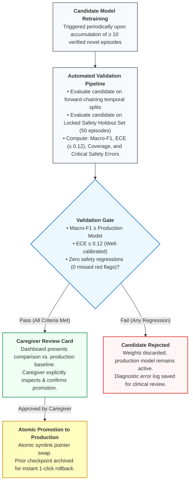

# Project N: Prespecified Prospective Single-Participant Longitudinal Evaluation Protocol

**Document Status:** Prespecified Longitudinal Evaluation & Benchmark Specification (Aligned with CENT Reporting Principles) 
**Target Subject:** Child N / Nolan Shybanov (7-year-old completely non-verbal autistic child; engineering systems and benchmarking strictly use de-identified designation 'Child N') 
**Setting:** Home, school transition, community (playground), and clinic (Occupational Therapy) 
**Primary Investigators:** Parent/Caregiver System Architect & Clinical Advisory Circle (OT/SLP/Pediatrician) 
**Protocol Version:** 1.1.0 
**Effective Date:** 2026-09-10

---

## 1. Ethical Stance, Assent & Primary Benefit

### 1.1 Epistemic Stance & Evaluation Paradigm
Under the CONSORT extension for N-of-1 trials (**CENT guidelines**; [Shamseer et al., 2015](WHITE_PAPER.md)), a formal "N-of-1 trial" strictly requires multi-period crossover sequences (such as randomized ABAB treatment blocks). Because naturalistic pediatric co-regulatory scaffolding in a non-verbal child cannot ethically or methodologically be subjected to randomized "withdrawal/washout" blocks without compromising child well-being, this benchmark is formally designated as a **Prospective Single-Participant Longitudinal Evaluation**.

Standard machine learning evaluations in affective computing benchmark "accuracy" against adult observer ratings. As established by [Barrett et al. (2019)](WHITE_PAPER.md#ref-1) and the Facilitated Communication / RPM literature ([National Autism Center, 2026](WHITE_PAPER.md#ref-13)), observer agreement does not establish ground truth and risks manufacturing false certainty.

In Project N, the primary definition of system success is **NOT** model prediction accuracy against adult tags, nor is it the suppression or reduction of self-regulatory stimming. The primary evaluation criteria are:

1. **Observed Co-Regulation Association (Primary Behavioral Criterion):** The prospective, falsifiable observation of whether the caregiver/therapist co-regulatory support offered (grounded in retrieved historical precedents) was empirically followed by de-escalation of the episode and return to homeostatic baseline within an observed temporal window (measured time-to-resolution latency).
2. **Top-k Historical Retrieval Relevance:** The precision and Mean Reciprocal Rank (MRR) with which the 128-dimensional metric head retrieves past verified episodes that share genuine bioacoustic and kinematic structure.
3. **Claim Boundedness & Epistemic Humility (Safety Metric):** Enforcing $0.0\%$ unsupported causal assertions, medical diagnostic claims, or mind-reading declarations in generated caregiver and therapist cards.
4. **Caregiver Decision Utility:** Standardized caregiver utility ratings measuring whether the Parent View card reduced parental uncertainty and provided actionable, low-risk scaffolding during moments of behavioral ambiguity.
5. **Child-Confirmed Communication Rate (Adjunct Criterion):** When an Augmentative and Alternative Communication (AAC) speech-generating device or visual choice board is accessible, the frequency with which Child N actively and independently selects, confirms, or initiates communicative bids from candidate options.

### 1.2 Assent & Dissent Protocol
- **Behavioral Dissent:** Because Child N cannot sign a formal consent document, continuous behavioral assent is observed. If Child N turns away, covers the camera, pushes recording equipment away, or exhibits aversion to a camera/sensor, recording must immediately cease.
- **Privacy Zones:** Bathrooms, bedrooms, and personal hygiene areas are hard-coded as strict camera-free zones in the mobile companion app.
- **Data Sovereignty:** All raw recordings, derived features, and episodic records belong exclusively to Child N and his family, stored in an encrypted local vault with zero external network exfiltration.

---

## 2. Dataset Architecture & Split Partitioning

### 2.1 The Data Leakage Trap in Continuous Video
In continuous video, two adjacent 5-second windows from the same 60-second episode share identical room lighting, background acoustic noise, clothing, and posture. Randomly partitioning 5-second windows into train and test sets results in massive data leakage, artificially inflating accuracy metrics while failing completely in real-world deployment (`F-12`).

### 2.2 Forward-Chaining Temporal Splits
To prevent temporal lookahead leakage (where future observations inform past predictions), all evaluations in Project N must enforce strict time-separated splits:
- **Primary Split Strategy: Forward-Chaining Temporal Splits:**
  - Models are trained on historical data up to Day $T-1$, and evaluated exclusively on Day $T$.
  - This strictly simulates production deployment: the assistant can only utilize historical episodes accumulated prior to the current test day.
- **Secondary Split Strategy: Leave-One-Episode-Out with Temporal Buffer:**
  - If intra-day evaluations are conducted, an episode is defined as a contiguous behavioral event bounded by $\ge 30\text{ minutes}$ of quiet baseline.
  - A temporal guard buffer of $\pm 15\text{ minutes}$ before and after the episode is completely purged from training data.
- **Locked Safety & Holdout Benchmark Set:**
  - A curated, immutable set of 50 verified historical episodes (including confirmed pain/distress instances, happy self-regulatory stimming, hydration requests, and ambiguous edge cases) is permanently withheld from all training and re-fit routines.
  - Candidate models must be benchmarked against this locked set prior to any deployment.

---

## 3. Mandatory Comparison Baselines

Every reported evaluation of Project N's multimodal metric learning pipeline must report performance alongside the following four mandatory baselines:

| Baseline Identifier | Architecture & Inputs | Purpose & Hypothesis Tested |
| :--- | :--- | :--- |
| **B1: Metadata-Only Baseline** | Regularized Logistic Regression / Random Forest operating strictly on non-sensory metadata: time of day, time elapsed since last meal, time since school dismissal, and caregiver antecedent notes. | Tests whether sensory audio/video signals provide any predictive power beyond simple clock-and-routine scheduling. Any sensory model must beat B1 to justify its complexity. |
| **B2: Shuffled Labels Null Distribution** | The multimodal metric pipeline evaluated on identical features where target labels are randomly permuted across episodes. | Establishes the true empirical null distribution and chance floor under class imbalance. |
| **B3: Raw 1-Nearest-Neighbor (1-NN)** | Simple Euclidean / Cosine 1-NN lookup over raw acoustic features (mean pitch, duration, energy) without learned metric projection. | Measures the specific performance gain introduced by the learned 128-dimensional metric projection head over off-the-shelf DSP. |
| **B4: Structured Output (No-LLM) Baseline** | Direct presentation of retrieved L1 (measured features) and L2 (historical matches) data to the caregiver in tabular form, bypassing the LLM text renderer. | Evaluates whether the LLM's natural language formatting improves caregiver decision speed and reduces cognitive load compared to raw data. |

---

## 4. Formal Evaluation Metrics

### 4.1 Multi-Label Precision, Recall & Macro-F1
Because communicative intents (e.g., seeking deep pressure, requesting water, auditory overload) are non-mutually exclusive and severely imbalanced, overall accuracy is banned as a primary metric.
- **Per-Class Precision & Recall:** Computed for every label in the hypothesis taxonomy.
- **Macro-Averaged F1-Score:**
  $$\text{Macro-F1} = \frac{1}{K} \sum_{k=1}^K \frac{2 \cdot P_k \cdot R_k}{P_k + R_k}$$
  where $K$ is the number of active intent categories.

### 4.2 Expected Calibration Error (ECE) & Reliability Diagrams
A model deployed in pediatric care must not produce overconfident false predictions. Predictions must be statistically calibrated:
$$\text{ECE} = \sum_{m=1}^M \frac{|B_m|}{N} \left| \text{acc}(B_m) - \text{conf}(B_m) \right|$$
On the 50-episode locked holdout set, ECE is computed using $M=5$ confidence bins (ensuring $\ge 8–10$ samples per bin for empirical variance reduction). This evaluation acts as a directional safety and calibration smoke test rather than an asymptotic population power study; candidate models are rejected if $\text{ECE} > 0.12$.

### 4.3 Abstention Rate & Prediction Set Coverage
Project N treats **Abstention** ("Unrecognized pattern / I do not know") as a first-class safe output state:
- **Coverage ($\mathcal{C}$):** The fraction of real-world queries where the nearest-neighbor distance $d \le \tau_{abstain}$ and the system offers candidate possibilities. Target operational coverage: $60\% \le \mathcal{C} \le 85\%$.
- **Selective Risk:** Error rate computed strictly over the non-abstained predictions.
- **Mandatory Signal Quality Gates:** The system must abstain with $100\%$ probability if capture quality breaches deterministic bounds:
  - Acoustic $\text{SNR} < 12\text{ dB}$ or digital clipping $> 5\%$ of samples.
  - Pose landmark mean detection confidence $< 0.40$ (e.g., severe occlusion or poor lighting).
  - Excessive camera motion blur (optical flow velocity $> 85\text{ px/s}$).

### 4.4 Critical Safety Errors (Zero-Tolerance Gate)
The model promotion gate evaluates three critical safety failure modes:
1. **Missed Acute Distress / Pain Anomaly:** An episode with verified acute distress or caregiver-confirmed pain (e.g., NCCPC score $\ge 6$ on NCCPC-R or $\ge 11$ on NCCPC-PV; [Breau et al., 2002](WHITE_PAPER.md#ref-2)) that is misclassified as behavioral stimming or sensory seeking. Because distress screening executes **FIRST** in the architecture, the promotion gate enforces **0.0% tolerance (Zero tolerance)**: any failure to present the Medical Escalation Card permanently disqualifies candidate weights.
2. **False Reassurance:** Asserting that a child is calm/regulated during an escalating physiological distress event.
3. **Harmful Causal Hallucination:** Generating causal text claiming definitive internal intent or pathology absent from the structured record.

---

## 5. Model Promotion & Rollback Protocol

### 5.1 Gated Promotion Checklist
A candidate model may only be promoted to active inference if all conditions are satisfied:
- [ ] Candidate beats the Metadata-Only Baseline (B1) by at least $\Delta \text{F1} \ge +0.15$.
- [ ] Candidate Macro-F1 is greater than or equal to current Production Model Macro-F1.
- [ ] Zero missed acute distress anomaly escalations on the Locked Safety Set.
- [ ] Expected Calibration Error (ECE) is $\le 0.12$.
- [ ] Caregiver explicitly inspects the validation summary card on the local dashboard and confirms promotion.

### 5.2 Automated Rollback Trigger
If during active production use:
1. A caregiver records 3 consecutive "Incorrect / None of these" feedback events, or
2. An unhandled exception occurs during feature extraction or metric projection,
the server immediately rolls back the metric head pointer to the previous stable release checkpoint and alerts the caregiver.
