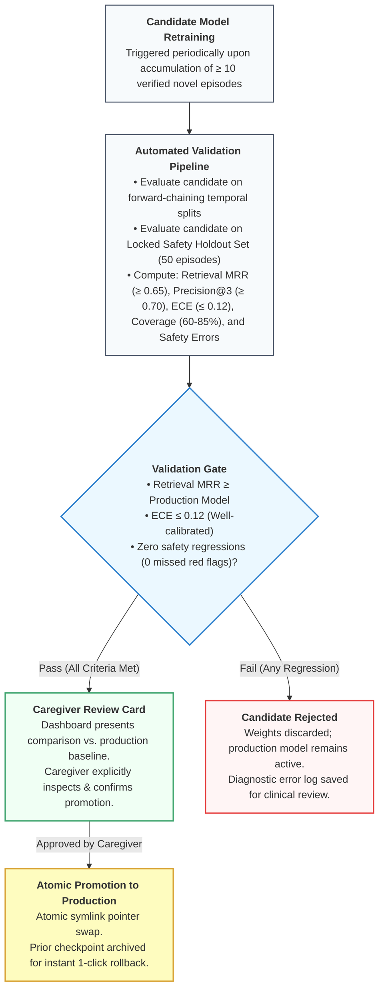

# Project N: Prespecified Prospective Single-Participant Longitudinal Evaluation Protocol

**Document Status:** Prespecified Longitudinal Evaluation & Benchmark Specification (Informed by Selected CENT Reporting Principles) 
**Target Subject:** Child N (7-year-old completely non-verbal autistic child; pseudonymized designation strictly maintained across all experimental benchmarks, datasets, and code fixtures) 
**Setting:** Home, school transition, community (playground), and clinic (Occupational Therapy) 
**Primary Investigators:** Parent/Caregiver System Architect & Clinical Advisory Circle (OT/SLP/Pediatrician) 
**Protocol Version:** 1.2.0 
**Effective Date:** 2026-09-13

---

## 1. Ethical Stance, Assent & Primary Benefit

### 1.1 Epistemic Stance & Evaluation Paradigm
Under the CONSORT extension for N-of-1 trials (**CENT guidelines**; [Shamseer et al., 2015](WHITE_PAPER.md#ref-shamseer-2015)), formal N-of-1 trials typically utilize prospective repeated crossover sequences. In naturalistic pediatric care for a non-verbal child, withholding supportive interventions or forcing randomized withdrawal blocks during acute distress would be clinically and ethically unacceptable; however, low-risk interface variations (such as comparing structured tabular telemetry versus natural-language Parent View scaffolding) can be evaluated longitudinally without withholding care. This protocol is formally designated as a **Prospective Single-Participant Longitudinal Evaluation** informed by selected CENT reporting principles.

Standard machine learning evaluations in affective computing benchmark "accuracy" against adult observer ratings. As established by [Barrett et al. (2019)](WHITE_PAPER.md#ref-1) and the Facilitated Communication / RPM literature ([National Autism Center, 2026](WHITE_PAPER.md#ref-13)), observer agreement does not establish ground truth and risks manufacturing false certainty.

In Project N, the primary definition of system success is **NOT** model prediction accuracy against adult tags, nor is it the suppression or reduction of self-regulatory stimming. As a decision-support and insight assistant, the evaluation criteria are prioritized as follows:

1. **Caregiver Decision Utility & Cognitive Load Reduction (Primary Insight Criterion):** Standardized caregiver utility ratings measuring whether the Parent View card meaningfully reduced parental uncertainty and provided actionable, low-risk scaffolding during moments of behavioral ambiguity.
2. **Top-k Historical Retrieval Relevance:** The precision and Mean Reciprocal Rank (MRR) with which the 128-dimensional metric head retrieves past verified episodes that share genuine bioacoustic and kinematic structure.
3. **Claim Traceability & Unsupported-Claim Rate (Safety Invariant):** Enforcing $0.0\%$ unsupported causal assertions, medical diagnostic claims, or ungrounded mind-reading declarations in generated caregiver and therapist cards.
4. **Calibrated Abstention Accuracy:** True positive rate of abstention on novel, out-of-distribution, or degraded sensor episodes ($\min_k d > \tau_{abstain}$), avoiding false reassurance or ungrounded guesses.
5. **Observed Co-Regulation Association (Secondary Behavioral Observational Criterion):** The prospective observation of whether the caregiver/therapist co-regulatory support offered (grounded in retrieved historical precedents) was empirically followed by settling to baseline within measured latency.
6. **Independent Child Communication Rate (Adjunct Observational Criterion):** When an independent Augmentative and Alternative Communication (AAC) speech-generating device, PECS card, or visual choice board is utilized by Child N, the frequency with which the child independently initiates or confirms a choice following caregiver scaffolding.

### 1.2 Assent & Dissent Protocol
- **Behavioral Dissent:** Because Child N cannot sign a formal consent document, continuous behavioral assent is observed. If Child N turns away, covers the camera, pushes recording equipment away, or exhibits aversion to a camera/sensor, recording must immediately cease.
- **Privacy Zones:** Bathrooms, bedrooms, and personal hygiene areas are hard-coded as strict camera-free zones in the mobile companion app.
- **Data Sovereignty:** All raw recordings, derived features, and episodic records belong exclusively to Child N and his family, stored in an encrypted local vault with zero external network exfiltration.

---

## 2. Dataset Architecture & Split Partitioning

### 2.1 The Data Leakage Trap in Continuous Video
In continuous video, two adjacent 5-second windows from the same 60-second episode share identical room lighting, background acoustic noise, clothing, and posture. Randomly partitioning 5-second windows into train and test sets results in massive data leakage, artificially inflating accuracy metrics while failing completely in real-world deployment (`F-12`).

### 2.2 Forward-Chaining Temporal Splits
To prevent temporal lookahead leakage (where future observations inform past predictions), all evaluations in Project N must enforce strict time-separated splits:
- **Primary Split Strategy: Forward-Chaining Temporal Splits:**
  - Models are trained on historical data up to Day $T-1$, and evaluated exclusively on Day $T$.
  - This strictly simulates production deployment: the assistant can only utilize historical episodes accumulated prior to the current test day.
- **Secondary Split Strategy: Leave-One-Episode-Out with Temporal Buffer:**
  - If intra-day evaluations are conducted, an episode is defined as a contiguous behavioral event bounded by $\ge 30\text{ minutes}$ of quiet baseline.
  - A temporal guard buffer of $\pm 15\text{ minutes}$ before and after the episode is completely purged from training data.
- **Locked Safety & Holdout Benchmark Set:**
  - A curated, immutable set of 50 verified historical episodes (including confirmed pain/distress instances, happy self-regulatory stimming, hydration requests, and ambiguous edge cases) is permanently withheld from all training and re-fit routines.
  - Candidate models must be benchmarked against this locked set prior to any deployment.
  - **Statistical Power & Safety Bound:** Observing zero distress misclassifications across $N=50$ holdout episodes ($0/50$) is an essential operational smoke test, but by the statistical Rule of Three, it corresponds to an approximate one-sided 95% confidence upper bound on the true failure rate of $3/50 \approx 6.0\%$. To prevent repeated adaptation to this holdout set across continuous re-fit cycles, a secondary sealed validation vault is permanently preserved and uninspected during intermediate development.

---

## 3. Mandatory Comparison Baselines

Every reported evaluation of Project N's multimodal metric learning pipeline must report performance alongside the following four mandatory baselines:

| Baseline Identifier | Architecture & Inputs | Purpose & Hypothesis Tested |
| :--- | :--- | :--- |
| **B1: Metadata-Only Baseline** | Regularized Logistic Regression / Random Forest operating strictly on non-sensory metadata: time of day, time elapsed since last meal, time since school dismissal, and caregiver antecedent notes. | Tests whether sensory audio/video signals provide any predictive power beyond simple clock-and-routine scheduling. Any sensory model must beat B1 to justify its complexity. |
| **B2: Shuffled Labels Null Distribution** | The multimodal metric pipeline evaluated on identical features where target labels are randomly permuted across episodes. | Establishes the true empirical null distribution and chance floor under class imbalance. |
| **B3: Raw 1-Nearest-Neighbor (1-NN)** | Simple Euclidean / Cosine 1-NN lookup over raw acoustic features (mean pitch, duration, energy) without learned metric projection. | Measures the specific performance gain introduced by the learned 128-dimensional metric projection head over off-the-shelf DSP. |
| **B4: Structured Output (No-LLM) Baseline & Blinded Contrast** | Direct presentation of retrieved L1 (measured features) and L2 (historical matches) data to the caregiver in tabular form, bypassing the LLM text renderer. | Evaluates whether the LLM's natural language formatting improves caregiver decision speed and reduces cognitive load compared to raw data. To mitigate single-rater observer bias, the caregiver evaluates card helpfulness **blinded** to whether output was rendered by the LLM or tabular baseline B4. |

---

## 4. Formal Evaluation Metrics

### 4.1 Caregiver Decision Utility (Primary Insight Metric)
Measured via a standardized 5-point Likert scale completed on the dashboard within a 10-minute post-episode reflection window:
- **Rating Instrument (1 to 5):**
  - `1`: Distracting or misleading (increased caregiver confusion).
  - `2`: Neutral / uninformative (no practical value).
  - `3`: Somewhat helpful (confirmed existing suspicion).
  - `4`: Actionable (provided clear, low-risk scaffolding options grounded in history).
  - `5`: Decisive & Calming (significantly reduced caregiver cognitive load and facilitated settling).
- **Target Operational Utility:** Mean score $\ge 4.0 / 5.0$ across active deployment weeks.

### 4.2 Top-k Historical Retrieval Relevance & MRR
Evaluates the geometric fidelity of the 128-dimensional metric head in clustering episodes with shared sensory and co-regulatory dynamics:
- **Mean Reciprocal Rank (MRR):**
  $$\text{MRR} = \frac{1}{Q} \sum_{q=1}^Q \frac{1}{\text{rank}_q}$$
  where $\text{rank}_q$ is the position of the first historically verified matching episode. Target: $\text{MRR} \ge 0.65$.
- **Top-3 Retrieval Precision:** Fraction of top-3 retrieved historical neighbors that share verified antecedent or co-regulatory profiles. Target: $\ge 0.70$.

### 4.3 Expected Calibration Error (ECE) & Reliability Diagrams
A model deployed in pediatric care must not produce overconfident false predictions. Predictions must be statistically calibrated:
$$\text{ECE} = \sum_{m=1}^M \frac{|B_m|}{N} \left| \text{acc}(B_m) - \text{conf}(B_m) \right|$$
On the 50-episode locked holdout set, ECE is computed using $M=5$ confidence bins (ensuring $\ge 8–10$ samples per bin for empirical variance reduction). Candidate models are rejected if $\text{ECE} > 0.12$.

### 4.4 Abstention Rate & Prediction Set Coverage
Project N treats **Abstention** ("Unrecognized pattern / I do not know") as a first-class safe output state:
- **Coverage ($\mathcal{C}$):** The fraction of real-world queries where the nearest-neighbor distance $d \le \tau_{abstain}$ and the system offers candidate possibilities. Target operational coverage: $60\% \le \mathcal{C} \le 85\%$.
- **Selective Risk:** Error rate computed strictly over the non-abstained predictions.
- **Mandatory Signal Quality Gates:** The system must abstain with $100\%$ probability if capture quality breaches deterministic bounds:
  - Acoustic $\text{SNR} < 12\text{ dB}$ or digital clipping $> 5\%$ of samples.
  - Pose landmark mean detection confidence $< 0.40$ (e.g., severe occlusion or poor lighting).
  - Excessive camera motion blur (optical flow velocity $> 85\text{ px/s}$).

### 4.5 Critical Safety Errors (Zero-Tolerance Gate)
The model promotion gate evaluates three critical safety failure modes:
1. **Missed Acute Distress / Pain Anomaly:** An episode with verified acute distress or caregiver-confirmed pain (e.g., NCCPC score $\ge 7$ on NCCPC-R or $\ge 11$ on NCCPC-PV; [Breau et al., 2002](WHITE_PAPER.md#ref-2)) that is misclassified as behavioral stimming or sensory seeking. Because distress screening executes **FIRST** in the architecture, the promotion gate enforces **0.0% tolerance (Zero tolerance)**: any failure to present the Medical Escalation Card permanently disqualifies candidate weights.
2. **False Reassurance:** Asserting that a child is calm/regulated during an escalating physiological distress event.
3. **Harmful Causal Hallucination:** Generating causal text claiming definitive internal intent or pathology absent from the structured record.

---

## 5. Model Promotion & Rollback Protocol

### 5.1 Gated Promotion Checklist
A candidate model may only be promoted to active inference if all conditions are satisfied:
- [ ] Candidate beats the Metadata-Only Baseline (B1) on historical retrieval MRR.
- [ ] Candidate Retrieval MRR is greater than or equal to current Production Model ($\text{MRR} \ge 0.65$).
- [ ] Candidate Top-3 Retrieval Precision is $\ge 0.70$.
- [ ] Calibrated prediction set coverage is within the operational target ($60\% \le \mathcal{C} \le 85\%$).
- [ ] Zero missed acute distress anomaly escalations on the Locked Safety Set (0/50 missed red flags).
- [ ] Expected Calibration Error (ECE) is $\le 0.12$.
- [ ] Caregiver decision utility rating on validation trials averages $\ge 4.0 / 5.0$.
- [ ] Caregiver explicitly inspects the validation summary card on the local dashboard and confirms promotion.

### 5.2 Automated Rollback Trigger
If during active production use:
1. A caregiver records 3 consecutive "Incorrect / None of these" feedback events, or
2. An unhandled exception occurs during feature extraction or metric projection,
the server immediately rolls back the metric head pointer to the previous stable release checkpoint and alerts the caregiver.
