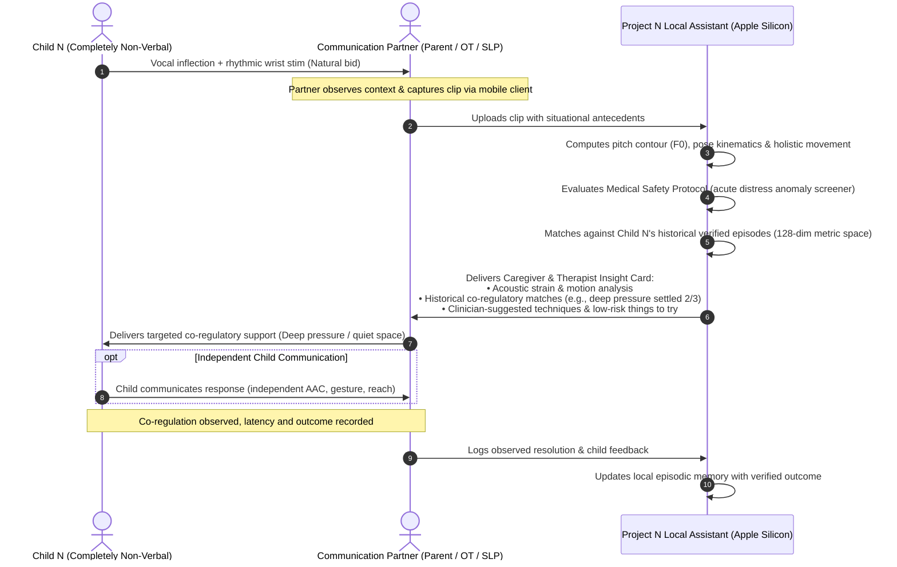
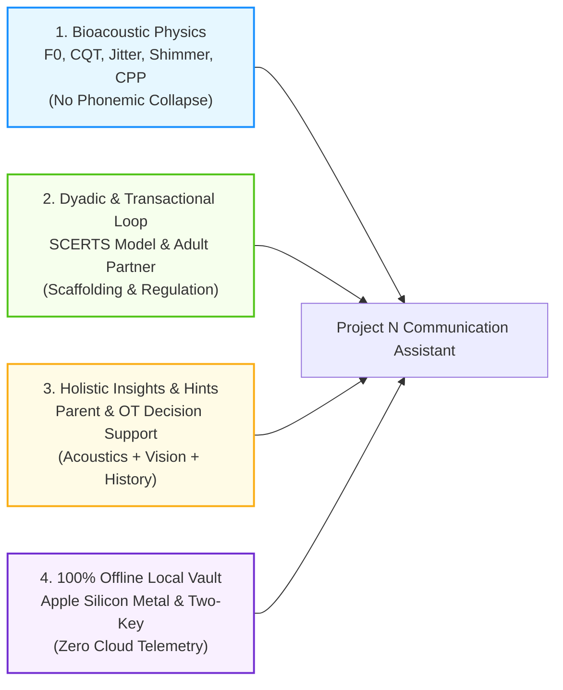

# Project N: Multimodal Communication Support for Non-Verbal Autism

  <em>An open-source, local-first observation and decision-support assistant designed to support completely non-verbal autistic children through high-resolution acoustic physics, body-relative kinematics, dyadic partner scaffolding, and personalized caregiver insights.</em>

---

## A Note from the Project Initiator

  
"I am <a href="https://olostan.me/" target="_blank"><strong>Valentyn Shybanov</strong></a>, a software engineer, systems architect, and the father of Nolan, a 7-year-old completely non-verbal boy with Level 3 autism. Every single day of my life is shaped by the profound love, challenge, and heartbreak of trying to understand my son. Nolan is non-verbal. Completely.

  
My son cannot use spoken words, but he is never silent. He communicates continuously: through subtle pitch inflections in his throat, micro-tremors in his hands, bodily orientations, and rhythms of movement. Traditional foundation models and commercial AI discard these signals as 'meaningless background noise.' But to me, as his father, that 'noise' is his entire voice.

  
I started Project N not as a commercial startup, not to make money, and not to promote a product. I started it out of a father’s deep desire to understand his child. I am pouring my twenty-plus years of engineering experience, systems architecture knowledge, and machine learning skills into building a free, open-source, local-first tool that can help parents like me and the dedicated therapists who support our children.

  
If you are a speech-language pathologist, an occupational therapist, an autism researcher, or an engineer who believes in communication rights: I warmly invite you to review this work, critique it, and help us make it better."

  
<strong>— Valentyn Shybanov (Father & Project Initiator · <a href="https://olostan.me/">olostan.me</a> · <a href="https://github.com/olostan">GitHub</a>)</strong>

---

## Core System Architecture

Project N is engineered to run **100% offline** on local Apple Silicon hardware (targeting an Apple M5 Pro with 48GB Unified Memory), preserving complete family privacy while eliminating cloud latency.

---

## The Four Foundational Pillars

1. **Acoustic Physics Without Words:** Level 3 non-verbal vocalizations are analyzed using raw bioacoustic physics (fundamental frequency $F_0$ pitch tracking via pYIN/autocorrelation, jitter, shimmer, harmonic overtones via CQT, and periodic-to-aperiodic energy ratio via CPP). Sounds are matched directly to past verified episodes without forcing them into clumsy English descriptions.
2. **The Dyadic Transactional Loop:** Communication is an evolving interaction loop between the child and their communication partner (parent, therapist). Grounded in the **SCERTS Model** ([Prizant et al., 2006](WHITE_PAPER.md#ref-14)) and the **Transactional Model of Communication** ([Sameroff, 1975](WHITE_PAPER.md#ref-16); [Wetherby & Prizant, 2000](WHITE_PAPER.md#ref-20)), the system analyzes what the adult said, what physical scaffolding was offered, and how the child responded.
3. **Dual-Perspective Insights (Parent View & Therapist View):** The primary goal is helping parents and therapists (OTs, SLPs) understand the child's communicative bids through a dual-perspective toggle. **Parent View (Default)** translates dense bioacoustic and kinematic data into warm, accessible everyday language (*e.g., "Nolan's vocal tension and wrist motion are elevated relative to recent baseline; in similar past episodes, offering his favorite red toy or a 3-minute quiet break was followed by calming"*), presenting gentle exploratory possibilities to investigate and concrete, low-risk things to try based on past co-regulatory successes, accompanied by an explicit non-diagnostic notice; **Therapist View** provides the full bioacoustic and motion telemetry ($F_0$, CPP, CQT harmonics, pose frequencies, Ayres sensory categories) and cited literature for clinical sessions.
4. **Medical Safety Protocol & Distress Screening:** Automated signals screen for acute acoustic/kinematic anomalies (deviation from Nolan's baseline) and immediately prompt the caregiver to conduct their pediatrician-approved physical health check (such as the caregiver-observed NCCPC checklist; [Breau et al., 2002](WHITE_PAPER.md#ref-2)), prioritizing physical comfort and medical rule-out over behavioral inferences.

---

## Technology Stack At a Glance

| Layer | Technology | Role in Project N |
| :--- | :--- | :--- |
| **ML Engine** | **Apple MLX 0.22+** | Metal-accelerated sensory encoders, metric projection, and local inference. |
| **Backend Daemon** | **Python 3.11+ / FastAPI** | High-performance local server with zero-copy in-memory tensor access. |
| **Caregiver Dashboard** | **React 18 + Tailwind CSS** | Local web application bundled with FastAPI (zero external CDNs or trackers). |
| **Live Event Bus** | **Server-Sent Events (SSE)** | Unidirectional streaming of pipeline stages, memory telemetry, and cards. |
| **Mobile Client** | **Flutter 3.24+ (Dart)** | Cross-platform app (Android & iOS) with encrypted offline outbox for capture at playgrounds or OT sessions. |
| **Vector Storage** | **ChromaDB (Persistent)** | Embedded HNSW indexing for 128-dim metric embeddings and clinical RAG library. |
| **Base Language Model** | **Qwen2.5-14B-Instruct** | 4-bit quantized, 100% frozen model used strictly for schema-constrained rendering. |

---

## Documentation Roadmap

- 📄 **[Scientific & Architectural Whitepaper](WHITE_PAPER.md):** Clinical and computational foundations paper for Speech-Language Pathologists, OTs, and autism researchers detailing the transactional paradigm, bioacoustics, and dyadic co-regulation support.
- 📋 **[Prespecified Evaluation Protocol](evaluation_protocol.md):** Prospective single-participant longitudinal evaluation design with forward-chaining temporal splits, mandatory baselines B1–B4, and safety metrics.
- 📐 **[Technical Specifications](SPECS.md):** Complete mathematical definitions, tensor shapes, REST endpoints, SSE event schemas, and executable MLX pseudo-code.
- 🧠 **[Theoretical Architecture & Design](DESIGN.md):** Detailed neurobiology, acoustic physics, pose kinematics, literature grounding, and continuous adaptation.
- 🛡️ **[System & Safety Invariants](INVARIANTS.md):** True non-negotiable invariants (100% offline, privacy vault, frozen LLM, medical rule-out) vs. tunable empirical defaults.
- 🔍 **[Multi-Reviewer Scientific Audit](REVIEW_REFINEMENTS.md):** Comprehensive finding-by-finding peer review and corrective action matrix.
- 🤖 **[Agent Directives](AGENTS.md):** Engineering standards, MLX memory conventions, and mandatory documentation synchronization protocol.
