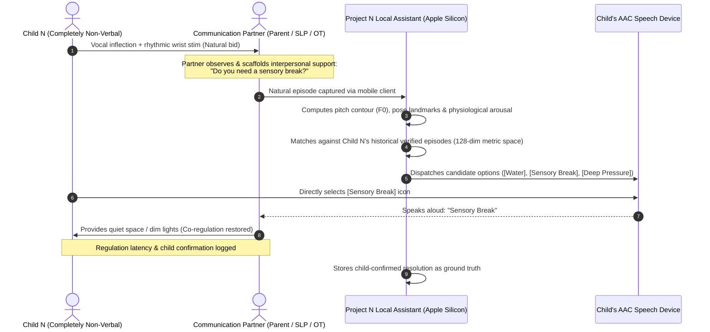
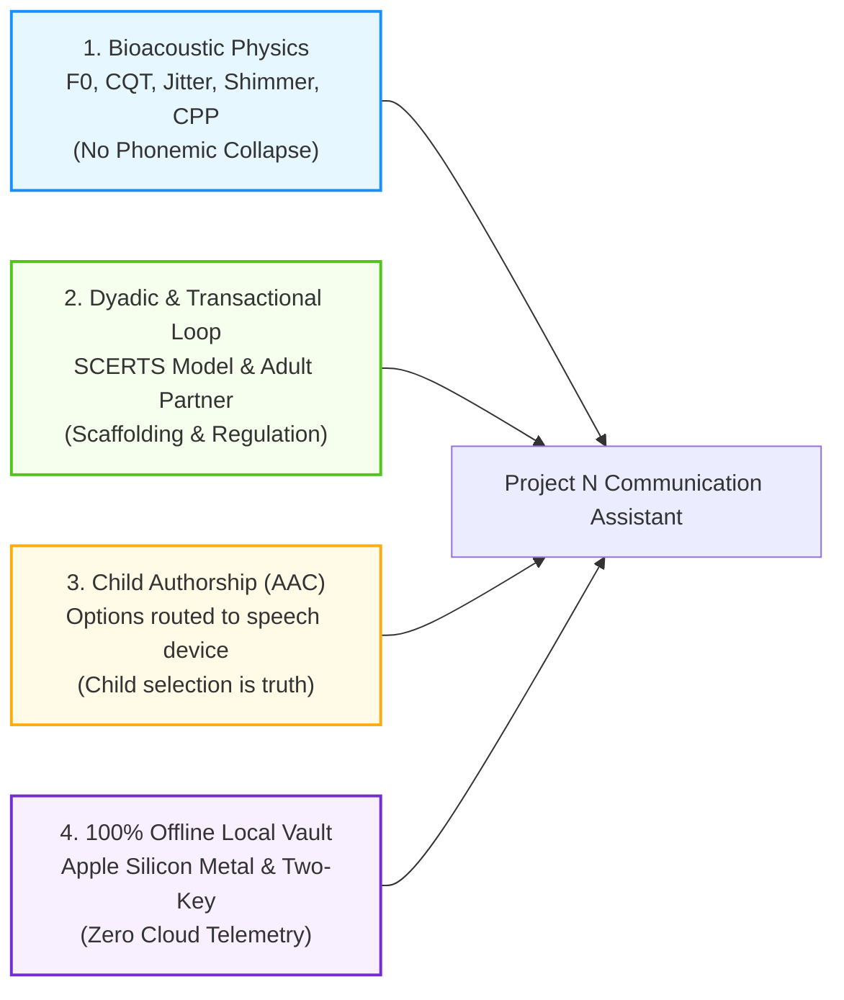

# Project N: Multimodal Communication Support for Non-Verbal Autism

  <em>An open-source, local-first intelligence architecture designed to support completely non-verbal autistic children through high-resolution acoustic physics, body-relative kinematics, transactional adult partner scaffolding, and child-authored AAC communication.</em>

---

## A Note from the Founder

  
"I am <a href="https://olostan.me/" target="_blank"><strong>Valentyn Shybanov</strong></a>, a software engineer, systems architect, and the father of Nolan, a 7-year-old completely non-verbal boy with Level 3 autism. Every single day of my life is shaped by the profound love, challenge, and heartbreak of trying to understand my son. Nolan is non-verbal. Completely.

  
My son cannot use spoken words, but he is never silent. He communicates continuously: through subtle pitch inflections in his throat, micro-tremors in his hands, bodily orientations, and rhythms of movement. Traditional foundation models and commercial AI discard these signals as 'meaningless background noise.' But to me, as his father, that 'noise' is his entire voice.

  
I started Project N not as a commercial startup, not to make money, and not to promote a product. I started it out of a father’s deep desire to understand his child. I am pouring my twenty-plus years of engineering experience, systems architecture knowledge, and machine learning skills into building a free, open-source, local-first tool that can help parents like me and the dedicated therapists who support our children.

  
If you are a speech-language pathologist, an occupational therapist, an autism researcher, or an engineer who believes in communication rights: I warmly invite you to review this work, critique it, and help us make it better."

  
<strong>— Valentyn Shybanov (<a href="https://olostan.me/">olostan.me</a> · <a href="https://github.com/olostan">GitHub</a>)</strong>

---

## Core System Architecture

Project N is engineered to run **100% offline** on local Apple Silicon hardware (tested on an Apple M5 Pro with 48GB Unified Memory), preserving complete family privacy while eliminating cloud latency.

---

## The Four Foundational Pillars

1. **Acoustic Physics Without Words:** Level 3 non-verbal vocalizations are analyzed using raw bioacoustic physics (fundamental frequency $F_0$ pitch tracking at $\sim 1\text{ Hz}$ resolution, jitter, shimmer, harmonic overtones via CQT, and glottal strain via CPP). Sounds are matched directly to past verified episodes without forcing them into clumsy English descriptions.
2. **The Dyadic Transactional Loop:** Communication is an evolving interaction loop between the child and their communication partner (parent, therapist). Grounded in the **SCERTS Model** ([Prizant et al., 2006](WHITE_PAPER.md#ref-11)), the system analyzes what the adult said, what physical scaffolding was offered, and how the child responded.
3. **Child Authorship via the AAC Bridge:** The system never speaks *for* the child. Candidate possibilities are routed to Child N's speech-generating device or AAC choice board as pre-populated icons for him to select, confirm, or reject.
4. **Medical Safety Gate (NCCPC-R):** Acute distress is evaluated using the validated 27-item Non-Communicating Children’s Pain Checklist – Revised ([Breau et al., 2002](WHITE_PAPER.md#ref-2)), immediately triggering medical review escalations for physical pain (ear infections, dental abscesses, GI reflux).

---

## Documentation Roadmap

- 📄 **[Scientific Whitepaper](WHITE_PAPER.md):** Formal clinical paper for Speech-Language Pathologists, OTs, and autism researchers detailing the transactional paradigm, bioacoustics, and AAC authorship.
- 📋 **[Preregistered Evaluation Protocol](evaluation_protocol.md):** Single-case (N-of-1) study design with leave-one-day-out splits, mandatory baselines B1–B4, and safety metrics.
- 📐 **[Technical Specifications](specs.md):** Complete mathematical definitions, tensor shapes, REST endpoints, SSE event schemas, and executable MLX pseudo-code.
- 🧠 **[Theoretical Architecture & Design](design.md):** Detailed neurobiology, acoustic physics, pose kinematics, literature grounding, and continuous adaptation.
- 🛡️ **[System & Safety Invariants](invariants.md):** True non-negotiable invariants (100% offline, privacy vault, frozen LLM, medical rule-out) vs. tunable empirical defaults.
- 🔍 **[Multi-Reviewer Scientific Audit](REVIEW_REFINEMENTS.md):** Comprehensive finding-by-finding peer review and corrective action matrix.
- 🤖 **[Agent Directives](agents.md):** Engineering standards, MLX memory conventions, and mandatory documentation synchronization protocol.
